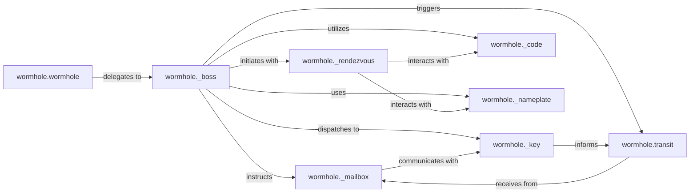

## Details

The `magic-wormhole` project facilitates secure, peer-to-peer data transfer using a shared "wormhole code." The `wormhole.wormhole` component serves as the primary user interface, delegating core connection management to the `wormhole._boss` state machine. The `_boss` orchestrates the connection lifecycle, interacting with specialized modules for distinct phases. The `_rendezvous` module handles initial discovery via a rendezvous server, utilizing `_code` for generating human-readable codes and `_nameplate` for unique identifiers. Cryptographic key exchange is managed by `_key`, which then enables secure message exchange through `_mailbox`. Finally, `transit` is responsible for the actual data transfer once a secure channel is established, often informed by the `_key` module and receiving data via `_mailbox`. This modular design ensures a clear separation of concerns, from initial connection to secure data transmission.

### wormhole.wormhole
Provides the user-facing API for creating and managing wormhole connections. It's responsible for the initial setup and delegation of core operations.

**Related Classes/Methods**:

- <a href="https://github.com/magic-wormhole/magic-wormhole/blob/master/src/wormhole/wormhole.py#L1-L999999" target="_blank" rel="noopener noreferrer">`wormhole.wormhole`:1-999999</a>

### wormhole._boss
Acts as the central state machine for a wormhole connection. It handles the progression of the connection through various stages (e.g., PAKE, rendezvous, transit), processes messages, and orchestrates interactions with other specialized modules.

**Related Classes/Methods**:

- <a href="https://github.com/magic-wormhole/magic-wormhole/blob/master/src/wormhole/wormhole.py" target="_blank" rel="noopener noreferrer">`wormhole._boss`</a>

### wormhole._rendezvous
Manages the initial connection establishment phase, allowing two parties to find each other using a shared "wormhole code" via a rendezvous server. This module handles the communication with the rendezvous server.

**Related Classes/Methods**:

- <a href="https://github.com/magic-wormhole/magic-wormhole/blob/master/src/wormhole/_rendezvous.py#L1-L999999" target="_blank" rel="noopener noreferrer">`wormhole._rendezvous`:1-999999</a>

### wormhole._mailbox
Handles the secure exchange of messages between the two communicating parties, often facilitated by the rendezvous server or a direct connection. This module provides the mechanisms for sending and receiving encrypted messages.

**Related Classes/Methods**:

- <a href="https://github.com/magic-wormhole/magic-wormhole/blob/master/src/wormhole/_mailbox.py#L1-L999999" target="_blank" rel="noopener noreferrer">`wormhole._mailbox`:1-999999</a>

### wormhole._key
Manages the cryptographic key exchange (PAKE) and derivation processes, ensuring secure communication channels. This module is responsible for generating and managing the cryptographic keys used for secure communication.

**Related Classes/Methods**:

- <a href="https://github.com/magic-wormhole/magic-wormhole/blob/master/src/wormhole/wormhole.py" target="_blank" rel="noopener noreferrer">`wormhole._key`</a>

### wormhole.transit
Responsible for the actual data transfer between the two endpoints once a secure channel has been established. This module handles the direct or relayed transfer of data.

**Related Classes/Methods**:

- <a href="https://github.com/magic-wormhole/magic-wormhole/blob/master/src/wormhole/transit.py#L1-L999999" target="_blank" rel="noopener noreferrer">`wormhole.transit`:1-999999</a>

### wormhole._code
Generates and manages the short, human-readable "wormhole codes" used for initial rendezvous. This module provides the logic for creating and parsing these codes.

**Related Classes/Methods**:

- <a href="https://github.com/magic-wormhole/magic-wormhole/blob/master/src/wormhole/_code.py#L1-L999999" target="_blank" rel="noopener noreferrer">`wormhole._code`:1-999999</a>

### wormhole._nameplate
Manages the unique identifiers (nameplates) used by the rendezvous server to match communicating parties. This module handles the allocation and release of these nameplates.

**Related Classes/Methods**:

- <a href="https://github.com/magic-wormhole/magic-wormhole/blob/master/src/wormhole/_nameplate.py#L1-L999999" target="_blank" rel="noopener noreferrer">`wormhole._nameplate`:1-999999</a>

### [FAQ](https://github.com/CodeBoarding/GeneratedOnBoardings/tree/main?tab=readme-ov-file#faq)