```mermaid
graph LR
    CLI_Application_User_Interface_["CLI Application (User Interface)"]
    Wormhole_Core_Orchestrator["Wormhole Core Orchestrator"]
    Rendezvous_Signaling_Module["Rendezvous Signaling Module"]
    Cryptographic_Module["Cryptographic Module"]
    Direct_Transit_Module["Direct Transit Module"]
    Dilation_Protocol_Module["Dilation Protocol Module"]
    File_Data_Transfer_Handler["File/Data Transfer Handler"]
    CLI_Application_User_Interface_ -- "initiates transfer request to" --> Wormhole_Core_Orchestrator
    Wormhole_Core_Orchestrator -- "coordinates handshake with" --> Rendezvous_Signaling_Module
    Rendezvous_Signaling_Module -- "leverages" --> Cryptographic_Module
    Cryptographic_Module -- "provides session keys to" --> Wormhole_Core_Orchestrator
    Wormhole_Core_Orchestrator -- "instructs to establish connection to" --> Direct_Transit_Module
    Direct_Transit_Module -- "provides raw connection to" --> Dilation_Protocol_Module
    Dilation_Protocol_Module -- "creates and manages subchannels for" --> File_Data_Transfer_Handler
    File_Data_Transfer_Handler -- "reports status to" --> CLI_Application_User_Interface_
    click CLI_Application_User_Interface_ href "https://github.com/CodeBoarding/GeneratedOnBoardings/blob/main/magic-wormhole/CLI_Application_User_Interface_.md" "Details"
    click Wormhole_Core_Orchestrator href "https://github.com/CodeBoarding/GeneratedOnBoardings/blob/main/magic-wormhole/Wormhole_Core_Orchestrator.md" "Details"
    click Rendezvous_Signaling_Module href "https://github.com/CodeBoarding/GeneratedOnBoardings/blob/main/magic-wormhole/Rendezvous_Signaling_Module.md" "Details"
    click Cryptographic_Module href "https://github.com/CodeBoarding/GeneratedOnBoardings/blob/main/magic-wormhole/Cryptographic_Module.md" "Details"
    click Direct_Transit_Module href "https://github.com/CodeBoarding/GeneratedOnBoardings/blob/main/magic-wormhole/Direct_Transit_Module.md" "Details"
    click Dilation_Protocol_Module href "https://github.com/CodeBoarding/GeneratedOnBoardings/blob/main/magic-wormhole/Dilation_Protocol_Module.md" "Details"
    click File_Data_Transfer_Handler href "https://github.com/CodeBoarding/GeneratedOnBoardings/blob/main/magic-wormhole/File_Data_Transfer_Handler.md" "Details"
```

## Details

The `magic-wormhole` project implements a secure, peer-to-peer data transfer system, primarily functioning as a CLI tool and a library. Its architecture is centered around a `Wormhole Core Orchestrator` that manages the entire connection lifecycle. The process begins with user interaction via the `CLI Application`, which triggers the orchestrator to establish a secure, authenticated channel. This involves a `Rendezvous Signaling Module` for initial coordination and a `Cryptographic Module` for key exchange and session security. Once a secure channel is negotiated, the `Direct Transit Module` establishes a direct peer-to-peer connection, which is then enhanced by the `Dilation Protocol Module` to create multiplexed subchannels. Finally, the `File/Data Transfer Handler` leverages these subchannels for the actual data transfer, providing feedback to the user interface. This layered approach ensures robust communication, strong security, and efficient data flow, making it ideal for secure file and data exchange.

### CLI Application (User Interface) [[Expand]](./CLI_Application_User_Interface_.md)
The primary entry point for users, responsible for parsing commands, displaying progress, and initiating send/receive operations. It acts as the user-facing facade of the wormhole system.

**Related Classes/Methods**:

- <a href="https://github.com/magic-wormhole/magic-wormhole/blob/master/src/wormhole/cli/cli.py" target="_blank" rel="noopener noreferrer">`wormhole.cli.cli`</a>
- <a href="https://github.com/magic-wormhole/magic-wormhole/blob/master/src/wormhole/cli/cmd_send.py" target="_blank" rel="noopener noreferrer">`wormhole.cli.cmd_send`</a>
- <a href="https://github.com/magic-wormhole/magic-wormhole/blob/master/src/wormhole/cli/cmd_receive.py" target="_blank" rel="noopener noreferrer">`wormhole.cli.cmd_receive`</a>

### Wormhole Core Orchestrator [[Expand]](./Wormhole_Core_Orchestrator.md)
The central control module that manages the entire lifecycle of a wormhole connection. It coordinates the interactions between various sub-modules to establish a secure channel and facilitate data transfer.

**Related Classes/Methods**:

- <a href="https://github.com/magic-wormhole/magic-wormhole/blob/master/src/wormhole/wormhole.py" target="_blank" rel="noopener noreferrer">`wormhole.wormhole`</a>
- <a href="https://github.com/magic-wormhole/magic-wormhole/blob/master/src/wormhole/wormhole.py" target="_blank" rel="noopener noreferrer">`wormhole._boss`</a>

### Rendezvous Signaling Module [[Expand]](./Rendezvous_Signaling_Module.md)
Handles the initial, indirect communication between peers via a central rendezvous server. This module is crucial for exchanging short, authenticated messages, including wormhole codes and PAKE (Password Authenticated Key Exchange) messages, to bootstrap the connection.

**Related Classes/Methods**:

- <a href="https://github.com/magic-wormhole/magic-wormhole/blob/master/src/wormhole/_rendezvous.py" target="_blank" rel="noopener noreferrer">`wormhole._rendezvous`</a>
- <a href="https://github.com/magic-wormhole/magic-wormhole/blob/master/src/wormhole/_mailbox.py" target="_blank" rel="noopener noreferrer">`wormhole._mailbox`</a>
- <a href="https://github.com/magic-wormhole/magic-wormhole/blob/master/src/wormhole/_code.py" target="_blank" rel="noopener noreferrer">`wormhole._code`</a>
- <a href="https://github.com/magic-wormhole/magic-wormhole/blob/master/src/wormhole/_nameplate.py" target="_blank" rel="noopener noreferrer">`wormhole._nameplate`</a>

### Cryptographic Module [[Expand]](./Cryptographic_Module.md)
Encapsulates all cryptographic operations necessary for establishing and maintaining a secure, authenticated channel. This includes key derivation, encryption, and message authentication.

**Related Classes/Methods**:

- <a href="https://github.com/magic-wormhole/magic-wormhole/blob/master/src/wormhole/wormhole.py" target="_blank" rel="noopener noreferrer">`wormhole._key`</a>

### Direct Transit Module [[Expand]](./Direct_Transit_Module.md)
Manages the establishment and maintenance of direct peer-to-peer TCP connections. It handles various connection strategies, including direct IP connections, NAT traversal techniques, and fallback to relay servers when direct connections are not possible.

**Related Classes/Methods**:

- <a href="https://github.com/magic-wormhole/magic-wormhole/blob/master/src/wormhole/transit.py" target="_blank" rel="noopener noreferrer">`wormhole.transit`</a>

### Dilation Protocol Module [[Expand]](./Dilation_Protocol_Module.md)
Implements a multiplexing protocol over the direct transit connection. This module allows multiple logical "subchannels" to operate concurrently over a single underlying TCP connection, enabling efficient and organized data flow.

**Related Classes/Methods**:

- <a href="https://github.com/magic-wormhole/magic-wormhole/blob/master/src/wormhole/_dilation/manager.py" target="_blank" rel="noopener noreferrer">`wormhole._dilation.manager`</a>
- <a href="https://github.com/magic-wormhole/magic-wormhole/blob/master/src/wormhole/_dilation/connection.py" target="_blank" rel="noopener noreferrer">`wormhole._dilation.connection`</a>
- <a href="https://github.com/magic-wormhole/magic-wormhole/blob/master/src/wormhole/_dilation/subchannel.py" target="_blank" rel="noopener noreferrer">`wormhole._dilation.subchannel`</a>

### File/Data Transfer Handler [[Expand]](./File_Data_Transfer_Handler.md)
Responsible for the actual application-level transfer of data, such as files, directories, or text messages, over the established secure subchannels. It manages the reading and writing of data streams.

**Related Classes/Methods**:

- <a href="https://github.com/magic-wormhole/magic-wormhole/blob/master/src/wormhole/_send.py" target="_blank" rel="noopener noreferrer">`wormhole._send`</a>
- <a href="https://github.com/magic-wormhole/magic-wormhole/blob/master/src/wormhole/_receive.py" target="_blank" rel="noopener noreferrer">`wormhole._receive`</a>
- <a href="https://github.com/magic-wormhole/magic-wormhole/blob/master/src/wormhole/xfer_util.py" target="_blank" rel="noopener noreferrer">`wormhole.xfer_util`</a>

### [FAQ](https://github.com/CodeBoarding/GeneratedOnBoardings/tree/main?tab=readme-ov-file#faq)