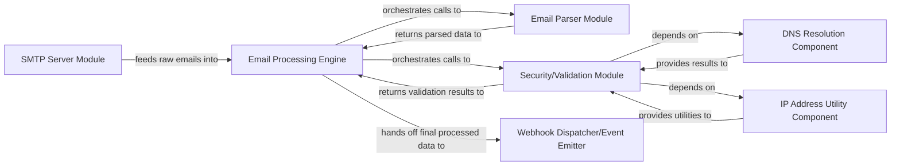

## Details

The Email Processing Server operates around a central `Email Processing Engine` that orchestrates the lifecycle of an incoming email. The process begins with the `SMTP Server Module` receiving raw email data and forwarding it to the `Email Processing Engine`. This engine then directs the raw email to the `Email Parser Module` for structured conversion. Concurrently, the `Security/Validation Module` performs critical authenticity checks, leveraging the `DNS Resolution Component` for domain lookups and the `IP Address Utility Component` for IP-related validations. Once processed and validated, the `Email Processing Engine` dispatches the final email data to external systems via the `Webhook Dispatcher/Event Emitter`. This architecture ensures a robust and modular approach to email handling, from reception to final delivery.

### Email Processing Engine [[Expand]](./Email_Processing_Engine.md)
The central orchestration component that manages the sequential flow of an email through various validation, parsing, and analysis stages. It acts as the control hub for email data transformation, embodying the core pipeline processing model of the Email Processing Server.

**Related Classes/Methods**:

- <a href="https://github.com/Flolagale/mailin/blob/master/lib/mailin.js" target="_blank" rel="noopener noreferrer">`mailin.js:dataReady`</a>
- <a href="https://github.com/Flolagale/mailin/blob/master/lib/mailin.js" target="_blank" rel="noopener noreferrer">`mailin.js:retrieveRawEmail`</a>
- <a href="https://github.com/Flolagale/mailin/blob/master/lib/mailin.js" target="_blank" rel="noopener noreferrer">`mailin.js:finalizeMessage`</a>

### SMTP Server Module
Handles incoming SMTP connections, receives raw email messages, and passes them to the Email Processing Engine.

**Related Classes/Methods**:

- <a href="https://github.com/Flolagale/mailin/blob/master/lib/mailin.js" target="_blank" rel="noopener noreferrer">`lib.mailin.Mailin._smtp`</a>

### Email Parser Module
Parses raw email content (headers, body, attachments) into a structured, accessible format.

**Related Classes/Methods**:

- <a href="https://github.com/Flolagale/mailin/blob/master/lib/mailin.js" target="_blank" rel="noopener noreferrer">`lib.mailin.parseEmail`</a>

### Security/Validation Module
Performs security and authenticity checks on emails, including DKIM signature validation and SPF record verification. It relies on DNS lookups and IP address utilities.

**Related Classes/Methods**:

- <a href="https://github.com/Flolagale/mailin/blob/master/python/dkim" target="_blank" rel="noopener noreferrer">`python.dkim`</a>
- <a href="https://github.com/Flolagale/mailin/blob/master/python/spf.py" target="_blank" rel="noopener noreferrer">`python.spf`</a>

### Webhook Dispatcher/Event Emitter
Dispatches the final processed email data to configured external webhooks or emits internal events for other application components to consume.

**Related Classes/Methods**:

- <a href="https://github.com/Flolagale/mailin/blob/master/lib/mailin.js" target="_blank" rel="noopener noreferrer">`lib.mailin.Mailin.postWebhook`</a>
- <a href="https://github.com/Flolagale/mailin/blob/master/lib/mailin.js" target="_blank" rel="noopener noreferrer">`lib.mailin.Mailin`</a>

### DNS Resolution Component
Performs DNS lookups.

**Related Classes/Methods**:

- <a href="https://github.com/Flolagale/mailin/blob/master/python/DNS" target="_blank" rel="noopener noreferrer">`python.DNS`</a>

### IP Address Utility Component
Provides IP address utilities.

**Related Classes/Methods**:

- <a href="https://github.com/Flolagale/mailin/blob/master/python/ipaddr.py" target="_blank" rel="noopener noreferrer">`python.ipaddr`</a>

### [FAQ](https://github.com/CodeBoarding/GeneratedOnBoardings/tree/main?tab=readme-ov-file#faq)