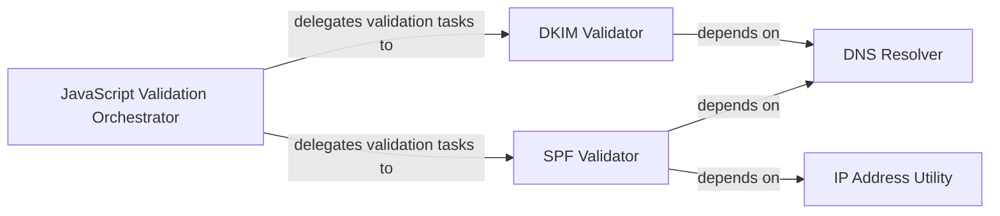

## Details

The Email Validation & Security subsystem is a critical part of the mailin project, focusing on verifying the authenticity and integrity of incoming emails. It acts as a security gate, ensuring that emails adhere to established standards like DKIM and SPF before further processing.

### JavaScript Validation Orchestrator
Serves as the primary entry point for email security checks within the Node.js environment. It orchestrates the asynchronous execution of DKIM and SPF validation tasks, delegating the complex, low-level validation logic to specialized Python modules. This component acts as the bridge between the Node.js application and the Python-based validation engine.

**Related Classes/Methods**:

- <a href="https://github.com/Flolagale/mailin/blob/master/lib/mailin.js" target="_blank" rel="noopener noreferrer">`validateDkim`</a>
- <a href="https://github.com/Flolagale/mailin/blob/master/lib/mailin.js" target="_blank" rel="noopener noreferrer">`validateSpf`</a>
- <a href="https://github.com/Flolagale/mailin/blob/master/lib/mailin.js" target="_blank" rel="noopener noreferrer">`validateAddress`</a>
- <a href="https://github.com/Flolagale/mailin/blob/master/lib/mailUtilities.js" target="_blank" rel="noopener noreferrer">`validateDkimAsync`</a>
- <a href="https://github.com/Flolagale/mailin/blob/master/lib/mailUtilities.js" target="_blank" rel="noopener noreferrer">`validateSpfAsync`</a>

### DKIM Validator
Responsible for verifying the DomainKeys Identified Mail (DKIM) signature of an email. It parses DKIM-Signature headers, performs canonicalization of email headers and body, executes cryptographic hashing and signature verification, and validates the signature against public keys retrieved via DNS.

**Related Classes/Methods**:

- <a href="https://github.com/Flolagale/mailin/blob/master/python/dkim/__init__.py#L247-L571" target="_blank" rel="noopener noreferrer">`dkim`:247-571</a>

### SPF Validator
Handles the Sender Policy Framework (SPF) validation. This component parses SPF records from DNS, evaluates the sender's IP address against various SPF mechanisms (e.g., `a`, `mx`, `ptr`, `ip4`, `ip6`, `include`), and determines the final SPF validation result (e.g., Pass, Fail, SoftFail).

**Related Classes/Methods**:

- <a href="https://github.com/Flolagale/mailin/blob/master/python/spf.py" target="_blank" rel="noopener noreferrer">`spf`</a>

### DNS Resolver
Provides fundamental DNS query capabilities. It is responsible for sending UDP/TCP DNS requests, processing DNS replies, and managing DNS name server discovery. This component is crucial for both DKIM (to fetch public keys) and SPF (to fetch SPF records) validations.

**Related Classes/Methods**:

- <a href="https://github.com/Flolagale/mailin/blob/master/python/DNS/Base.py" target="_blank" rel="noopener noreferrer">`DNS.Base`</a>

### IP Address Utility
Offers utilities for parsing, validating, and manipulating IPv4 and IPv6 addresses and network ranges. It supports CIDR matching, address range summarization, and checks for private or loopback addresses, which are essential for SPF validation's IP-based checks.

**Related Classes/Methods**:

- <a href="https://github.com/Flolagale/mailin/blob/master/python/spf.py" target="_blank" rel="noopener noreferrer">`ipaddr`</a>

### [FAQ](https://github.com/CodeBoarding/GeneratedOnBoardings/tree/main?tab=readme-ov-file#faq)