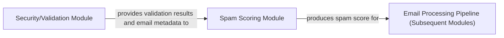

## Details

The email processing system is structured around a pipeline that begins with initial security and validation, proceeds to spam scoring, and concludes with subsequent processing based on the determined spam score. The `Security/Validation Module` acts as the initial gatekeeper, performing essential checks like SPF and DKIM validation and providing crucial metadata. This information is then fed into the `Spam Scoring Module`, which aggregates various indicators to compute a comprehensive spam score. Finally, the `Email Processing Pipeline (Subsequent Modules)` consumes this spam score to make informed decisions on how to handle the email, such as delivery, quarantine, or rejection, forming a clear and sequential processing chain.

### Spam Scoring Module
This is the core component responsible for assessing the likelihood of an incoming email being spam. It computes an overall spam score by aggregating results from various preliminary checks and potentially integrates with external spam filtering tools like SpamAssassin. It acts as a central calculator and aggregator for spam-related metrics.

**Related Classes/Methods**:

- <a href="https://github.com/Flolagale/mailin/blob/master/lib/mailin.js" target="_blank" rel="noopener noreferrer">`computeSpamScore`</a>
- <a href="https://github.com/Flolagale/mailin/blob/master/lib/mailUtilities.js" target="_blank" rel="noopener noreferrer">`computeSpamScoreAsync`</a>

### Security/Validation Module
This module performs initial security and validation checks on incoming emails. It provides essential validation results and other relevant email metadata (e.g., sender reputation, SPF/DKIM results) that are crucial inputs for the Spam Scoring Module to make informed decisions.

**Related Classes/Methods**:

- <a href="https://github.com/Flolagale/mailin/blob/master/python/verifyspf.py#L13-L25" target="_blank" rel="noopener noreferrer">`verifyspf.main`:13-25</a>
- <a href="https://github.com/Flolagale/mailin/blob/master/python/verifydkim.py#L11-L19" target="_blank" rel="noopener noreferrer">`verifydkim.main`:11-19</a>

### Email Processing Pipeline (Subsequent Modules)
This represents the downstream components in the overall email processing chain. These modules consume the spam score produced by the Spam Scoring Module to make decisions regarding the email's disposition, such as routing to an inbox, quarantining, or rejecting it. This aligns with the "Pipeline/Processing Chain" architectural pattern.

**Related Classes/Methods**:

- <a href="https://github.com/Flolagale/mailin/blob/master/lib/mailin.js" target="_blank" rel="noopener noreferrer">`mailin.Mailin`</a>

### [FAQ](https://github.com/CodeBoarding/GeneratedOnBoardings/tree/main?tab=readme-ov-file#faq)