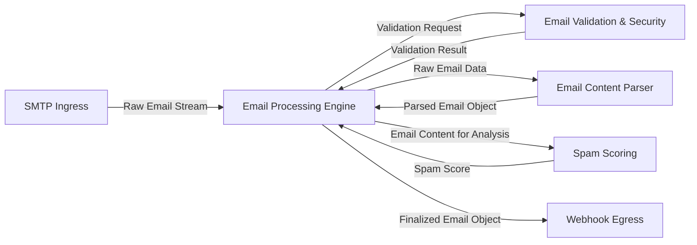

## Details

The mailin project is architected as an event-driven email processing server, primarily functioning as a pipeline that transforms incoming raw SMTP email into structured data for external consumption. At its core, the SMTP Ingress component serves as the initial entry point, receiving email streams. These streams are then handed off to the Email Processing Engine, which orchestrates a series of sequential operations. This includes delegating to the Email Validation & Security module for critical DKIM and SPF checks, utilizing Python-based utilities for these tasks. Concurrently, the Email Content Parser extracts structured information from the raw email, and the Spam Scoring module assesses the email's spam likelihood. Once all processing is complete and the email object is finalized, the Webhook Egress component dispatches this data to a configurable external HTTP endpoint. The entire system is supported by a cross-cutting `Configuration & Logging Module` (not shown as a primary flow component to maintain diagram clarity), ensuring operational settings and system activities are managed effectively. This design facilitates a clear, traceable flow of email data, making it ideal for visual representation as a processing pipeline.

### SMTP Ingress
The primary entry point for the server, responsible for receiving raw email data via the SMTP protocol. It handles incoming connections and streams email content to the processing engine.

**Related Classes/Methods**:

- <a href="https://github.com/Flolagale/mailin/blob/master/lib/mailin.js" target="_blank" rel="noopener noreferrer">`Mailin.prototype.start`</a>
- <a href="https://github.com/Flolagale/mailin/blob/master/index.js" target="_blank" rel="noopener noreferrer">`index.js`</a>

### Email Processing Engine [[Expand]](./Email_Processing_Engine.md)
The central orchestration component that manages the sequential flow of an email through various validation, parsing, and analysis stages. It acts as the control hub for email data transformation.

**Related Classes/Methods**:

- <a href="https://github.com/Flolagale/mailin/blob/master/lib/mailin.js" target="_blank" rel="noopener noreferrer">`dataReady`</a>
- <a href="https://github.com/Flolagale/mailin/blob/master/lib/mailin.js" target="_blank" rel="noopener noreferrer">`retrieveRawEmail`</a>
- <a href="https://github.com/Flolagale/mailin/blob/master/lib/mailin.js" target="_blank" rel="noopener noreferrer">`finalizeMessage`</a>

### Email Validation & Security [[Expand]](./Email_Validation_Security.md)
Performs critical security and authenticity checks on incoming emails, including DomainKeys Identified Mail (DKIM) and Sender Policy Framework (SPF) validation. It leverages underlying Python modules for the actual cryptographic and DNS-based checks.

**Related Classes/Methods**:

- <a href="https://github.com/Flolagale/mailin/blob/master/lib/mailin.js" target="_blank" rel="noopener noreferrer">`validateDkim`</a>
- <a href="https://github.com/Flolagale/mailin/blob/master/lib/mailin.js" target="_blank" rel="noopener noreferrer">`validateSpf`</a>
- <a href="https://github.com/Flolagale/mailin/blob/master/lib/mailin.js" target="_blank" rel="noopener noreferrer">`validateAddress`</a>
- <a href="https://github.com/Flolagale/mailin/blob/master/lib/mailUtilities.js" target="_blank" rel="noopener noreferrer">`validateDkimAsync`</a>
- <a href="https://github.com/Flolagale/mailin/blob/master/lib/mailUtilities.js" target="_blank" rel="noopener noreferrer">`validateSpfAsync`</a>
- <a href="https://github.com/Flolagale/mailin/blob/master/python/dkim/__init__.py" target="_blank" rel="noopener noreferrer">`python/dkim/__init__.py`</a>
- <a href="https://github.com/Flolagale/mailin/blob/master/python/spf.py" target="_blank" rel="noopener noreferrer">`python/spf.py`</a>
- <a href="https://github.com/Flolagale/mailin/blob/master/python/DNS/Base.py" target="_blank" rel="noopener noreferrer">`python/DNS/Base.py`</a>
- <a href="https://github.com/Flolagale/mailin/blob/master/python/ipaddr.py" target="_blank" rel="noopener noreferrer">`python/ipaddr.py`</a>

### Email Content Parser
Extracts structured information from the raw email content, converting it into a more usable format (e.g., headers, text body, HTML body, attachments).

**Related Classes/Methods**:

- <a href="https://github.com/Flolagale/mailin/blob/master/lib/mailin.js" target="_blank" rel="noopener noreferrer">`parseEmail`</a>

### Spam Scoring [[Expand]](./Spam_Scoring.md)
Assesses the likelihood of an incoming email being spam by computing a spam score, potentially integrating with external spam filtering tools like SpamAssassin.

**Related Classes/Methods**:

- <a href="https://github.com/Flolagale/mailin/blob/master/lib/mailin.js" target="_blank" rel="noopener noreferrer">`computeSpamScore`</a>
- <a href="https://github.com/Flolagale/mailin/blob/master/lib/mailUtilities.js" target="_blank" rel="noopener noreferrer">`computeSpamScoreAsync`</a>

### Webhook Egress
The output mechanism for processed emails, responsible for sending the finalized email data to a configurable external HTTP webhook endpoint.

**Related Classes/Methods**:

- <a href="https://github.com/Flolagale/mailin/blob/master/lib/mailin.js" target="_blank" rel="noopener noreferrer">`postWebhook`</a>

### [FAQ](https://github.com/CodeBoarding/GeneratedOnBoardings/tree/main?tab=readme-ov-file#faq)