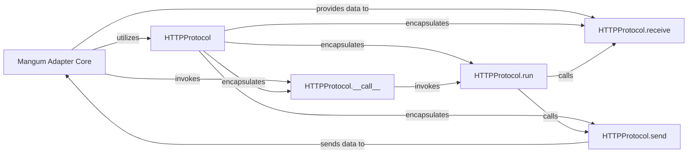

## Details

The `mangum` project's HTTP subsystem is centered around the `Mangum Adapter Core`, which serves as the primary interface between the AWS Lambda environment and the ASGI application. Upon receiving an HTTP event, the `Mangum Adapter Core` invokes the `HTTPProtocol` component, specifically its `__call__` method, to initiate the ASGI HTTP communication. The `HTTPProtocol` then orchestrates the request-response cycle through its `run` method, asynchronously receiving incoming request data via `HTTPProtocol.receive` (data supplied by the `Mangum Adapter Core`) and transmitting outgoing response data via `HTTPProtocol.send` (data returned to the `Mangum Adapter Core` for dispatch back to AWS). This design effectively adapts AWS Lambda events to the ASGI specification, enabling standard ASGI applications to run seamlessly in a serverless environment.

### Mangum Adapter Core [[Expand]](./Mangum_Adapter_Core.md)
This component represents the central orchestration logic within Mangum. It acts as the primary interface between the AWS Lambda environment (or other event sources) and the ASGI application. It receives incoming events, selects the appropriate ASGI protocol handler (like `HTTPProtocol`), and manages the flow of data to and from the ASGI application, ultimately returning the response to the AWS environment.

**Related Classes/Methods**: _None_

### HTTPProtocol
This is the overarching component representing the ASGI HTTP protocol implementation. It acts as the primary interface for the `Mangum Adapter Core` to interact with the HTTP request/response cycle. It embodies the "Adapter Pattern" by translating between the `Mangum` internal representation of an HTTP event and the ASGI standard.

**Related Classes/Methods**:

- <a href="https://github.com/Kludex/mangum/blob/main/mangum/protocols/http.py" target="_blank" rel="noopener noreferrer">`mangum.protocols.http.HTTPProtocol`</a>

### HTTPProtocol.__call__
The primary entry point for the `HTTPProtocol` component. It's the method invoked by the `Mangum Adapter Core` to initiate the processing of an HTTP request, effectively starting the ASGI HTTP communication.

**Related Classes/Methods**:

- <a href="https://github.com/Kludex/mangum/blob/main/mangum/protocols/http.py" target="_blank" rel="noopener noreferrer">`mangum.protocols.http.HTTPProtocol:__call__`</a>

### HTTPProtocol.run
The core orchestrator of the HTTP communication flow within the ASGI protocol layer. It manages the lifecycle of a single HTTP request and its corresponding response, coordinating the asynchronous reception of request data and transmission of response data.

**Related Classes/Methods**:

- <a href="https://github.com/Kludex/mangum/blob/main/mangum/protocols/http.py" target="_blank" rel="noopener noreferrer">`mangum.protocols.http.HTTPProtocol:run`</a>

### HTTPProtocol.receive
Responsible for handling the asynchronous reception of incoming HTTP request data, including headers and body streams, from the underlying event source (via `Mangum Adapter Core`). It transforms this raw data into ASGI-compliant `http.request` and `http.disconnect` events.

**Related Classes/Methods**:

- <a href="https://github.com/Kludex/mangum/blob/main/mangum/protocols/http.py" target="_blank" rel="noopener noreferrer">`mangum.protocols.http.HTTPProtocol:receive`</a>

### HTTPProtocol.send
Manages the asynchronous transmission of outgoing HTTP response data, such as status codes, headers, and response body chunks, generated by the `User ASGI Application`. It transforms ASGI `http.response.start` and `http.response.body` events into a format suitable for the `Mangum Adapter Core` to send back to AWS.

**Related Classes/Methods**:

- <a href="https://github.com/Kludex/mangum/blob/main/mangum/protocols/http.py" target="_blank" rel="noopener noreferrer">`mangum.protocols.http.HTTPProtocol:send`</a>

### [FAQ](https://github.com/CodeBoarding/GeneratedOnBoardings/tree/main?tab=readme-ov-file#faq)