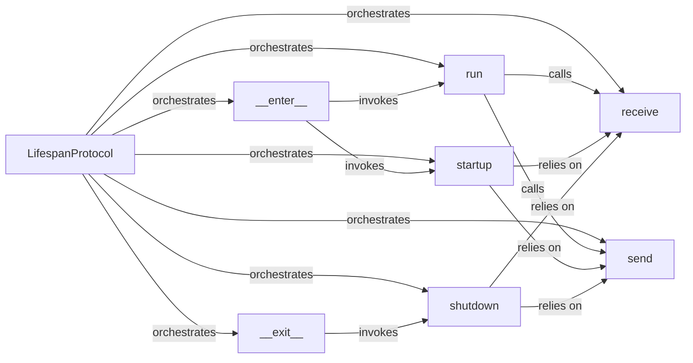

## Details

The ASGI Lifespan Protocol Layer subsystem is encapsulated within the `mangum.protocols.lifespan` module, primarily defined in the file `/mnt/e/StartUp/mangum/mangum/protocols/lifespan.py`. Its responsibility is to manage the lifecycle events (startup and shutdown) of the `User ASGI Application` in accordance with the ASGI lifespan protocol, ensuring proper initialization and cleanup.

### LifespanProtocol
The central orchestrator of the ASGI lifespan protocol. It acts as an adapter between the Mangum serverless environment and the user's ASGI application, managing lifecycle events. It ensures the application can perform necessary initialization and cleanup tasks according to the ASGI specification.

**Related Classes/Methods**:

- <a href="https://github.com/Kludex/mangum/blob/main/mangum/protocols/lifespan.py" target="_blank" rel="noopener noreferrer">`LifespanProtocol`</a>

### __enter__
The entry point for the lifespan context. This method initiates the lifespan protocol, specifically triggering the startup sequence for the ASGI application.

**Related Classes/Methods**:

- <a href="https://github.com/Kludex/mangum/blob/main/mangum/protocols/lifespan.py" target="_blank" rel="noopener noreferrer">`LifespanProtocol:__enter__`</a>

### __exit__
The exit point for the lifespan context. This method ensures proper cleanup by triggering the shutdown sequence for the ASGI application when the lifespan context is exited.

**Related Classes/Methods**:

- <a href="https://github.com/Kludex/mangum/blob/main/mangum/protocols/lifespan.py" target="_blank" rel="noopener noreferrer">`LifespanProtocol:__exit__`</a>

### run
The core asynchronous loop responsible for managing the exchange of lifespan messages between Mangum and the ASGI application. It continuously processes incoming and outgoing messages related to startup and shutdown events.

**Related Classes/Methods**:

- <a href="https://github.com/Kludex/mangum/blob/main/mangum/protocols/lifespan.py" target="_blank" rel="noopener noreferrer">`LifespanProtocol:run`</a>

### startup
Handles the ASGI `lifespan.startup` event. This component sends the startup event to the application and awaits a `lifespan.startup.complete` or `lifespan.startup.failed` response, indicating the application's readiness.

**Related Classes/Methods**:

- <a href="https://github.com/Kludex/mangum/blob/main/mangum/protocols/lifespan.py" target="_blank" rel="noopener noreferrer">`LifespanProtocol:startup`</a>

### shutdown
Handles the ASGI `lifespan.shutdown` event. This component sends the shutdown event to the application and waits for a `lifespan.shutdown.complete` response, ensuring the application gracefully terminates.

**Related Classes/Methods**:

- <a href="https://github.com/Kludex/mangum/blob/main/mangum/protocols/lifespan.py" target="_blank" rel="noopener noreferrer">`LifespanProtocol:shutdown`</a>

### receive
An abstract mechanism within the `LifespanProtocol` for receiving messages from the ASGI application. It acts as the inbound channel for application-generated lifespan events.

**Related Classes/Methods**:

- <a href="https://github.com/Kludex/mangum/blob/main/mangum/protocols/lifespan.py" target="_blank" rel="noopener noreferrer">`LifespanProtocol:receive`</a>

### send
An abstract mechanism within the `LifespanProtocol` for sending messages to the ASGI application. It acts as the outbound channel for Mangum-generated lifespan events.

**Related Classes/Methods**:

- <a href="https://github.com/Kludex/mangum/blob/main/mangum/protocols/lifespan.py" target="_blank" rel="noopener noreferrer">`LifespanProtocol:send`</a>

### [FAQ](https://github.com/CodeBoarding/GeneratedOnBoardings/tree/main?tab=readme-ov-file#faq)