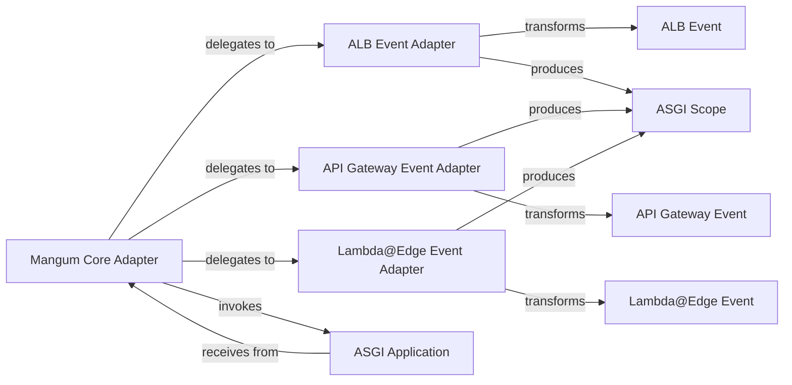

## Details

The mangum library acts as a bridge between various AWS event sources and ASGI applications, providing a robust and flexible architecture for deploying ASGI applications on AWS Lambda.

### Mangum Core Adapter
The central component responsible for initializing the ASGI application, detecting the incoming AWS event type, and delegating event parsing to the appropriate Event Adapter. It then passes the transformed ASGI scope and receive callable to the ASGI application.

**Related Classes/Methods**: _None_

### ALB Event Adapter
Parses incoming AWS Application Load Balancer (ALB) event JSON structures and transforms them into a compliant ASGI scope dictionary, handling ALB-specific nuances like header casing and query string encoding.

**Related Classes/Methods**: _None_

### API Gateway Event Adapter
Parses diverse AWS API Gateway events (V1 and V2) and converts them into a standardized ASGI scope, managing multi-value headers and API Gateway-specific query string encoding.

**Related Classes/Methods**: _None_

### Lambda@Edge Event Adapter
Parses the unique event structure from CloudFront Lambda@Edge and transforms it into the standardized ASGI scope dictionary, enabling ASGI applications to process requests originating from the CloudFront CDN.

**Related Classes/Methods**: _None_

### ASGI Application
Represents the user's ASGI-compatible application that receives the standardized ASGI scope and receive callable from the Mangum Core Adapter and processes the request.

**Related Classes/Methods**: _None_

### ALB Event
Represents an incoming AWS Application Load Balancer (ALB) event.

**Related Classes/Methods**: _None_

### API Gateway Event
Represents an incoming AWS API Gateway event.

**Related Classes/Methods**: _None_

### Lambda@Edge Event
Represents an incoming AWS CloudFront Lambda@Edge event.

**Related Classes/Methods**: _None_

### ASGI Scope
The standardized ASGI scope dictionary, which is the output of the event adapters.

**Related Classes/Methods**: _None_

### [FAQ](https://github.com/CodeBoarding/GeneratedOnBoardings/tree/main?tab=readme-ov-file#faq)