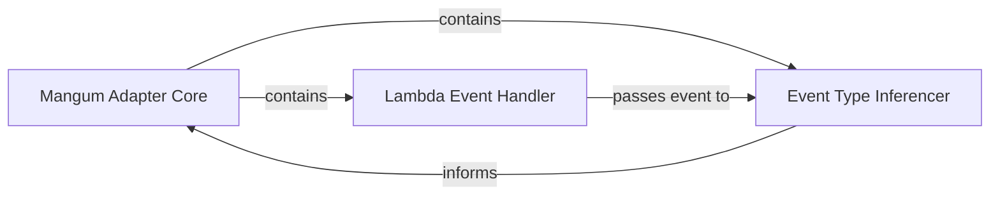

## Details

The `Mangum Adapter Core` subsystem is designed around the central `Mangum` class, which acts as the primary orchestrator for handling AWS Lambda events and interfacing with ASGI applications. It encapsulates key functionalities for event reception, type inference, and initial processing.

### Mangum Adapter Core [[Expand]](./Mangum_Adapter_Core.md)
The central orchestrator of the Mangum adapter. It serves as the primary entry point for all incoming AWS Lambda events, responsible for event type inference, dispatching to appropriate handlers, managing the ASGI application lifecycle, and coordinating the overall ASGI communication flow. It embodies the Adapter pattern, translating AWS Lambda events into ASGI-compliant scopes and vice-versa for responses. This component is fundamental as it represents the core `Mangum` class, which is the entry point and coordinator for the entire adapter's operation.

**Related Classes/Methods**:

- <a href="https://github.com/Kludex/mangum/blob/main/mangum/adapter.py#L27-L75" target="_blank" rel="noopener noreferrer">`mangum.adapter.Mangum`:27-75</a>

### Lambda Event Handler
Serves as the direct AWS Lambda handler, receiving the raw AWS event and context. It initiates the event processing pipeline by invoking the core `Mangum` adapter's call method. This component is crucial as it is the direct interface with the AWS Lambda runtime, responsible for the initial capture of events.

**Related Classes/Methods**:

- <a href="https://github.com/Kludex/mangum/blob/main/mangum/adapter.py#L27-L75" target="_blank" rel="noopener noreferrer">`mangum.adapter.Mangum.__call__`:27-75</a>

### Event Type Inferencer
Analyzes the incoming AWS Lambda event payload to identify its source (e.g., API Gateway, ALB, Lambda@Edge, Function URL). This step is critical for correctly parsing the event and preparing it for the ASGI application by determining the appropriate event structure and processing logic. This component is vital for the adapter's flexibility, allowing it to handle diverse AWS event types.

**Related Classes/Methods**:

- <a href="https://github.com/Kludex/mangum/blob/main/mangum/adapter.py#L27-L75" target="_blank" rel="noopener noreferrer">`mangum.adapter.Mangum.infer`:27-75</a>

### [FAQ](https://github.com/CodeBoarding/GeneratedOnBoardings/tree/main?tab=readme-ov-file#faq)