```mermaid
graph LR
    AWS_Lambda_Event_Source["AWS Lambda Event Source"]
    Mangum_Adapter_Core["Mangum Adapter Core"]
    AWS_Event_Handlers["AWS Event Handlers"]
    ASGI_Lifespan_Protocol_Layer["ASGI Lifespan Protocol Layer"]
    ASGI_HTTP_Protocol_Layer["ASGI HTTP Protocol Layer"]
    User_ASGI_Application["User ASGI Application"]
    AWS_Lambda_Response_Destination["AWS Lambda Response Destination"]
    AWS_Lambda_Event_Source -- "Triggers Invocation" --> Mangum_Adapter_Core
    Mangum_Adapter_Core -- "Dispatches Event for Parsing" --> AWS_Event_Handlers
    AWS_Event_Handlers -- "Returns Normalized ASGI Scope" --> Mangum_Adapter_Core
    Mangum_Adapter_Core -- "Manages Application Lifecycle" --> ASGI_Lifespan_Protocol_Layer
    ASGI_Lifespan_Protocol_Layer -- "Communicates Lifespan Events" --> User_ASGI_Application
    User_ASGI_Application -- "Communicates Lifespan Events" --> ASGI_Lifespan_Protocol_Layer
    Mangum_Adapter_Core -- "Initiates HTTP Request Processing" --> ASGI_HTTP_Protocol_Layer
    ASGI_HTTP_Protocol_Layer -- "Exchanges HTTP Data (Request/Response)" --> User_ASGI_Application
    User_ASGI_Application -- "Exchanges HTTP Data (Request/Response)" --> ASGI_HTTP_Protocol_Layer
    Mangum_Adapter_Core -- "Transforms & Returns AWS Response" --> AWS_Lambda_Response_Destination
    click Mangum_Adapter_Core href "https://github.com/CodeBoarding/GeneratedOnBoardings/blob/main/mangum/Mangum_Adapter_Core.md" "Details"
    click AWS_Event_Handlers href "https://github.com/CodeBoarding/GeneratedOnBoardings/blob/main/mangum/AWS_Event_Handlers.md" "Details"
    click ASGI_Lifespan_Protocol_Layer href "https://github.com/CodeBoarding/GeneratedOnBoardings/blob/main/mangum/ASGI_Lifespan_Protocol_Layer.md" "Details"
    click ASGI_HTTP_Protocol_Layer href "https://github.com/CodeBoarding/GeneratedOnBoardings/blob/main/mangum/ASGI_HTTP_Protocol_Layer.md" "Details"
```

## Details

The `mangum` architecture centers around the `Mangum Adapter Core`, which serves as the primary interface between diverse `AWS Lambda Event Sources` and a `User ASGI Application`. Upon receiving an event, the `Mangum Adapter Core` leverages `AWS Event Handlers` to normalize the event into a standard ASGI scope. It then orchestrates the `User ASGI Application`'s execution, managing its lifecycle through the `ASGI Lifespan Protocol Layer` and facilitating HTTP communication via the `ASGI HTTP Protocol Layer`. Finally, the `Mangum Adapter Core` transforms the ASGI application's output into an `AWS Lambda Response Destination` format, ensuring seamless integration within the AWS Lambda ecosystem.

### AWS Lambda Event Source
Represents the origin of an incoming event that triggers the AWS Lambda function. This could be an API Gateway request, an Application Load Balancer (ALB) request, or a CloudFront Lambda@Edge event.

**Related Classes/Methods**:

- <a href="https://github.com/Kludex/mangum/blob/main/mangum/adapter.py" target="_blank" rel="noopener noreferrer">`mangum.adapter.Mangum.__call__`</a>

### Mangum Adapter Core [[Expand]](./Mangum_Adapter_Core.md)
The central orchestrator of the Mangum adapter. It serves as the primary entry point for all incoming AWS Lambda events, responsible for event type inference, dispatching to appropriate handlers, managing the ASGI application lifecycle, and coordinating the overall ASGI communication flow.

**Related Classes/Methods**:

- <a href="https://github.com/Kludex/mangum/blob/main/mangum/adapter.py#L27-L75" target="_blank" rel="noopener noreferrer">`mangum.adapter.Mangum`:27-75</a>

### AWS Event Handlers [[Expand]](./AWS_Event_Handlers.md)
A set of specialized modules designed to parse and normalize diverse AWS Lambda event structures (e.g., API Gateway, Application Load Balancer, Lambda@Edge) into a standardized ASGI `scope` dictionary. Each handler is tailored to a specific AWS event format.

**Related Classes/Methods**:

- <a href="https://github.com/Kludex/mangum/blob/main/mangum/handlers/alb.py" target="_blank" rel="noopener noreferrer">`mangum.handlers.alb`</a>
- <a href="https://github.com/Kludex/mangum/blob/main/mangum/handlers/api_gateway.py" target="_blank" rel="noopener noreferrer">`mangum.handlers.api_gateway`</a>
- <a href="https://github.com/Kludex/mangum/blob/main/mangum/handlers/lambda_at_edge.py" target="_blank" rel="noopener noreferrer">`mangum.handlers.lambda_at_edge`</a>

### ASGI Lifespan Protocol Layer [[Expand]](./ASGI_Lifespan_Protocol_Layer.md)
Manages the lifecycle events (startup and shutdown) of the `User ASGI Application` according to the ASGI lifespan protocol. This ensures that the user's application can perform necessary initialization and cleanup tasks.

**Related Classes/Methods**:

- <a href="https://github.com/Kludex/mangum/blob/main/mangum/protocols/lifespan.py" target="_blank" rel="noopener noreferrer">`mangum.protocols.lifespan`</a>

### ASGI HTTP Protocol Layer [[Expand]](./ASGI_HTTP_Protocol_Layer.md)
Implements the ASGI HTTP protocol, facilitating the bidirectional communication of HTTP requests and responses between the `Mangum Adapter Core` and the `User ASGI Application`. It handles the streaming of request bodies and the assembly of response parts.

**Related Classes/Methods**:

- <a href="https://github.com/Kludex/mangum/blob/main/mangum/protocols/http.py" target="_blank" rel="noopener noreferrer">`mangum.protocols.http`</a>

### User ASGI Application
The external, user-provided web application built using an ASGI-compatible framework (e.g., Starlette, FastAPI, Django). Mangum acts as the bridge, allowing this application to run in a serverless AWS Lambda environment.

**Related Classes/Methods**:

- <a href="https://github.com/Kludex/mangum/blob/main/mangum/adapter.py" target="_blank" rel="noopener noreferrer">`mangum.adapter.Mangum.__init__`</a>

### AWS Lambda Response Destination
Represents the final destination for the processed response, which has been transformed by Mangum into an AWS Lambda-compatible format. This response is then returned to the invoking AWS service.

**Related Classes/Methods**:

- <a href="https://github.com/Kludex/mangum/blob/main/mangum/adapter.py" target="_blank" rel="noopener noreferrer">`mangum.adapter.Mangum.__call__`</a>

### [FAQ](https://github.com/CodeBoarding/GeneratedOnBoardings/tree/main?tab=readme-ov-file#faq)