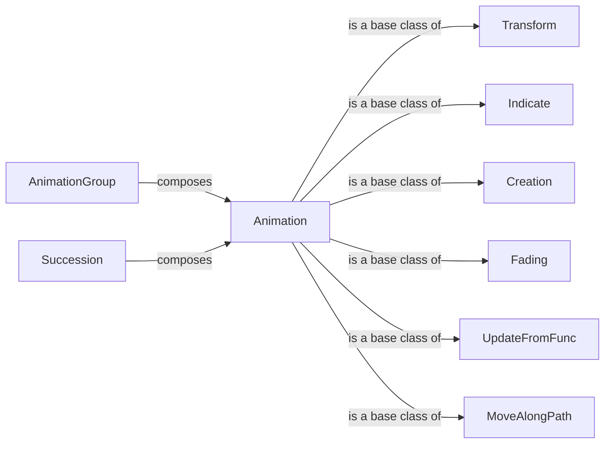

## Component Details

The Animation Engine in manim is responsible for creating dynamic visual changes in mathematical concepts. It provides a set of classes and methods for animating Mobjects, including transformations, fading, growing, and specialized effects. The engine manages the interpolation and updating of Mobjects over time, bringing mathematical concepts to life through dynamic visual changes. The core of the engine revolves around the `Animation` base class, which defines the structure for all animations. Subclasses like `Transform`, `Indicate`, `Creation`, and `Fading` provide specific animation types. `AnimationGroup` and `Succession` allow for combining multiple animations. `UpdateFromFunc` enables custom animations based on functions, and `MoveAlongPath` facilitates movement along defined trajectories.

### Animation
The base class for all animations in manim. It defines the basic structure and methods for creating and updating animations, including interpolation, updating mobjects, and cleaning up after the animation is finished. It serves as the foundation for all other animation types.
- **Related Classes/Methods**: `manim.manimlib.animation.animation.Animation`

### Transform
A subclass of Animation that focuses on transforming one mobject into another. It handles the creation of a target mobject and the interpolation between the starting and target states. It's a fundamental animation for morphing shapes and changing properties.
- **Related Classes/Methods**: `manim.manimlib.animation.transform.Transform`

### Indicate
A family of animations that highlight or emphasize a mobject, such as flashing, circling, or focusing on it. These animations often involve creating temporary visual elements to draw attention to the mobject.
- **Related Classes/Methods**: `manim.manimlib.animation.indication.Indicate`, `manim.manimlib.animation.indication.Flash`, `manim.manimlib.animation.indication.FocusOn`

### Creation
A set of animations that create mobjects, such as drawing a line or writing text. These animations often involve gradually revealing the mobject over time.
- **Related Classes/Methods**: `manim.manimlib.animation.creation.ShowCreation`, `manim.manimlib.animation.creation.Write`, `manim.manimlib.animation.creation.DrawBorderThenFill`

### AnimationGroup
A class that allows multiple animations to be played simultaneously. It manages the timing and interpolation of its constituent animations, enabling complex, coordinated effects.
- **Related Classes/Methods**: `manim.manimlib.animation.composition.AnimationGroup`

### Succession
A class that plays animations sequentially, one after the other. It manages the timing and order of its constituent animations, creating a chain of effects.
- **Related Classes/Methods**: `manim.manimlib.animation.composition.Succession`

### Fading
A set of animations that control the opacity of mobjects, such as fading in or fading out. These animations often involve changing the alpha value of the mobject's color.
- **Related Classes/Methods**: `manim.manimlib.animation.fading.Fade`, `manim.manimlib.animation.fading.FadeIn`, `manim.manimlib.animation.fading.FadeOut`

### UpdateFromFunc
Animation that updates the mobject based on a provided function. This allows for highly customizable and dynamic animations where the mobject's state is directly controlled by a function over time.
- **Related Classes/Methods**: `manim.manimlib.animation.update.UpdateFromFunc`

### MoveAlongPath
Animation that moves a mobject along a specified path. This is useful for creating animations where objects follow a specific trajectory.
- **Related Classes/Methods**: `manim.manimlib.animation.movement.MoveAlongPath`
