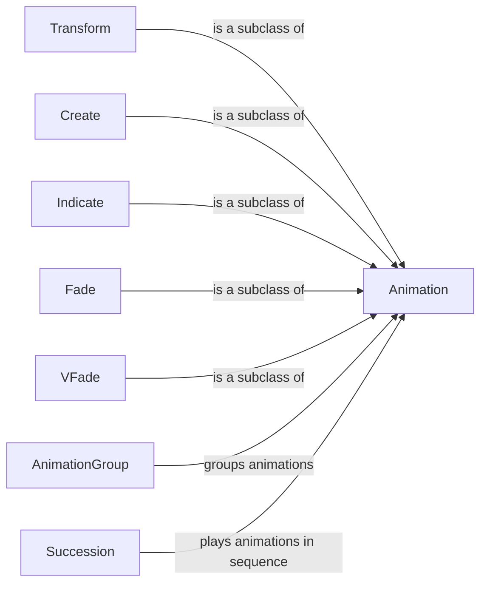

## Component Details

The Animation Engine in manim is responsible for creating dynamic visual changes in mathematical concepts. It provides a set of classes and methods for defining, updating, and managing animations of Mobjects over time. The engine handles interpolation, transformations, fading, and other specialized effects, allowing users to bring mathematical ideas to life through engaging and informative animations. The core of the engine revolves around the Animation class, which serves as the base for all other animation types. Subclasses like Transform, Create, Indicate, Fade, and VFade extend the Animation class to provide specific animation functionalities. Composition classes like AnimationGroup and Succession allow for combining multiple animations to create complex effects.

### Animation
The base class for all animations in manim. It defines the basic structure for creating, updating, and cleaning up animations. It handles the interpolation of Mobjects over time and provides methods for managing the animation's duration and timing. It serves as an abstract class, providing common functionalities for all its subclasses.
- **Related Classes/Methods**: `manim.manimlib.animation.animation.Animation`

### Transform
A subclass of Animation that focuses on transforming Mobjects from one state to another. It provides mechanisms for defining the target state of a Mobject and interpolating between the starting and target states. It is used for animations that involve changes in position, size, shape, or other properties of a Mobject.
- **Related Classes/Methods**: `manim.manimlib.animation.transform.Transform`

### Create
A subclass of Animation that specifically handles the creation of Mobjects. It defines how a Mobject is drawn or revealed over time. Includes also Uncreate and DrawBorderThenFill. It is used for animations that involve the appearance of a Mobject on the screen.
- **Related Classes/Methods**: `manim.manimlib.animation.creation.ShowCreation`, `manim.manimlib.animation.creation.Uncreate`, `manim.manimlib.animation.creation.DrawBorderThenFill`

### Indicate
A class of animations used to highlight or draw attention to specific parts of a Mobject. It includes animations like Flash, FocusOn, and CircleIndicate. It is used for animations that involve emphasizing or drawing attention to a specific Mobject or part of a Mobject.
- **Related Classes/Methods**: `manim.manimlib.animation.indication.Indicate`, `manim.manimlib.animation.indication.Flash`, `manim.manimlib.animation.indication.FocusOn`, `manim.manimlib.animation.indication.CircleIndicate`

### Fade
A class of animations used to fade Mobjects in or out. It includes animations like FadeIn, FadeOut, and FadeTransform. It is used for animations that involve the gradual appearance or disappearance of a Mobject.
- **Related Classes/Methods**: `manim.manimlib.animation.fading.Fade`, `manim.manimlib.animation.fading.FadeIn`, `manim.manimlib.animation.fading.FadeOut`, `manim.manimlib.animation.fading.FadeTransform`

### VFade
A class of animations used to fade submobjects in or out. It includes animations like VFadeIn, VFadeOut, and VFadeInThenOut. It is used for animations that involve the gradual appearance or disappearance of parts of a Mobject.
- **Related Classes/Methods**: `manim.manimlib.animation.fading.VFadeIn`, `manim.manimlib.animation.fading.VFadeOut`, `manim.manimlib.animation.fading.VFadeInThenOut`

### AnimationGroup
A class for grouping multiple animations together and playing them simultaneously. It allows for complex animations to be built from simpler ones. It is used for animations that involve multiple actions happening at the same time.
- **Related Classes/Methods**: `manim.manimlib.animation.composition.AnimationGroup`

### Succession
A class for playing multiple animations in sequence, one after the other. It provides a way to create animations that unfold over time in a specific order. It is used for animations that involve a series of actions happening one after the other.
- **Related Classes/Methods**: `manim.manimlib.animation.composition.Succession`
