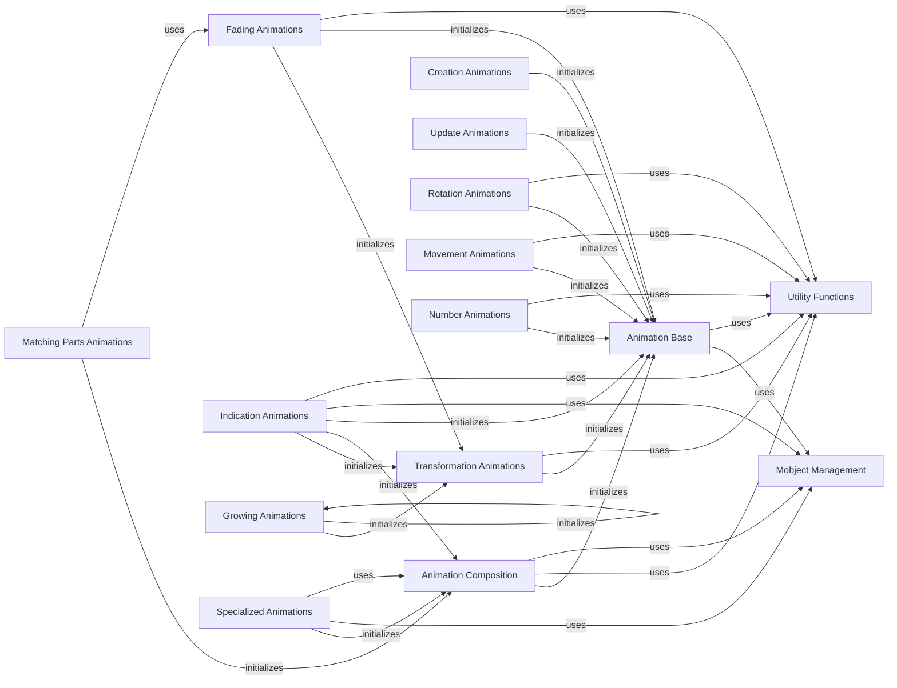

## Component Details

This component provides the framework for creating and managing dynamic visual changes (animations) of Mobjects. It defines the base animation class, handles interpolation of Mobject properties over time, and offers mechanisms for composing multiple animations into complex sequences and various visual transformations.

### Animation Base
This component defines the fundamental structure and behavior of all animations in Manim. It provides methods for initializing, beginning, finishing, and interpolating animations, as well as managing the mobjects involved.

**Related Classes/Methods**:

- <a href="https://github.com/3b1b/manim/blob/master/manimlib/animation/animation.py#L23-L203" target="_blank" rel="noopener noreferrer">`manim.manimlib.animation.animation.Animation` (23:203)</a>
- <a href="https://github.com/3b1b/manim/blob/master/manimlib/animation/animation.py#L60-L74" target="_blank" rel="noopener noreferrer">`manim.manimlib.animation.animation.Animation:begin` (60:74)</a>
- <a href="https://github.com/3b1b/manim/blob/master/manimlib/animation/animation.py#L135-L136" target="_blank" rel="noopener noreferrer">`manim.manimlib.animation.animation.Animation:interpolate` (135:136)</a>
- <a href="https://github.com/3b1b/manim/blob/master/manimlib/utils/rate_functions.py#L17-L21" target="_blank" rel="noopener noreferrer">`manimlib.utils.rate_functions.smooth` (17:21)</a>
- <a href="https://github.com/3b1b/manim/blob/master/manimlib/utils/simple_functions.py#L40-L45" target="_blank" rel="noopener noreferrer">`manimlib.utils.simple_functions.clip` (40:45)</a>
- <a href="https://github.com/3b1b/manim/blob/master/manimlib/utils/iterables.py#L17-L22" target="_blank" rel="noopener noreferrer">`manimlib.utils.iterables.remove_list_redundancies` (17:22)</a>
- <a href="https://github.com/3b1b/manim/blob/master/manimlib/mobject/mobject.py#L64-L2166" target="_blank" rel="noopener noreferrer">`manimlib.mobject.mobject.Mobject` (64:2166)</a>

### Transformation Animations
This component handles animations that transform one mobject into another, including scaling, rotating, moving, and applying functions or matrices. It extends the base Animation class to manage target mobjects and define transformation paths.

**Related Classes/Methods**:

- <a href="https://github.com/3b1b/manim/blob/master/manimlib/animation/transform.py#L24-L129" target="_blank" rel="noopener noreferrer">`manim.manimlib.animation.transform.Transform` (24:129)</a>
- <a href="https://github.com/3b1b/manim/blob/master/manimlib/animation/transform.py#L27-L41" target="_blank" rel="noopener noreferrer">`manim.manimlib.animation.transform.Transform:__init__` (27:41)</a>
- <a href="https://github.com/3b1b/manim/blob/master/manimlib/animation/transform.py#L132-L133" target="_blank" rel="noopener noreferrer">`manim.manimlib.animation.transform.ReplacementTransform` (132:133)</a>
- <a href="https://github.com/3b1b/manim/blob/master/manimlib/animation/transform.py#L136-L140" target="_blank" rel="noopener noreferrer">`manim.manimlib.animation.transform.TransformFromCopy` (136:140)</a>
- <a href="https://github.com/3b1b/manim/blob/master/manimlib/animation/transform.py#L143-L152" target="_blank" rel="noopener noreferrer">`manim.manimlib.animation.transform.MoveToTarget` (143:152)</a>
- <a href="https://github.com/3b1b/manim/blob/master/manimlib/animation/transform.py#L155-L158" target="_blank" rel="noopener noreferrer">`manim.manimlib.animation.transform._MethodAnimation` (155:158)</a>
- <a href="https://github.com/3b1b/manim/blob/master/manimlib/animation/transform.py#L161-L195" target="_blank" rel="noopener noreferrer">`manim.manimlib.animation.transform.ApplyMethod` (161:195)</a>
- <a href="https://github.com/3b1b/manim/blob/master/manimlib/animation/transform.py#L198-L206" target="_blank" rel="noopener noreferrer">`manim.manimlib.animation.transform.ApplyPointwiseFunction` (198:206)</a>
- <a href="https://github.com/3b1b/manim/blob/master/manimlib/animation/transform.py#L209-L220" target="_blank" rel="noopener noreferrer">`manim.manimlib.animation.transform.ApplyPointwiseFunctionToCenter` (209:220)</a>
- <a href="https://github.com/3b1b/manim/blob/master/manimlib/animation/transform.py#L223-L230" target="_blank" rel="noopener noreferrer">`manim.manimlib.animation.transform.FadeToColor` (223:230)</a>
- <a href="https://github.com/3b1b/manim/blob/master/manimlib/animation/transform.py#L233-L240" target="_blank" rel="noopener noreferrer">`manim.manimlib.animation.transform.ScaleInPlace` (233:240)</a>
- <a href="https://github.com/3b1b/manim/blob/master/manimlib/animation/transform.py#L243-L245" target="_blank" rel="noopener noreferrer">`manim.manimlib.animation.transform.ShrinkToCenter` (243:245)</a>
- <a href="https://github.com/3b1b/manim/blob/master/manimlib/animation/transform.py#L248-L252" target="_blank" rel="noopener noreferrer">`manim.manimlib.animation.transform.Restore` (248:252)</a>
- <a href="https://github.com/3b1b/manim/blob/master/manimlib/animation/transform.py#L255-L269" target="_blank" rel="noopener noreferrer">`manim.manimlib.animation.transform.ApplyFunction` (255:269)</a>
- <a href="https://github.com/3b1b/manim/blob/master/manimlib/animation/transform.py#L272-L294" target="_blank" rel="noopener noreferrer">`manim.manimlib.animation.transform.ApplyMatrix` (272:294)</a>
- <a href="https://github.com/3b1b/manim/blob/master/manimlib/animation/transform.py#L297-L311" target="_blank" rel="noopener noreferrer">`manim.manimlib.animation.transform.ApplyComplexFunction` (297:311)</a>
- <a href="https://github.com/3b1b/manim/blob/master/manimlib/animation/transform.py#L316-L326" target="_blank" rel="noopener noreferrer">`manim.manimlib.animation.transform.CyclicReplace` (316:326)</a>
- <a href="https://github.com/3b1b/manim/blob/master/manimlib/utils/paths.py#L36-L58" target="_blank" rel="noopener noreferrer">`manimlib.utils.paths.path_along_arc` (36:58)</a>
- <a href="https://github.com/3b1b/manim/blob/master/manimlib/utils/paths.py#L22-L33" target="_blank" rel="noopener noreferrer">`manimlib.utils.paths.straight_path` (22:33)</a>

### Fading Animations
This component provides various animations for fading mobjects in and out, or transforming them with a fading effect. It includes animations for simple fades, fades from/to a point, and more complex fade transformations.

**Related Classes/Methods**:

- <a href="https://github.com/3b1b/manim/blob/master/manimlib/animation/fading.py#L21-L31" target="_blank" rel="noopener noreferrer">`manim.manimlib.animation.fading.Fade` (21:31)</a>
- <a href="https://github.com/3b1b/manim/blob/master/manimlib/animation/fading.py#L34-L43" target="_blank" rel="noopener noreferrer">`manim.manimlib.animation.fading.FadeIn` (34:43)</a>
- <a href="https://github.com/3b1b/manim/blob/master/manimlib/animation/fading.py#L46-L67" target="_blank" rel="noopener noreferrer">`manim.manimlib.animation.fading.FadeOut` (46:67)</a>
- <a href="https://github.com/3b1b/manim/blob/master/manimlib/animation/fading.py#L70-L77" target="_blank" rel="noopener noreferrer">`manim.manimlib.animation.fading.FadeInFromPoint` (70:77)</a>
- <a href="https://github.com/3b1b/manim/blob/master/manimlib/animation/fading.py#L80-L87" target="_blank" rel="noopener noreferrer">`manim.manimlib.animation.fading.FadeOutToPoint` (80:87)</a>
- <a href="https://github.com/3b1b/manim/blob/master/manimlib/animation/fading.py#L90-L136" target="_blank" rel="noopener noreferrer">`manim.manimlib.animation.fading.FadeTransform` (90:136)</a>
- <a href="https://github.com/3b1b/manim/blob/master/manimlib/animation/fading.py#L139-L146" target="_blank" rel="noopener noreferrer">`manim.manimlib.animation.fading.FadeTransformPieces` (139:146)</a>
- <a href="https://github.com/3b1b/manim/blob/master/manimlib/animation/fading.py#L149-L171" target="_blank" rel="noopener noreferrer">`manim.manimlib.animation.fading.VFadeIn` (149:171)</a>
- <a href="https://github.com/3b1b/manim/blob/master/manimlib/animation/fading.py#L174-L195" target="_blank" rel="noopener noreferrer">`manim.manimlib.animation.fading.VFadeOut` (174:195)</a>
- <a href="https://github.com/3b1b/manim/blob/master/manimlib/animation/fading.py#L198-L213" target="_blank" rel="noopener noreferrer">`manim.manimlib.animation.fading.VFadeInThenOut` (198:213)</a>
- <a href="https://github.com/3b1b/manim/blob/master/manimlib/utils/bezier.py#L97-L105" target="_blank" rel="noopener noreferrer">`manimlib.utils.bezier.interpolate` (97:105)</a>

### Animation Composition
This component allows for combining multiple animations into a single, more complex animation. It provides classes for grouping animations, playing them in succession, or with lagged start times.

**Related Classes/Methods**:

- <a href="https://github.com/3b1b/manim/blob/master/manimlib/animation/composition.py#L27-L121" target="_blank" rel="noopener noreferrer">`manim.manimlib.animation.composition.AnimationGroup` (27:121)</a>
- <a href="https://github.com/3b1b/manim/blob/master/manimlib/animation/composition.py#L28-L58" target="_blank" rel="noopener noreferrer">`manim.manimlib.animation.composition.AnimationGroup:__init__` (28:58)</a>
- <a href="https://github.com/3b1b/manim/blob/master/manimlib/animation/composition.py#L124-L153" target="_blank" rel="noopener noreferrer">`manim.manimlib.animation.composition.Succession` (124:153)</a>
- <a href="https://github.com/3b1b/manim/blob/master/manimlib/animation/composition.py#L156-L163" target="_blank" rel="noopener noreferrer">`manim.manimlib.animation.composition.LaggedStart` (156:163)</a>
- <a href="https://github.com/3b1b/manim/blob/master/manimlib/animation/composition.py#L166-L182" target="_blank" rel="noopener noreferrer">`manim.manimlib.animation.composition.LaggedStartMap` (166:182)</a>
- <a href="https://github.com/3b1b/manim/blob/master/manimlib/animation/animation.py#L206-L213" target="_blank" rel="noopener noreferrer">`manimlib.animation.animation.prepare_animation` (206:213)</a>
- <a href="https://github.com/3b1b/manim/blob/master/manimlib/utils/bezier.py#L128-L150" target="_blank" rel="noopener noreferrer">`manimlib.utils.bezier.integer_interpolate` (128:150)</a>
- <a href="https://github.com/3b1b/manim/blob/master/manimlib/mobject/types/vectorized_mobject.py#L1298-L1313" target="_blank" rel="noopener noreferrer">`manimlib.mobject.types.vectorized_mobject.VGroup` (1298:1313)</a>
- <a href="https://github.com/3b1b/manim/blob/master/manimlib/mobject/mobject.py#L2169-L2190" target="_blank" rel="noopener noreferrer">`manimlib.mobject.mobject.Group` (2169:2190)</a>

### Creation Animations
This component focuses on animations that visually create mobjects on the screen, such as drawing borders, filling shapes, or writing text.

**Related Classes/Methods**:

- <a href="https://github.com/3b1b/manim/blob/master/manimlib/animation/creation.py#L25-L45" target="_blank" rel="noopener noreferrer">`manim.manimlib.animation.creation.ShowPartial` (25:45)</a>
- <a href="https://github.com/3b1b/manim/blob/master/manimlib/animation/creation.py#L48-L53" target="_blank" rel="noopener noreferrer">`manim.manimlib.animation.creation.ShowCreation` (48:53)</a>
- <a href="https://github.com/3b1b/manim/blob/master/manimlib/animation/creation.py#L56-L71" target="_blank" rel="noopener noreferrer">`manim.manimlib.animation.creation.Uncreate` (56:71)</a>
- <a href="https://github.com/3b1b/manim/blob/master/manimlib/animation/creation.py#L74-L141" target="_blank" rel="noopener noreferrer">`manim.manimlib.animation.creation.DrawBorderThenFill` (74:141)</a>
- <a href="https://github.com/3b1b/manim/blob/master/manimlib/animation/creation.py#L144-L174" target="_blank" rel="noopener noreferrer">`manim.manimlib.animation.creation.Write` (144:174)</a>
- <a href="https://github.com/3b1b/manim/blob/master/manimlib/animation/creation.py#L177-L200" target="_blank" rel="noopener noreferrer">`manim.manimlib.animation.creation.ShowIncreasingSubsets` (177:200)</a>
- <a href="https://github.com/3b1b/manim/blob/master/manimlib/animation/creation.py#L203-L217" target="_blank" rel="noopener noreferrer">`manim.manimlib.animation.creation.ShowSubmobjectsOneByOne` (203:217)</a>
- <a href="https://github.com/3b1b/manim/blob/master/manimlib/animation/creation.py#L220-L244" target="_blank" rel="noopener noreferrer">`manim.manimlib.animation.creation.AddTextWordByWord` (220:244)</a>

### Indication Animations
This component provides animations used to highlight or draw attention to specific mobjects, such as focusing on a point, flashing, or circling.

**Related Classes/Methods**:

- <a href="https://github.com/3b1b/manim/blob/master/manimlib/animation/indication.py#L41-L70" target="_blank" rel="noopener noreferrer">`manim.manimlib.animation.indication.FocusOn` (41:70)</a>
- <a href="https://github.com/3b1b/manim/blob/master/manimlib/animation/indication.py#L73-L90" target="_blank" rel="noopener noreferrer">`manim.manimlib.animation.indication.Indicate` (73:90)</a>
- <a href="https://github.com/3b1b/manim/blob/master/manimlib/animation/indication.py#L93-L139" target="_blank" rel="noopener noreferrer">`manim.manimlib.animation.indication.Flash` (93:139)</a>
- <a href="https://github.com/3b1b/manim/blob/master/manimlib/animation/indication.py#L142-L162" target="_blank" rel="noopener noreferrer">`manim.manimlib.animation.indication.CircleIndicate` (142:162)</a>
- <a href="https://github.com/3b1b/manim/blob/master/manimlib/animation/indication.py#L165-L191" target="_blank" rel="noopener noreferrer">`manim.manimlib.animation.indication.ShowPassingFlash` (165:191)</a>
- <a href="https://github.com/3b1b/manim/blob/master/manimlib/animation/indication.py#L194-L252" target="_blank" rel="noopener noreferrer">`manim.manimlib.animation.indication.VShowPassingFlash` (194:252)</a>
- <a href="https://github.com/3b1b/manim/blob/master/manimlib/animation/indication.py#L255-L276" target="_blank" rel="noopener noreferrer">`manim.manimlib.animation.indication.FlashAround` (255:276)</a>
- <a href="https://github.com/3b1b/manim/blob/master/manimlib/animation/indication.py#L279-L281" target="_blank" rel="noopener noreferrer">`manim.manimlib.animation.indication.FlashUnder` (279:281)</a>
- <a href="https://github.com/3b1b/manim/blob/master/manimlib/animation/indication.py#L284-L286" target="_blank" rel="noopener noreferrer">`manim.manimlib.animation.indication.ShowCreationThenDestruction` (284:286)</a>
- <a href="https://github.com/3b1b/manim/blob/master/manimlib/animation/indication.py#L289-L296" target="_blank" rel="noopener noreferrer">`manim.manimlib.animation.indication.ShowCreationThenFadeOut` (289:296)</a>
- <a href="https://github.com/3b1b/manim/blob/master/manimlib/animation/indication.py#L299-L317" target="_blank" rel="noopener noreferrer">`manim.manimlib.animation.indication.AnimationOnSurroundingRectangle` (299:317)</a>
- <a href="https://github.com/3b1b/manim/blob/master/manimlib/animation/indication.py#L332-L352" target="_blank" rel="noopener noreferrer">`manim.manimlib.animation.indication.ApplyWave` (332:352)</a>
- <a href="https://github.com/3b1b/manim/blob/master/manimlib/animation/indication.py#L355-L394" target="_blank" rel="noopener noreferrer">`manim.manimlib.animation.indication.WiggleOutThenIn` (355:394)</a>
- <a href="https://github.com/3b1b/manim/blob/master/manimlib/animation/indication.py#L397-L405" target="_blank" rel="noopener noreferrer">`manim.manimlib.animation.indication.TurnInsideOut` (397:405)</a>
- <a href="https://github.com/3b1b/manim/blob/master/manimlib/animation/indication.py#L408-L425" target="_blank" rel="noopener noreferrer">`manim.manimlib.animation.indication.FlashyFadeIn` (408:425)</a>
- <a href="https://github.com/3b1b/manim/blob/master/manimlib/mobject/geometry.py#L290-L322" target="_blank" rel="noopener noreferrer">`manimlib.mobject.geometry.Circle` (290:322)</a>
- <a href="https://github.com/3b1b/manim/blob/master/manimlib/mobject/geometry.py#L325-L344" target="_blank" rel="noopener noreferrer">`manimlib.mobject.geometry.Dot` (325:344)</a>
- <a href="https://github.com/3b1b/manim/blob/master/manimlib/mobject/geometry.py#L446-L562" target="_blank" rel="noopener noreferrer">`manimlib.mobject.geometry.Line` (446:562)</a>
- <a href="https://github.com/3b1b/manim/blob/master/manimlib/mobject/shape_matchers.py#L22-L45" target="_blank" rel="noopener noreferrer">`manimlib.mobject.shape_matchers.SurroundingRectangle` (22:45)</a>
- <a href="https://github.com/3b1b/manim/blob/master/manimlib/mobject/shape_matchers.py#L116-L131" target="_blank" rel="noopener noreferrer">`manimlib.mobject.shape_matchers.Underline` (116:131)</a>
- <a href="https://github.com/3b1b/manim/blob/master/manimlib/mobject/mobject.py#L840-L846" target="_blank" rel="noopener noreferrer">`manimlib.mobject.mobject.Mobject.add_updater` (840:846)</a>
- <a href="https://github.com/3b1b/manim/blob/master/manimlib/mobject/mobject.py#L707-L710" target="_blank" rel="noopener noreferrer">`manimlib.mobject.mobject.Mobject.save_state` (707:710)</a>
- <a href="https://github.com/3b1b/manim/blob/master/manimlib/mobject/mobject.py#L1165-L1166" target="_blank" rel="noopener noreferrer">`manimlib.mobject.mobject.Mobject.set_width` (1165:1166)</a>
- <a href="https://github.com/3b1b/manim/blob/master/manimlib/mobject/types/vectorized_mobject.py#L174-L204" target="_blank" rel="noopener noreferrer">`manimlib.mobject.types.vectorized_mobject.VMobject.set_stroke` (174:204)</a>
- <a href="https://github.com/3b1b/manim/blob/master/manimlib/mobject/mobject.py#L456-L465" target="_blank" rel="noopener noreferrer">`manimlib.mobject.mobject.Mobject.add` (456:465)</a>
- <a href="https://github.com/3b1b/manim/blob/master/manimlib/mobject/types/vectorized_mobject.py#L906-L916" target="_blank" rel="noopener noreferrer">`manimlib.mobject.types.vectorized_mobject.VMobject.rotate` (906:916)</a>
- <a href="https://github.com/3b1b/manim/blob/master/manimlib/mobject/mobject.py#L916-L922" target="_blank" rel="noopener noreferrer">`manimlib.mobject.mobject.Mobject.shift` (916:922)</a>
- <a href="https://github.com/3b1b/manim/blob/master/manimlib/mobject/types/vectorized_mobject.py#L159-L172" target="_blank" rel="noopener noreferrer">`manimlib.mobject.types.vectorized_mobject.VMobject.set_fill` (159:172)</a>
- <a href="https://github.com/3b1b/manim/blob/master/manimlib/mobject/geometry.py#L303-L313" target="_blank" rel="noopener noreferrer">`manimlib.mobject.geometry.Circle.surround` (303:313)</a>
- <a href="https://github.com/3b1b/manim/blob/master/manimlib/mobject/mobject.py#L661-L700" target="_blank" rel="noopener noreferrer">`manimlib.mobject.mobject.Mobject.copy` (661:700)</a>
- <a href="https://github.com/3b1b/manim/blob/master/manimlib/mobject/mobject.py#L1912-L1914" target="_blank" rel="noopener noreferrer">`manimlib.mobject.mobject.Mobject.fix_in_frame` (1912:1914)</a>
- <a href="https://github.com/3b1b/manim/blob/master/manimlib/mobject/types/vectorized_mobject.py#L977-L982" target="_blank" rel="noopener noreferrer">`manimlib.mobject.types.vectorized_mobject.VMobject.insert_n_curves` (977:982)</a>
- <a href="https://github.com/3b1b/manim/blob/master/manimlib/mobject/types/vectorized_mobject.py#L1200-L1202" target="_blank" rel="noopener noreferrer">`manimlib.mobject.types.vectorized_mobject.VMobject.set_points` (1200:1202)</a>
- <a href="https://github.com/3b1b/manim/blob/master/manimlib/mobject/types/vectorized_mobject.py#L845-L850" target="_blank" rel="noopener noreferrer">`manimlib.mobject.types.vectorized_mobject.VMobject.get_points_without_null_curves` (845:850)</a>
- <a href="https://github.com/3b1b/manim/blob/master/manimlib/utils/rate_functions.py#L43-L45" target="_blank" rel="noopener noreferrer">`manimlib.utils.rate_functions.there_and_back` (43:45)</a>
- <a href="https://github.com/3b1b/manim/blob/master/manimlib/utils/rate_functions.py#L75-L76" target="_blank" rel="noopener noreferrer">`manimlib.utils.rate_functions.wiggle` (75:76)</a>
- <a href="https://github.com/3b1b/manim/blob/master/manimlib/utils/rate_functions.py#L79-L94" target="_blank" rel="noopener noreferrer">`manimlib.utils.rate_functions.squish_rate_func` (79:94)</a>

### Update Animations
This component provides animations that update mobjects based on a function or maintain their position relative to another mobject.

**Related Classes/Methods**:

- <a href="https://github.com/3b1b/manim/blob/master/manimlib/animation/update.py#L13-L34" target="_blank" rel="noopener noreferrer">`manim.manimlib.animation.update.UpdateFromFunc` (13:34)</a>
- <a href="https://github.com/3b1b/manim/blob/master/manimlib/animation/update.py#L37-L49" target="_blank" rel="noopener noreferrer">`manim.manimlib.animation.update.UpdateFromAlphaFunc` (37:49)</a>
- <a href="https://github.com/3b1b/manim/blob/master/manimlib/animation/update.py#L52-L66" target="_blank" rel="noopener noreferrer">`manim.manimlib.animation.update.MaintainPositionRelativeTo` (52:66)</a>

### Rotation Animations
This component handles animations specifically for rotating mobjects.

**Related Classes/Methods**:

- <a href="https://github.com/3b1b/manim/blob/master/manimlib/animation/rotation.py#L17-L55" target="_blank" rel="noopener noreferrer">`manim.manimlib.animation.rotation.Rotating` (17:55)</a>
- <a href="https://github.com/3b1b/manim/blob/master/manimlib/animation/rotation.py#L58-L75" target="_blank" rel="noopener noreferrer">`manim.manimlib.animation.rotation.Rotate` (58:75)</a>

### Movement Animations
This component provides animations for moving mobjects along paths or according to homotopy functions.

**Related Classes/Methods**:

- <a href="https://github.com/3b1b/manim/blob/master/manimlib/animation/movement.py#L17-L49" target="_blank" rel="noopener noreferrer">`manim.manimlib.animation.movement.Homotopy` (17:49)</a>
- <a href="https://github.com/3b1b/manim/blob/master/manimlib/animation/movement.py#L56-L72" target="_blank" rel="noopener noreferrer">`manim.manimlib.animation.movement.ComplexHomotopy` (56:72)</a>
- <a href="https://github.com/3b1b/manim/blob/master/manimlib/animation/movement.py#L75-L102" target="_blank" rel="noopener noreferrer">`manim.manimlib.animation.movement.PhaseFlow` (75:102)</a>
- <a href="https://github.com/3b1b/manim/blob/master/manimlib/animation/movement.py#L105-L118" target="_blank" rel="noopener noreferrer">`manim.manimlib.animation.movement.MoveAlongPath` (105:118)</a>

### Growing Animations
This component includes animations for making mobjects grow from a point, center, or edge, or specifically for growing arrows.

**Related Classes/Methods**:

- <a href="https://github.com/3b1b/manim/blob/master/manimlib/animation/growing.py#L15-L36" target="_blank" rel="noopener noreferrer">`manim.manimlib.animation.growing.GrowFromPoint` (15:36)</a>
- <a href="https://github.com/3b1b/manim/blob/master/manimlib/animation/growing.py#L39-L42" target="_blank" rel="noopener noreferrer">`manim.manimlib.animation.growing.GrowFromCenter` (39:42)</a>
- <a href="https://github.com/3b1b/manim/blob/master/manimlib/animation/growing.py#L45-L48" target="_blank" rel="noopener noreferrer">`manim.manimlib.animation.growing.GrowFromEdge` (45:48)</a>
- <a href="https://github.com/3b1b/manim/blob/master/manimlib/animation/growing.py#L51-L54" target="_blank" rel="noopener noreferrer">`manim.manimlib.animation.growing.GrowArrow` (51:54)</a>

### Number Animations
This component provides animations for changing decimal values or counting in from a specific number.

**Related Classes/Methods**:

- <a href="https://github.com/3b1b/manim/blob/master/manimlib/animation/numbers.py#L14-L34" target="_blank" rel="noopener noreferrer">`manim.manimlib.animation.numbers.ChangingDecimal` (14:34)</a>
- <a href="https://github.com/3b1b/manim/blob/master/manimlib/animation/numbers.py#L37-L49" target="_blank" rel="noopener noreferrer">`manim.manimlib.animation.numbers.ChangeDecimalToValue` (37:49)</a>
- <a href="https://github.com/3b1b/manim/blob/master/manimlib/animation/numbers.py#L52-L64" target="_blank" rel="noopener noreferrer">`manim.manimlib.animation.numbers.CountInFrom` (52:64)</a>

### Matching Parts Animations
This component handles animations that transform mobjects by matching their parts, useful for morphing between similar shapes or strings.

**Related Classes/Methods**:

- <a href="https://github.com/3b1b/manim/blob/master/manimlib/animation/transform_matching_parts.py#L21-L115" target="_blank" rel="noopener noreferrer">`manim.manimlib.animation.transform_matching_parts.TransformMatchingParts` (21:115)</a>
- <a href="https://github.com/3b1b/manim/blob/master/manimlib/animation/transform_matching_parts.py#L123-L186" target="_blank" rel="noopener noreferrer">`manim.manimlib.animation.transform_matching_parts.TransformMatchingStrings` (123:186)</a>

### Specialized Animations
This component includes animations with specific, often complex, visual effects that don't fit neatly into other categories.

**Related Classes/Methods**:

- <a href="https://github.com/3b1b/manim/blob/master/manimlib/animation/specialized.py#L16-L55" target="_blank" rel="noopener noreferrer">`manim.manimlib.animation.specialized.Broadcast` (16:55)</a>
- <a href="https://github.com/3b1b/manim/blob/master/manimlib/mobject/svg/drawings.py#L322-L348" target="_blank" rel="noopener noreferrer">`manim.manimlib.mobject.svg.drawings.ClockPassesTime` (322:348)</a>

### Mobject Management
This component encompasses the core Mobject classes and their methods that are frequently interacted with by animations for manipulation, grouping, and state management.

**Related Classes/Methods**:

- <a href="https://github.com/3b1b/manim/blob/master/manimlib/mobject/mobject.py#L64-L2166" target="_blank" rel="noopener noreferrer">`manimlib.mobject.mobject.Mobject` (64:2166)</a>
- <a href="https://github.com/3b1b/manim/blob/master/manimlib/mobject/mobject.py#L2169-L2190" target="_blank" rel="noopener noreferrer">`manimlib.mobject.mobject.Group` (2169:2190)</a>
- <a href="https://github.com/3b1b/manim/blob/master/manimlib/mobject/types/vectorized_mobject.py#L1298-L1313" target="_blank" rel="noopener noreferrer">`manimlib.mobject.types.vectorized_mobject.VGroup` (1298:1313)</a>
- <a href="https://github.com/3b1b/manim/blob/master/manimlib/mobject/types/vectorized_mobject.py#L60-L1295" target="_blank" rel="noopener noreferrer">`manimlib.mobject.types.vectorized_mobject.VMobject` (60:1295)</a>

### Utility Functions
This component groups various utility functions used across different animation types for common mathematical operations, rate functions, and iterable manipulations.

**Related Classes/Methods**:

- <a href="https://github.com/3b1b/manim/blob/master/manimlib/utils/rate_functions.py#L17-L21" target="_blank" rel="noopener noreferrer">`manimlib.utils.rate_functions.smooth` (17:21)</a>
- <a href="https://github.com/3b1b/manim/blob/master/manimlib/utils/rate_functions.py#L43-L45" target="_blank" rel="noopener noreferrer">`manimlib.utils.rate_functions.there_and_back` (43:45)</a>
- <a href="https://github.com/3b1b/manim/blob/master/manimlib/utils/rate_functions.py#L79-L94" target="_blank" rel="noopener noreferrer">`manimlib.utils.rate_functions.squish_rate_func` (79:94)</a>
- <a href="https://github.com/3b1b/manim/blob/master/manimlib/utils/rate_functions.py#L75-L76" target="_blank" rel="noopener noreferrer">`manimlib.utils.rate_functions.wiggle` (75:76)</a>
- <a href="https://github.com/3b1b/manim/blob/master/manimlib/utils/bezier.py#L97-L105" target="_blank" rel="noopener noreferrer">`manimlib.utils.bezier.interpolate` (97:105)</a>
- <a href="https://github.com/3b1b/manim/blob/master/manimlib/utils/bezier.py#L128-L150" target="_blank" rel="noopener noreferrer">`manimlib.utils.bezier.integer_interpolate` (128:150)</a>
- <a href="https://github.com/3b1b/manim/blob/master/manimlib/utils/simple_functions.py#L40-L45" target="_blank" rel="noopener noreferrer">`manimlib.utils.simple_functions.clip` (40:45)</a>
- <a href="https://github.com/3b1b/manim/blob/master/manimlib/utils/iterables.py#L17-L22" target="_blank" rel="noopener noreferrer">`manimlib.utils.iterables.remove_list_redundancies` (17:22)</a>
- <a href="https://github.com/3b1b/manim/blob/master/manimlib/utils/paths.py#L36-L58" target="_blank" rel="noopener noreferrer">`manimlib.utils.paths.path_along_arc` (36:58)</a>
- <a href="https://github.com/3b1b/manim/blob/master/manimlib/utils/paths.py#L22-L33" target="_blank" rel="noopener noreferrer">`manimlib.utils.paths.straight_path` (22:33)</a>

### [FAQ](https://github.com/CodeBoarding/GeneratedOnBoardings/tree/main?tab=readme-ov-file#faq)