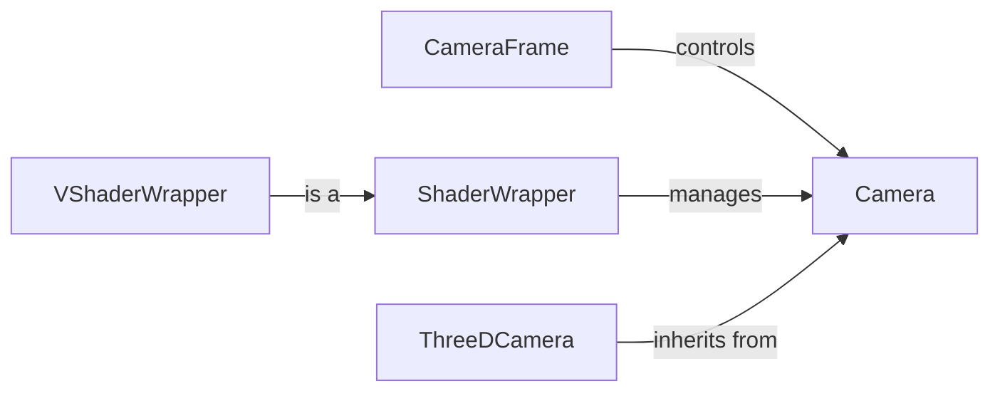

## Component Details

The Camera and Rendering subsystem in Manim is responsible for generating the final visual output of a scene. It involves capturing the scene from a specific viewpoint, applying lighting and transformations, and rendering the result to a frame buffer. The Camera component manages the overall rendering process, while the CameraFrame component controls the camera's position and orientation. Shaders, managed by the ShaderWrapper and VShaderWrapper components, are used to apply visual effects and transformations to the rendered scene. The ThreeDCamera extends the Camera for 3D scenes.

### Camera
The Camera class is responsible for capturing the scene. It initializes the frame buffer object (FBO), light source, and other camera parameters. It provides methods for capturing the scene, retrieving the rendered image as a pixel array or texture, and managing camera uniforms. It orchestrates the rendering process.
- **Related Classes/Methods**: `manim.manimlib.camera.camera.Camera`

### CameraFrame
The CameraFrame class controls the viewpoint and orientation of the camera. It provides methods for rotating, reorienting, and interpolating the camera frame. It also provides methods for getting and setting camera parameters such as focal distance, aspect ratio, and center. It essentially defines the camera's perspective.
- **Related Classes/Methods**: `manim.manimlib.camera.camera_frame.CameraFrame`

### ShaderWrapper
The ShaderWrapper class manages the shaders used to process the rendered output. It initializes the shader program, textures, and uniforms. It provides methods for replacing shader code, updating program uniforms, and pre-rendering the scene. It's a base class for managing shader programs.
- **Related Classes/Methods**: `manim.manimlib.shader_wrapper.ShaderWrapper`

### VShaderWrapper
The VShaderWrapper class is a subclass of ShaderWrapper that is specifically used for vertex shaders. It provides methods for refreshing the shader ID and rendering the scene using the vertex shader. It specializes in handling vertex shaders.
- **Related Classes/Methods**: `manim.manimlib.shader_wrapper.VShaderWrapper`

### ThreeDCamera
A subclass of Camera specifically designed for rendering 3D scenes. It inherits from the Camera class and extends its functionality to handle 3D-specific rendering tasks. It provides specialized rendering for 3D scenes.
- **Related Classes/Methods**: `manim.manimlib.camera.camera.ThreeDCamera`
