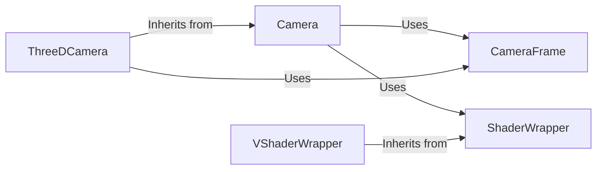

## Component Details

The Camera and Rendering subsystem in Manim is responsible for creating the visual output of mathematical animations. It involves capturing the scene from a specified viewpoint, applying transformations, managing lighting and shaders, and rendering the final image to a frame buffer. The Camera class orchestrates the rendering process, utilizing CameraFrame to define the viewpoint, and ShaderWrapper (including VShaderWrapper) to apply visual effects. The final rendered output can then be displayed or saved.

### Camera
The Camera class is the central component for rendering scenes. It initializes the frame buffer object (FBO), manages the light source, and sets up camera parameters. It provides methods for capturing the scene, retrieving the rendered image as a pixel array or texture, and managing camera uniforms. It uses ShaderWrapper to apply shaders and CameraFrame to define the viewpoint.
- **Related Classes/Methods**: `manim.manimlib.camera.camera.Camera`

### CameraFrame
The CameraFrame class controls the viewpoint and orientation of the camera. It provides methods for setting and getting Euler angles, rotating the camera, and interpolating between different camera positions. It also manages the camera's focal distance and aspect ratio, influencing how the scene is projected onto the screen.
- **Related Classes/Methods**: `manim.manimlib.camera.camera_frame.CameraFrame`

### ShaderWrapper
The ShaderWrapper class manages the shaders used for rendering. It initializes the shader program, reads in shader code, replaces code snippets, and updates shader uniforms. It also handles texture management and pre-rendering tasks, allowing for complex visual effects to be applied to the scene.
- **Related Classes/Methods**: `manim.manimlib.shader_wrapper.ShaderWrapper`

### VShaderWrapper
The VShaderWrapper class is a subclass of ShaderWrapper specifically for vertex shaders. It handles the initialization, refreshing, and rendering processes specific to vertex shaders, which are crucial for transforming the geometry of the scene.
- **Related Classes/Methods**: `manim.manimlib.shader_wrapper.VShaderWrapper`

### ThreeDCamera
The ThreeDCamera class extends the Camera class to handle 3D scenes. It incorporates perspective projection and depth information management, enabling the rendering of 3D objects with realistic depth and perspective. It utilizes CameraFrame for viewpoint control and ShaderWrapper for applying 3D-specific shaders.
- **Related Classes/Methods**: `manim.manimlib.camera.camera.ThreeDCamera`
