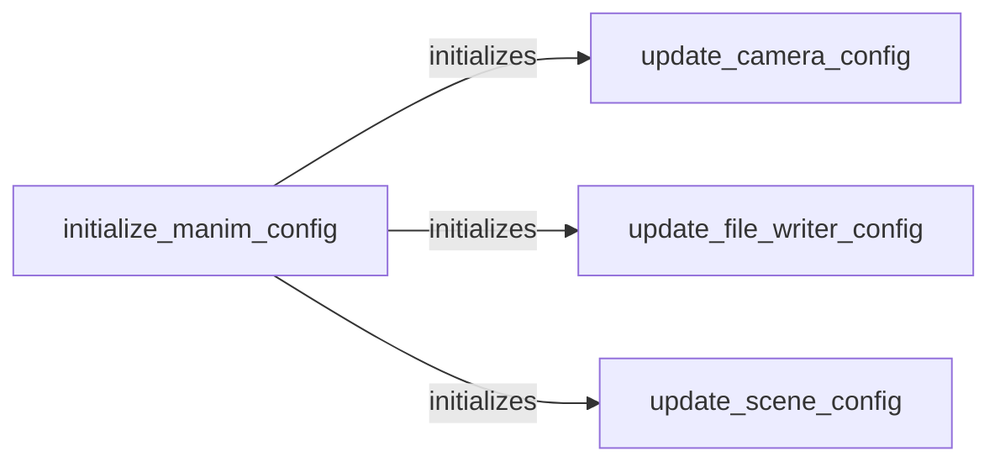

## Component Details

The Configuration Management subsystem in Manim is responsible for initializing, managing, and updating the configuration settings that govern the behavior of the entire animation environment. It ensures that the necessary parameters for file output, camera settings, and scene-specific configurations are properly set up, allowing for customization and control over the rendering process. The core of this subsystem involves initializing the global configuration and providing mechanisms to update specific aspects such as camera, file writer, and scene configurations.

### initialize_manim_config
This component initializes the global Manim configuration by setting default values for various parameters. It reads configuration files, sets up the initial environment, and prepares the system for rendering. This includes setting up the file paths, default camera settings, and other global parameters.
- **Related Classes/Methods**: `manim.manimlib.config.initialize_manim_config`

### update_camera_config
This component updates the configuration settings specifically related to the camera. It allows for customization of camera properties such as resolution, field of view, and other camera-specific parameters, enabling users to adjust the camera's behavior according to their needs.
- **Related Classes/Methods**: `manim.manimlib.config.update_camera_config`

### update_file_writer_config
This component updates the configuration settings related to how Manim writes output files. It allows specifying the output directory, file format, and other file-writing options, providing control over the output process and ensuring that the rendered animations are saved in the desired format and location.
- **Related Classes/Methods**: `manim.manimlib.config.update_file_writer_config`

### update_scene_config
This component updates the configuration settings specific to the current scene being rendered. It allows for scene-specific overrides of the global configuration, providing flexibility in customizing individual scenes without affecting the global settings. This is useful for adjusting parameters like background color or frame rate on a per-scene basis.
- **Related Classes/Methods**: `manim.manimlib.config.update_scene_config`
