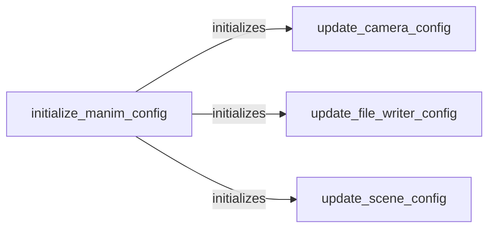

## Component Details

The Configuration Management component in Manim is responsible for initializing and managing the configuration settings of the Manim environment. It ensures that the environment is properly set up for rendering and that animations behave as expected by handling file paths, camera settings, and scene parameters. The configuration process involves setting default values, reading configuration files, and updating configurations based on command-line arguments or user-defined settings. This component is crucial for customizing and controlling various aspects of the animation creation process.

### initialize_manim_config
This component initializes the global Manim configuration by setting up default values for various configuration options used throughout the Manim library. It reads configuration files (if they exist) and sets up the initial state of the configuration, which is then used by other components to determine the behavior of the animation.
- **Related Classes/Methods**: `manim.manimlib.config:initialize_manim_config`

### update_camera_config
This component updates the configuration related to the camera, including parameters like resolution, frame rate, and field of view. It modifies the global configuration based on specified camera settings, allowing users to customize the camera's behavior during rendering.
- **Related Classes/Methods**: `manim.manimlib.config:update_camera_config`

### update_file_writer_config
This component updates the configuration related to file writing, including the output directory, file name, video quality settings, and whether to save the animation as a movie or a series of images. It modifies the global configuration based on specified file writing settings, allowing users to control how the animation is saved and stored.
- **Related Classes/Methods**: `manim.manimlib.config:update_file_writer_config`

### update_scene_config
This component updates the configuration related to the scene, including parameters like background color, aspect ratio, and whether to display the animation in a window. It modifies the global configuration based on specified scene settings, allowing users to customize the appearance and behavior of the animation scene.
- **Related Classes/Methods**: `manim.manimlib.config:update_scene_config`
