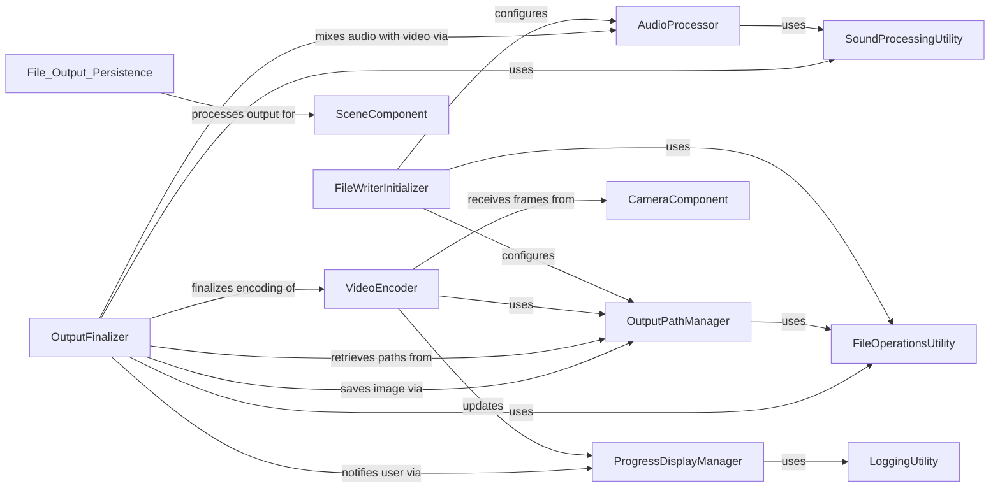

## Component Details

This graph illustrates the structure and interactions within the 'File Output & Persistence' subsystem. The core functionality revolves around the `SceneFileWriter` which orchestrates the process of rendering animation frames and audio into various output file formats like video, GIF, and images. It manages file paths, synchronizes audio with video, and provides progress updates during the rendering process. The subsystem initializes output directories and audio handling, manages all output file paths, processes and adds audio segments, encodes video frames using FFmpeg, and finalizes the output by merging audio, saving the last frame, and displaying completion messages. It relies on various utility components for file operations, sound processing, and logging, and interacts with the Camera and Scene components to receive frame data and process the animation.

### FileWriterInitializer
Responsible for initializing the SceneFileWriter instance, setting up output directories, and preparing audio handling at the start of the file writing process.

**Related Classes/Methods**:

- <a href="https://github.com/3b1b/manim/blob/master/manimlib/scene/scene_file_writer.py#L29-L77" target="_blank" rel="noopener noreferrer">`manim.manimlib.scene.scene_file_writer.SceneFileWriter:__init__` (29:77)</a>
- <a href="https://github.com/3b1b/manim/blob/master/manimlib/scene/scene_file_writer.py#L80-L86" target="_blank" rel="noopener noreferrer">`manim.manimlib.scene.scene_file_writer.SceneFileWriter.init_output_directories` (80:86)</a>
- <a href="https://github.com/3b1b/manim/blob/master/manimlib/scene/scene_file_writer.py#L129-L130" target="_blank" rel="noopener noreferrer">`manim.manimlib.scene.scene_file_writer.SceneFileWriter.init_audio` (129:130)</a>

### OutputPathManager
Handles the generation and management of all output file paths for movies, images, and temporary partial movie files, ensuring proper directory existence and naming conventions.

**Related Classes/Methods**:

- <a href="https://github.com/3b1b/manim/blob/master/manimlib/scene/scene_file_writer.py#L88-L89" target="_blank" rel="noopener noreferrer">`manim.manimlib.scene.scene_file_writer.SceneFileWriter.init_image_file_path` (88:89)</a>
- <a href="https://github.com/3b1b/manim/blob/master/manimlib/scene/scene_file_writer.py#L91-L92" target="_blank" rel="noopener noreferrer">`manim.manimlib.scene.scene_file_writer.SceneFileWriter.init_movie_file_path` (91:92)</a>
- <a href="https://github.com/3b1b/manim/blob/master/manimlib/scene/scene_file_writer.py#L94-L95" target="_blank" rel="noopener noreferrer">`manim.manimlib.scene.scene_file_writer.SceneFileWriter.init_partial_movie_directory` (94:95)</a>
- <a href="https://github.com/3b1b/manim/blob/master/manimlib/scene/scene_file_writer.py#L97-L101" target="_blank" rel="noopener noreferrer">`manim.manimlib.scene.scene_file_writer.SceneFileWriter.get_output_file_rootname` (97:101)</a>
- <a href="https://github.com/3b1b/manim/blob/master/manimlib/scene/scene_file_writer.py#L103-L115" target="_blank" rel="noopener noreferrer">`manim.manimlib.scene.scene_file_writer.SceneFileWriter.get_output_file_name` (103:115)</a>
- <a href="https://github.com/3b1b/manim/blob/master/manimlib/scene/scene_file_writer.py#L118-L119" target="_blank" rel="noopener noreferrer">`manim.manimlib.scene.scene_file_writer.SceneFileWriter.get_image_file_path` (118:119)</a>
- <a href="https://github.com/3b1b/manim/blob/master/manimlib/scene/scene_file_writer.py#L121-L123" target="_blank" rel="noopener noreferrer">`manim.manimlib.scene.scene_file_writer.SceneFileWriter.get_next_partial_movie_path` (121:123)</a>
- <a href="https://github.com/3b1b/manim/blob/master/manimlib/scene/scene_file_writer.py#L125-L126" target="_blank" rel="noopener noreferrer">`manim.manimlib.scene.scene_file_writer.SceneFileWriter.get_movie_file_path` (125:126)</a>
- <a href="https://github.com/3b1b/manim/blob/master/manimlib/scene/scene_file_writer.py#L245-L250" target="_blank" rel="noopener noreferrer">`manim.manimlib.scene.scene_file_writer.SceneFileWriter.get_insert_file_path` (245:250)</a>

### AudioProcessor
Manages the creation, manipulation, and addition of audio segments, including loading sound files and overlaying them to be synchronized with the video output.

**Related Classes/Methods**:

- <a href="https://github.com/3b1b/manim/blob/master/manimlib/scene/scene_file_writer.py#L132-L133" target="_blank" rel="noopener noreferrer">`manim.manimlib.scene.scene_file_writer.SceneFileWriter.create_audio_segment` (132:133)</a>
- <a href="https://github.com/3b1b/manim/blob/master/manimlib/scene/scene_file_writer.py#L135-L162" target="_blank" rel="noopener noreferrer">`manim.manimlib.scene.scene_file_writer.SceneFileWriter:add_audio_segment` (135:162)</a>
- <a href="https://github.com/3b1b/manim/blob/master/manimlib/scene/scene_file_writer.py#L164-L175" target="_blank" rel="noopener noreferrer">`manim.manimlib.scene.scene_file_writer.SceneFileWriter.add_sound` (164:175)</a>

### VideoEncoder
Responsible for opening and managing the video encoding process via an FFmpeg pipe, writing raw frame data, and handling temporary video files for both full and partial movies, as well as inserts.

**Related Classes/Methods**:

- <a href="https://github.com/3b1b/manim/blob/master/manimlib/scene/scene_file_writer.py#L202-L239" target="_blank" rel="noopener noreferrer">`manim.manimlib.scene.scene_file_writer.SceneFileWriter.open_movie_pipe` (202:239)</a>
- <a href="https://github.com/3b1b/manim/blob/master/manimlib/scene/scene_file_writer.py#L284-L289" target="_blank" rel="noopener noreferrer">`manim.manimlib.scene.scene_file_writer.SceneFileWriter.write_frame` (284:289)</a>
- <a href="https://github.com/3b1b/manim/blob/master/manimlib/scene/scene_file_writer.py#L291-L301" target="_blank" rel="noopener noreferrer">`manim.manimlib.scene.scene_file_writer.SceneFileWriter.close_movie_pipe` (291:301)</a>
- <a href="https://github.com/3b1b/manim/blob/master/manimlib/scene/scene_file_writer.py#L241-L243" target="_blank" rel="noopener noreferrer">`manim.manimlib.scene.scene_file_writer.SceneFileWriter.use_fast_encoding` (241:243)</a>
- <a href="https://github.com/3b1b/manim/blob/master/manimlib/scene/scene_file_writer.py#L178-L180" target="_blank" rel="noopener noreferrer">`manim.manimlib.scene.scene_file_writer.SceneFileWriter.begin` (178:180)</a>
- <a href="https://github.com/3b1b/manim/blob/master/manimlib/scene/scene_file_writer.py#L182-L184" target="_blank" rel="noopener noreferrer">`manim.manimlib.scene.scene_file_writer.SceneFileWriter.begin_animation` (182:184)</a>
- <a href="https://github.com/3b1b/manim/blob/master/manimlib/scene/scene_file_writer.py#L186-L188" target="_blank" rel="noopener noreferrer">`manim.manimlib.scene.scene_file_writer.SceneFileWriter.end_animation` (186:188)</a>
- <a href="https://github.com/3b1b/manim/blob/master/manimlib/scene/scene_file_writer.py#L252-L260" target="_blank" rel="noopener noreferrer">`manim.manimlib.scene.scene_file_writer.SceneFileWriter.begin_insert` (252:260)</a>
- <a href="https://github.com/3b1b/manim/blob/master/manimlib/scene/scene_file_writer.py#L262-L265" target="_blank" rel="noopener noreferrer">`manim.manimlib.scene.scene_file_writer.SceneFileWriter.end_insert` (262:265)</a>

### OutputFinalizer
Orchestrates the finalization steps of the output process, including merging audio with video, saving the last frame as an image, displaying completion messages, and optionally opening the generated files.

**Related Classes/Methods**:

- <a href="https://github.com/3b1b/manim/blob/master/manimlib/scene/scene_file_writer.py#L190-L200" target="_blank" rel="noopener noreferrer">`manim.manimlib.scene.scene_file_writer.SceneFileWriter:finish` (190:200)</a>
- <a href="https://github.com/3b1b/manim/blob/master/manimlib/scene/scene_file_writer.py#L303-L332" target="_blank" rel="noopener noreferrer">`manim.manimlib.scene.scene_file_writer.SceneFileWriter.add_sound_to_video` (303:332)</a>
- <a href="https://github.com/3b1b/manim/blob/master/manimlib/scene/scene_file_writer.py#L334-L337" target="_blank" rel="noopener noreferrer">`manim.manimlib.scene.scene_file_writer.SceneFileWriter.save_final_image` (334:337)</a>
- <a href="https://github.com/3b1b/manim/blob/master/manimlib/scene/scene_file_writer.py#L339-L341" target="_blank" rel="noopener noreferrer">`manim.manimlib.scene.scene_file_writer.SceneFileWriter.print_file_ready_message` (339:341)</a>
- <a href="https://github.com/3b1b/manim/blob/master/manimlib/scene/scene_file_writer.py#L343-L347" target="_blank" rel="noopener noreferrer">`manim.manimlib.scene.scene_file_writer.SceneFileWriter.should_open_file` (343:347)</a>
- <a href="https://github.com/3b1b/manim/blob/master/manimlib/scene/scene_file_writer.py#L349-L385" target="_blank" rel="noopener noreferrer">`manim.manimlib.scene.scene_file_writer.SceneFileWriter.open_file` (349:385)</a>

### ProgressDisplayManager
Provides functionality for updating and managing the progress display during video rendering, including setting descriptions and handling display updates.

**Related Classes/Methods**:

- <a href="https://github.com/3b1b/manim/blob/master/manimlib/scene/scene_file_writer.py#L267-L268" target="_blank" rel="noopener noreferrer">`manim.manimlib.scene.scene_file_writer.SceneFileWriter.has_progress_display` (267:268)</a>
- <a href="https://github.com/3b1b/manim/blob/master/manimlib/scene/scene_file_writer.py#L270-L282" target="_blank" rel="noopener noreferrer">`manim.manimlib.scene.scene_file_writer.SceneFileWriter.set_progress_display_description` (270:282)</a>

### FileOperationsUtility
Provides low-level file system operations like creating directories, checking existence, and moving/copying files.

**Related Classes/Methods**:

- `manim.manimlib.utils.file_ops` (full file reference)

### SoundProcessingUtility
Provides utilities for handling and processing audio, such as merging audio files.

**Related Classes/Methods**:

- `manim.manimlib.utils.sounds` (full file reference)

### LoggingUtility
Handles logging messages and displaying information to the console.

**Related Classes/Methods**:

- `manim.manimlib.logger` (full file reference)

### CameraComponent
Represents the camera system responsible for rendering the scene into individual frames.

**Related Classes/Methods**:

- `manim.manimlib.camera.camera` (full file reference)

### SceneComponent
Represents the main scene where animations are defined and rendered. SceneFileWriter operates on a Scene.

**Related Classes/Methods**:

- `manim.manimlib.scene.scene` (full file reference)

### [FAQ](https://github.com/CodeBoarding/GeneratedOnBoardings/tree/main?tab=readme-ov-file#faq)