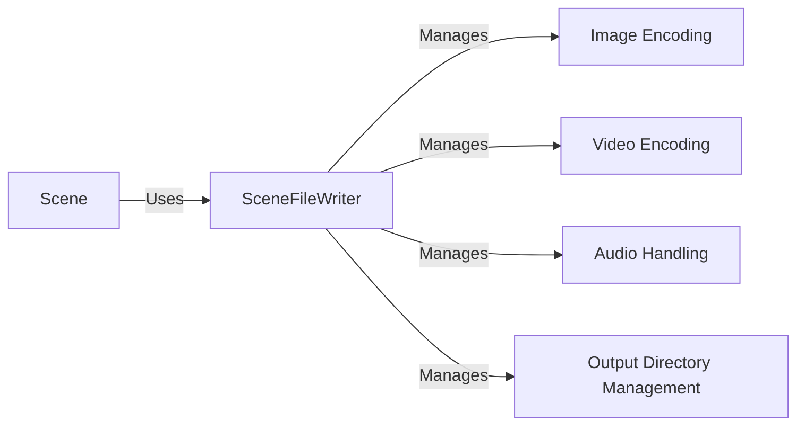

## Component Details

The file output subsystem in Manim is responsible for taking the rendered frames of a scene and encoding them into video and image files. It manages the creation of output directories, writes individual frames to files, and combines these frames into a final video, optionally adding audio. The core component, SceneFileWriter, orchestrates this process, interacting closely with the Scene class to receive rendering commands and manage the output files.

### SceneFileWriter
The SceneFileWriter class is the central component for managing output files. It initializes the output directory structure, handles the writing of individual frames as images, encodes these frames into a video, and adds audio to the video if provided. It receives commands from the Scene class to start, stop, and finalize the writing process.
- **Related Classes/Methods**: `manim.manimlib.scene.scene_file_writer.SceneFileWriter`

### Scene
The Scene class represents a single scene in Manim. It utilizes the SceneFileWriter to handle the output of the rendered scene. The Scene class calls methods on the SceneFileWriter to manage the output files during the rendering process, including initializing the output, writing frames, and finalizing the video.
- **Related Classes/Methods**: `manim.manimlib.scene.scene.Scene`

### Image Encoding
This component handles the encoding of individual frames into image files. It is responsible for taking the raw frame data and converting it into a suitable image format (e.g., PNG, JPEG) for storage. This functionality is typically embedded within the SceneFileWriter.
- **Related Classes/Methods**: `manim.manimlib.scene.scene_file_writer.SceneFileWriter`

### Video Encoding
This component takes the sequence of individual image frames and encodes them into a video file. It manages the video codec, frame rate, and other video-specific parameters. This functionality is typically embedded within the SceneFileWriter.
- **Related Classes/Methods**: `manim.manimlib.scene.scene_file_writer.SceneFileWriter`

### Audio Handling
This component is responsible for adding audio to the final video. It takes an audio file as input and merges it with the video stream. This functionality is typically embedded within the SceneFileWriter.
- **Related Classes/Methods**: `manim.manimlib.scene.scene_file_writer.SceneFileWriter`

### Output Directory Management
This component manages the creation and organization of the output directories where the image and video files are stored. It ensures that the necessary directories exist and that files are written to the correct locations. This functionality is typically embedded within the SceneFileWriter.
- **Related Classes/Methods**: `manim.manimlib.scene.scene_file_writer.SceneFileWriter`
