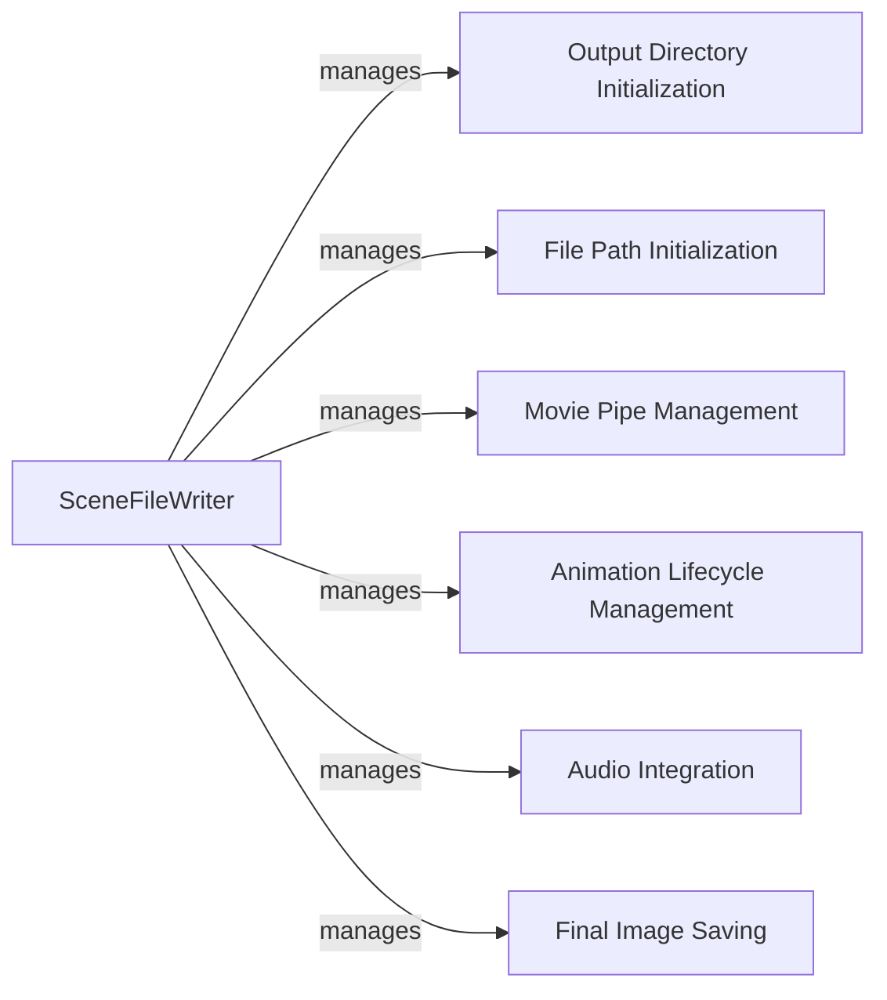

## Component Details

The File Output subsystem in Manim is responsible for writing the generated scene frames to image and video files. It orchestrates the creation of output directories, encodes individual frames into a video, and adds audio to the final video to produce a shareable or presentable product. The core component, SceneFileWriter, manages the entire process, initializing file paths, opening movie pipes, handling animation start and end, adding sound, and saving the final image.

### SceneFileWriter
The SceneFileWriter class is the central component responsible for managing the entire file writing process. It initializes output directories and file paths, opens a pipe to the movie file for writing frames, prepares for and finalizes animations, adds sound to the video, and saves the final image. It acts as the orchestrator for all file output operations.
- **Related Classes/Methods**: `manim.manimlib.scene.scene_file_writer.SceneFileWriter`

### Output Directory Initialization
This component initializes the output directories where the generated images, movies, and partial movie segments will be stored. It ensures that the necessary directory structure is in place before the rendering process begins.
- **Related Classes/Methods**: `manim.manimlib.scene.scene_file_writer.SceneFileWriter:init_output_directories`

### File Path Initialization
This component initializes the file paths for the final image and movie files. It determines the naming convention and location of the output files based on the scene name and configuration settings.
- **Related Classes/Methods**: `manim.manimlib.scene.scene_file_writer.SceneFileWriter:init_image_file_path`, `manim.manimlib.scene.scene_file_writer.SceneFileWriter:init_movie_file_path`

### Movie Pipe Management
This component manages the pipe to the movie file, allowing frames to be written sequentially. It handles the opening and closing of the pipe, ensuring that frames are written correctly to the video file.
- **Related Classes/Methods**: `manim.manimlib.scene.scene_file_writer.SceneFileWriter:open_movie_pipe`

### Animation Lifecycle Management
This component manages the lifecycle of an animation, preparing the file writer at the beginning and finalizing it at the end. It ensures that all necessary steps are taken to properly encode and save the animation frames.
- **Related Classes/Methods**: `manim.manimlib.scene.scene_file_writer.SceneFileWriter:begin_animation`, `manim.manimlib.scene.scene_file_writer.SceneFileWriter:end_animation`

### Audio Integration
This component integrates audio into the final video file. It adds the sound track to the video after the animation frames have been written, creating a complete multimedia experience.
- **Related Classes/Methods**: `manim.manimlib.scene.scene_file_writer.SceneFileWriter:add_sound_to_video`

### Final Image Saving
This component saves the final image of the scene to a file. It captures the last frame of the animation and stores it as a static image, providing a visual representation of the completed scene.
- **Related Classes/Methods**: `manim.manimlib.scene.scene_file_writer.SceneFileWriter:save_final_image`
