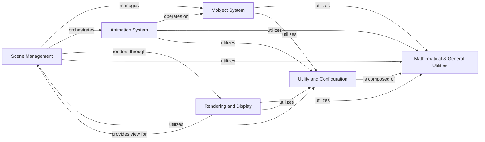

## Component Details

This graph represents the core components of Manim, a Python library for creating animated mathematical videos. The system is structured around visual objects (Mobjects), their transformations over time (Animations), the scene where these elements are composed and rendered (Scene Management), and the underlying display mechanisms (Rendering and Display). Various Utility and Configuration modules provide foundational services and settings, while Mathematical & General Utilities offer essential mathematical and general-purpose functions used across the entire system. The main flow involves defining Mobjects, applying Animations within a Scene, and then rendering the Scene through the Camera and Window for display or export.

### Mobject System
The Mobject System is the core of Manim's visual representation. It defines the base class 'Mobject' from which all displayable objects in Manim inherit. This system handles properties like position, color, opacity, and transformations. It also manages the hierarchy of objects, allowing for complex compositions. Key functionalities include adding and removing sub-mobjects, applying transformations, and managing rendering properties.

**Related Classes/Methods**:

- <a href="https://github.com/3b1b/manim/blob/master/manimlib/mobject/mobject.py#L64-L2166" target="_blank" rel="noopener noreferrer">`manimlib.mobject.mobject.Mobject` (64:2166)</a>
- `manimlib.mobject.types.vectorized_mobject.VectorizedMobject` (full file reference)
- <a href="https://github.com/3b1b/manim/blob/master/manimlib/mobject/geometry.py#L290-L322" target="_blank" rel="noopener noreferrer">`manimlib.mobject.geometry.Circle` (290:322)</a>
- <a href="https://github.com/3b1b/manim/blob/master/manimlib/mobject/geometry.py#L1067-L1069" target="_blank" rel="noopener noreferrer">`manimlib.mobject.geometry.Square` (1067:1069)</a>
- `manimlib.mobject.svg.tex_mobject.TexMobject` (full file reference)

### Animation System
The Animation System is responsible for defining and executing visual changes over time. It provides a base 'Animation' class and various specialized animations for transformations, creations, fading, and more. Animations operate on Mobjects, modifying their properties or appearance smoothly over a specified duration. This system orchestrates the visual flow of a Manim video.

**Related Classes/Methods**:

- <a href="https://github.com/3b1b/manim/blob/master/manimlib/animation/animation.py#L23-L203" target="_blank" rel="noopener noreferrer">`manimlib.animation.animation.Animation` (23:203)</a>
- <a href="https://github.com/3b1b/manim/blob/master/manimlib/animation/transform.py#L24-L129" target="_blank" rel="noopener noreferrer">`manimlib.animation.transform.Transform` (24:129)</a>
- <a href="https://github.com/3b1b/manim/blob/master/manimlib/animation/creation.py#L48-L53" target="_blank" rel="noopener noreferrer">`manimlib.animation.creation.ShowCreation` (48:53)</a>

### Scene Management
The Scene Management component provides the 'Scene' class, which acts as the canvas for Manim animations. It manages the Mobjects present in the scene, handles the camera, and orchestrates the playback of animations. Scenes define the sequence of events, allowing users to compose complex visual narratives by adding Mobjects and playing animations. It also integrates with the file writer for rendering output.

**Related Classes/Methods**:

- <a href="https://github.com/3b1b/manim/blob/master/manimlib/scene/scene.py#L51-L868" target="_blank" rel="noopener noreferrer">`manimlib.scene.scene.Scene` (51:868)</a>
- <a href="https://github.com/3b1b/manim/blob/master/manimlib/scene/scene_file_writer.py#L28-L385" target="_blank" rel="noopener noreferrer">`manimlib.scene.scene_file_writer.SceneFileWriter` (28:385)</a>

### Rendering and Display
The Rendering and Display component is responsible for visualizing the Manim scene. The 'Camera' class defines the view of the scene, handling projection and transformations from 3D space to 2D screen coordinates. The 'Window' class manages the graphical display window, handling events and rendering frames generated by the camera. This component bridges the internal Manim representation with the user's screen or output file.

**Related Classes/Methods**:

- <a href="https://github.com/3b1b/manim/blob/master/manimlib/camera/camera.py#L25-L255" target="_blank" rel="noopener noreferrer">`manimlib.camera.camera.Camera` (25:255)</a>
- <a href="https://github.com/3b1b/manim/blob/master/manimlib/window.py#L23-L242" target="_blank" rel="noopener noreferrer">`manimlib.window.Window` (23:242)</a>

### Utility and Configuration
The Utility and Configuration component encompasses various helper modules and configuration settings. This includes global settings managed by the 'Config' module and frequently used values from 'Constants'. It provides foundational services and configurable parameters that support other core systems.

**Related Classes/Methods**:

- `manimlib.config.Config` (full file reference)
- `manimlib.constants.constants` (full file reference)
- `manimlib.logger` (full file reference)
- `manimlib.module_loader` (full file reference)
- `manimlib.typing` (full file reference)
- `manimlib.event_handler` (full file reference)

### Mathematical & General Utilities
This component provides a collection of general-purpose utility functions that support various aspects of Manim, including vector and space operations, color conversions, iterable manipulations, mathematical functions (like Bezier curves and rate functions), file handling, and debugging tools. These utilities are foundational for Mobject transformations, rendering, and other core functionalities.

**Related Classes/Methods**:

- <a href="https://github.com/3b1b/manim/blob/master/manimlib/utils/space_ops.py#L117-L123" target="_blank" rel="noopener noreferrer">`manimlib.utils.space_ops:rotate_vector` (117:123)</a>
- <a href="https://github.com/3b1b/manim/blob/master/manimlib/utils/color.py#L22-L28" target="_blank" rel="noopener noreferrer">`manimlib.utils.color:color_to_rgb` (22:28)</a>
- <a href="https://github.com/3b1b/manim/blob/master/manimlib/utils/iterables.py#L25-L30" target="_blank" rel="noopener noreferrer">`manimlib.utils.iterables:list_update` (25:30)</a>
- <a href="https://github.com/3b1b/manim/blob/master/manimlib/utils/tex_file_writing.py#L51-L81" target="_blank" rel="noopener noreferrer">`manimlib.utils.tex_file_writing:latex_to_svg` (51:81)</a>
- <a href="https://github.com/3b1b/manim/blob/master/manimlib/utils/bezier.py#L28-L42" target="_blank" rel="noopener noreferrer">`manimlib.utils.bezier:bezier` (28:42)</a>
- <a href="https://github.com/3b1b/manim/blob/master/manimlib/utils/rate_functions.py#L24-L25" target="_blank" rel="noopener noreferrer">`manimlib.utils.rate_functions:rush_into` (24:25)</a>
- `manimlib.utils.debug` (full file reference)
- `manimlib.utils.file_ops` (full file reference)
- `manimlib.utils.directories` (full file reference)
- `manimlib.utils.images` (full file reference)
- `manimlib.utils.paths` (full file reference)
- `manimlib.utils.simple_functions` (full file reference)
- `manimlib.utils.sounds` (full file reference)
- `manimlib.utils.tex` (full file reference)
- `manimlib.utils.cache` (full file reference)
- `manimlib.utils.dict_ops` (full file reference)
- `manimlib.utils.family_ops` (full file reference)
- `manimlib.utils.shaders` (full file reference)

### [FAQ](https://github.com/CodeBoarding/GeneratedOnBoardings/tree/main?tab=readme-ov-file#faq)