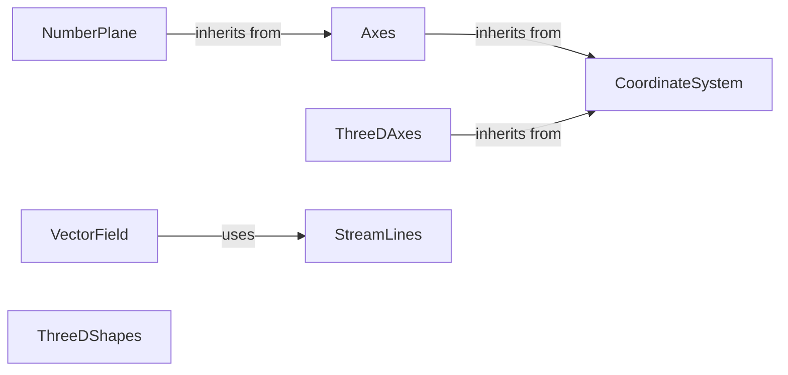

## Component Details

The Mathematical Constructs component provides a set of classes for creating and manipulating mathematical objects in 2D and 3D space. It includes coordinate systems, vector fields, and various 3D shapes, enabling users to visualize and animate mathematical concepts. The core of this component lies in the CoordinateSystem class, which serves as the foundation for creating axes and number planes. Vector fields are represented using VectorField and StreamLines, while 3D objects are created using classes like Sphere, Cube, and Cylinder. These components work together to provide a comprehensive toolkit for mathematical visualization.

### CoordinateSystem
Represents a base coordinate system, providing methods for converting between coordinates and points, and for creating axes and labels. It serves as the foundation for more specialized coordinate systems.
- **Related Classes/Methods**: `manim.manimlib.mobject.coordinate_systems.CoordinateSystem`

### Axes
Represents a 2D coordinate axes system, inheriting from CoordinateSystem and adding functionality for creating and labeling axes. It provides methods for creating x and y axes with customizable labels and tick marks.
- **Related Classes/Methods**: `manim.manimlib.mobject.coordinate_systems.Axes`

### ThreeDAxes
Represents a 3D coordinate axes system, inheriting from CoordinateSystem and adding functionality for creating and labeling 3D axes. It extends the Axes class to include a z-axis, enabling the representation of three-dimensional space.
- **Related Classes/Methods**: `manim.manimlib.mobject.coordinate_systems.ThreeDAxes`

### NumberPlane
Represents a 2D number plane, a specific type of coordinate system with background lines and vector drawing capabilities. It inherits from Axes and provides methods for drawing lines and vectors on the plane.
- **Related Classes/Methods**: `manim.manimlib.mobject.coordinate_systems.NumberPlane`

### VectorField
Represents a vector field, which is a collection of vectors defined over a region of space. It handles initialization, sampling points, and updating vector properties. It uses StreamLines to visualize the vector field.
- **Related Classes/Methods**: `manim.manimlib.mobject.vector_field.VectorField`

### StreamLines
Represents streamlines of a vector field. It draws lines that follow the direction of the vector field, providing a visual representation of the field's flow.
- **Related Classes/Methods**: `manim.manimlib.mobject.vector_field.StreamLines`

### ThreeDShapes
Represents a collection of 3D shapes like Sphere, Torus, Cylinder, Cone, Line3D, Disk3D, Square3D, Cube, Prism, VGroup3D, VCube, VPrism, Dodecahedron. It provides methods for creating and manipulating 3D objects in space.
- **Related Classes/Methods**: `manim.manimlib.mobject.three_dimensions.Sphere`, `manim.manimlib.mobject.three_dimensions.Torus`, `manim.manimlib.mobject.three_dimensions.Cylinder`, `manim.manimlib.mobject.three_dimensions.Cone`, `manim.manimlib.mobject.three_dimensions.Line3D`, `manim.manimlib.mobject.three_dimensions.Disk3D`, `manim.manimlib.mobject.three_dimensions.Square3D`, `manim.manimlib.mobject.three_dimensions.Cube`, `manim.manimlib.mobject.three_dimensions.Prism`, `manim.manimlib.mobject.three_dimensions.VGroup3D`, `manim.manimlib.mobject.three_dimensions.VCube`, `manim.manimlib.mobject.three_dimensions.VPrism`, `manim.manimlib.mobject.three_dimensions.Dodecahedron`
