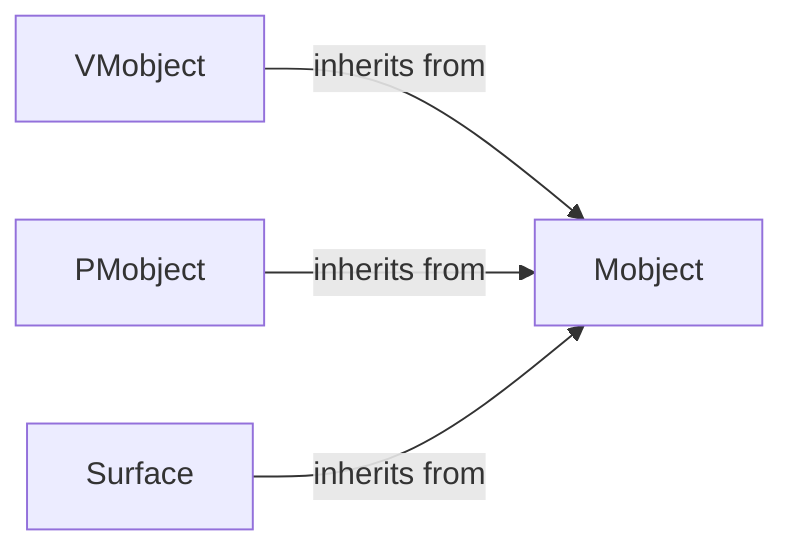

## Component Details

This component overview describes the core graphical object (Mobject) and its specialized derivatives (VMobject, PMobject, Surface) in Manim. Mobject serves as the foundational element, providing essential properties and operations like point management, transformations, color handling, and hierarchical relationships. VMobject extends Mobject for vectorized graphics, enabling the creation and manipulation of paths and curves. PMobject focuses on point-based objects, managing collections of individual points. Surface is designed for representing 3D surfaces, handling their generation and rendering. The primary flow involves specialized mobjects inheriting and building upon the fundamental capabilities provided by Mobject to define their specific visual and interactive behaviors.

### Mobject
The fundamental building block for all renderable objects in Manim. It provides core functionalities for managing points, colors, transformations (shift, scale, rotate), family relationships (submobjects, parents), updaters for animations, event listeners, and shader interactions. It defines the basic structure and behavior inherited by more specialized mobjects.

**Related Classes/Methods**:

- <a href="https://github.com/3b1b/manim/blob/master/manimlib/mobject/mobject.py#L64-L2166" target="_blank" rel="noopener noreferrer">`manim.manimlib.mobject.mobject.Mobject` (64:2166)</a>
- <a href="https://github.com/3b1b/manim/blob/master/manimlib/mobject/mobject.py#L79-L124" target="_blank" rel="noopener noreferrer">`manim.manimlib.mobject.mobject.Mobject:__init__` (79:124)</a>
- <a href="https://github.com/3b1b/manim/blob/master/manimlib/mobject/mobject.py#L137-L139" target="_blank" rel="noopener noreferrer">`manim.manimlib.mobject.mobject.Mobject:init_data` (137:139)</a>
- <a href="https://github.com/3b1b/manim/blob/master/manimlib/mobject/mobject.py#L141-L146" target="_blank" rel="noopener noreferrer">`manim.manimlib.mobject.mobject.Mobject:init_uniforms` (141:146)</a>
- <a href="https://github.com/3b1b/manim/blob/master/manimlib/mobject/mobject.py#L817-L820" target="_blank" rel="noopener noreferrer">`manim.manimlib.mobject.mobject.Mobject:init_updaters` (817:820)</a>
- <a href="https://github.com/3b1b/manim/blob/master/manimlib/mobject/mobject.py#L2074-L2075" target="_blank" rel="noopener noreferrer">`manim.manimlib.mobject.mobject.Mobject:init_event_listners` (2074:2075)</a>
- <a href="https://github.com/3b1b/manim/blob/master/manimlib/mobject/mobject.py#L151-L153" target="_blank" rel="noopener noreferrer">`manim.manimlib.mobject.mobject.Mobject:init_points` (151:153)</a>
- <a href="https://github.com/3b1b/manim/blob/master/manimlib/mobject/mobject.py#L148-L149" target="_blank" rel="noopener noreferrer">`manim.manimlib.mobject.mobject.Mobject:init_colors` (148:149)</a>
- <a href="https://github.com/3b1b/manim/blob/master/manimlib/mobject/mobject.py#L1925-L1928" target="_blank" rel="noopener noreferrer">`manim.manimlib.mobject.mobject.Mobject:apply_depth_test` (1925:1928)</a>
- <a href="https://github.com/3b1b/manim/blob/master/manimlib/mobject/mobject.py#L1912-L1914" target="_blank" rel="noopener noreferrer">`manim.manimlib.mobject.mobject.Mobject:fix_in_frame` (1912:1914)</a>
- <a href="https://github.com/3b1b/manim/blob/master/manimlib/mobject/mobject.py#L916-L922" target="_blank" rel="noopener noreferrer">`manim.manimlib.mobject.mobject.Mobject:shift` (916:922)</a>
- <a href="https://github.com/3b1b/manim/blob/master/manimlib/mobject/mobject.py#L279-L305" target="_blank" rel="noopener noreferrer">`manim.manimlib.mobject.mobject.Mobject:apply_points_function` (279:305)</a>
- <a href="https://github.com/3b1b/manim/blob/master/manimlib/mobject/mobject.py#L1369-L1381" target="_blank" rel="noopener noreferrer">`manim.manimlib.mobject.mobject.Mobject:set_color` (1369:1381)</a>
- <a href="https://github.com/3b1b/manim/blob/master/manimlib/mobject/mobject.py#L1349-L1367" target="_blank" rel="noopener noreferrer">`manim.manimlib.mobject.mobject.Mobject:set_rgba_array_by_color` (1349:1367)</a>
- <a href="https://github.com/3b1b/manim/blob/master/manimlib/mobject/mobject.py#L256-L259" target="_blank" rel="noopener noreferrer">`manim.manimlib.mobject.mobject.Mobject:set_points` (256:259)</a>
- <a href="https://github.com/3b1b/manim/blob/master/manimlib/mobject/mobject.py#L240-L253" target="_blank" rel="noopener noreferrer">`manim.manimlib.mobject.mobject.Mobject:resize_points` (240:253)</a>
- <a href="https://github.com/3b1b/manim/blob/master/manimlib/mobject/mobject.py#L423-L430" target="_blank" rel="noopener noreferrer">`manim.manimlib.mobject.mobject.Mobject:get_family` (423:430)</a>
- <a href="https://github.com/3b1b/manim/blob/master/manimlib/mobject/mobject.py#L332-L333" target="_blank" rel="noopener noreferrer">`manim.manimlib.mobject.mobject.Mobject:has_points` (332:333)</a>

### VMobject
A specialized type of Mobject designed for vectorized graphics, handling properties like stroke, fill, and bezier curves. It extends the base Mobject with functionalities specific to drawing and manipulating paths, including methods for adding cubic and quadratic bezier curves, managing subpaths, and calculating joint angles for rendering.

**Related Classes/Methods**:

- <a href="https://github.com/3b1b/manim/blob/master/manimlib/mobject/types/vectorized_mobject.py#L60-L1295" target="_blank" rel="noopener noreferrer">`manim.manimlib.mobject.types.vectorized_mobject.VMobject` (60:1295)</a>
- <a href="https://github.com/3b1b/manim/blob/master/manimlib/mobject/types/vectorized_mobject.py#L81-L122" target="_blank" rel="noopener noreferrer">`manim.manimlib.mobject.types.vectorized_mobject.VMobject:__init__` (81:122)</a>
- <a href="https://github.com/3b1b/manim/blob/master/manimlib/mobject/types/vectorized_mobject.py#L159-L172" target="_blank" rel="noopener noreferrer">`manim.manimlib.mobject.types.vectorized_mobject.VMobject:set_fill` (159:172)</a>
- <a href="https://github.com/3b1b/manim/blob/master/manimlib/mobject/types/vectorized_mobject.py#L467-L476" target="_blank" rel="noopener noreferrer">`manim.manimlib.mobject.types.vectorized_mobject.VMobject:add_cubic_bezier_curve` (467:476)</a>
- <a href="https://github.com/3b1b/manim/blob/master/manimlib/mobject/types/vectorized_mobject.py#L458-L465" target="_blank" rel="noopener noreferrer">`manim.manimlib.mobject.types.vectorized_mobject.VMobject:start_new_path` (458:465)</a>
- <a href="https://github.com/3b1b/manim/blob/master/manimlib/mobject/types/vectorized_mobject.py#L478-L503" target="_blank" rel="noopener noreferrer">`manim.manimlib.mobject.types.vectorized_mobject.VMobject:add_cubic_bezier_curve_to` (478:503)</a>

### PMobject
A type of Mobject that represents a collection of individual points, often used for particle systems or scatter plots. It provides methods for adding points with specific colors and opacities, filtering points based on conditions, and sorting them.

**Related Classes/Methods**:

- <a href="https://github.com/3b1b/manim/blob/master/manimlib/mobject/types/point_cloud_mobject.py#L17-L103" target="_blank" rel="noopener noreferrer">`manim.manimlib.mobject.types.point_cloud_mobject.PMobject` (17:103)</a>
- <a href="https://github.com/3b1b/manim/blob/master/manimlib/mobject/types/point_cloud_mobject.py#L18-L23" target="_blank" rel="noopener noreferrer">`manim.manimlib.mobject.types.point_cloud_mobject.PMobject:set_points` (18:23)</a>

### Surface
A Mobject subclass for representing 3D surfaces defined by a UV function. It handles the generation of points and normals for the surface, triangulation for rendering, and provides methods for partial rendering and sorting faces based on camera position.

**Related Classes/Methods**:

- <a href="https://github.com/3b1b/manim/blob/master/manimlib/mobject/types/surface.py#L28-L244" target="_blank" rel="noopener noreferrer">`manim.manimlib.mobject.types.surface.Surface` (28:244)</a>
- <a href="https://github.com/3b1b/manim/blob/master/manimlib/mobject/types/surface.py#L38-L70" target="_blank" rel="noopener noreferrer">`manim.manimlib.mobject.types.surface.Surface:__init__` (38:70)</a>
- <a href="https://github.com/3b1b/manim/blob/master/manimlib/mobject/types/surface.py#L136-L153" target="_blank" rel="noopener noreferrer">`manim.manimlib.mobject.types.surface.Surface:compute_triangle_indices` (136:153)</a>

### [FAQ](https://github.com/CodeBoarding/GeneratedOnBoardings/tree/main?tab=readme-ov-file#faq)