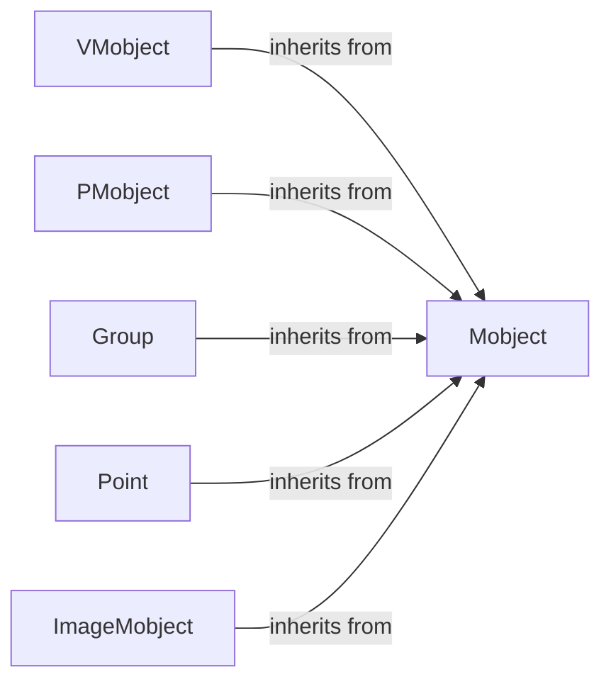

## Component Details

The Mobject System in Manim forms the foundation for all visual elements, providing a hierarchical structure and functionalities for creating, manipulating, and displaying mathematical objects. It defines the base class `Mobject` and its subclasses, which handle transformations, styling, and organization of objects within a scene. The system supports various types of Mobjects, including vectorized objects, point clouds, and groups, enabling the construction of complex and dynamic visual representations.

### Mobject
The base class for all visual objects in Manim. It manages the object's points, color, style, and submobjects. It provides methods for adding, removing, and transforming submobjects, as well as applying styles and handling animations. All visual elements in a Manim scene inherit from this class.
- **Related Classes/Methods**: `manim.manimlib.mobject.mobject.Mobject`

### VMobject
A subclass of `Mobject` that represents vectorized mathematical objects. It uses Bézier curves to define the shape of the object and handles properties like fill, stroke, and style. It is commonly used for creating shapes, curves, and other geometric figures.
- **Related Classes/Methods**: `manim.manimlib.mobject.types.vectorized_mobject.VMobject`

### PMobject
A subclass of `Mobject` that deals with point clouds. It provides methods for manipulating and coloring individual points. It is useful for representing objects as a collection of discrete points, such as scatter plots or particle systems.
- **Related Classes/Methods**: `manim.manimlib.mobject.types.point_cloud_mobject.PMobject`

### Group
A subclass of `Mobject` that groups multiple `Mobject` instances together. It allows treating multiple objects as a single entity, applying transformations and styles to the entire group. This simplifies the manipulation of complex scenes with many objects.
- **Related Classes/Methods**: `manim.manimlib.mobject.mobject.Group`

### Point
A subclass of `Mobject` representing a single point in space. It has methods for getting and setting its location. It is often used as an anchor or reference point for other objects or animations.
- **Related Classes/Methods**: `manim.manimlib.mobject.mobject.Point`

### ImageMobject
A subclass of `Mobject` that displays images. It handles image loading and pixel color mapping. It allows for incorporating raster images into Manim scenes, providing a way to include external visual content.
- **Related Classes/Methods**: `manim.manimlib.mobject.types.image_mobject.ImageMobject`
