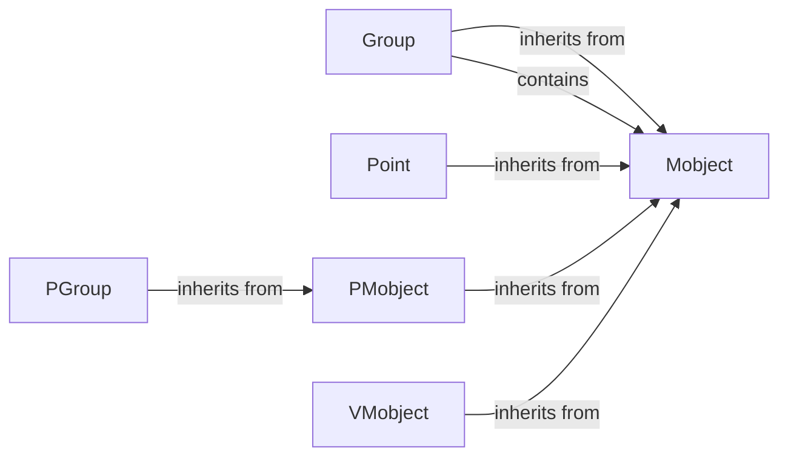

## Component Details

The Mobject system in Manim forms the foundation for all visual elements. It defines the base class `Mobject` and its subclasses, which are used to create and manipulate mathematical objects. The system handles object transformations, styling, and hierarchical relationships, enabling the creation of complex and dynamic scenes. Key components include `Mobject` (the base class), `VMobject` (for vector-based objects), `PMobject` (for point-cloud-based objects), and `Group` (for grouping multiple Mobjects). These components interact to form a flexible and powerful system for creating mathematical animations.

### Mobject
The base class for all visual objects in Manim. It manages core properties like points, colors, style, and transformations. It also handles hierarchical relationships by allowing Mobjects to contain other Mobjects as sub-Mobjects. It provides methods for manipulating these attributes and managing sub-Mobjects.
- **Related Classes/Methods**: `manim.manimlib.mobject.mobject.Mobject`

### Group
A subclass of Mobject that acts as a container for other Mobjects. It enables treating multiple Mobjects as a single entity for transformations and manipulations, simplifying complex animations.
- **Related Classes/Methods**: `manim.manimlib.mobject.mobject.Group`

### Point
A simple Mobject representing a single point in space. It is often used as an anchor or reference point for other Mobjects, providing a basic building block for more complex shapes.
- **Related Classes/Methods**: `manim.manimlib.mobject.mobject.Point`

### PMobject
A Mobject defined by a collection of points. It provides methods for adding, setting, and manipulating these points, as well as for applying color gradients, enabling the creation of point-cloud-based visual effects.
- **Related Classes/Methods**: `manim.manimlib.mobject.types.point_cloud_mobject.PMobject`

### PGroup
A subclass of PMobject that groups multiple PMobjects together. This allows for treating collections of point clouds as a single entity, simplifying transformations and manipulations of complex point-based structures.
- **Related Classes/Methods**: `manim.manimlib.mobject.types.point_cloud_mobject.PGroup`

### VMobject
A Mobject defined by a set of vectorized paths. It provides methods for defining and manipulating these paths, as well as for setting fill and stroke colors, enabling the creation of smooth, scalable vector graphics.
- **Related Classes/Methods**: `manim.manimlib.mobject.types.vectorized_mobject.VMobject`
