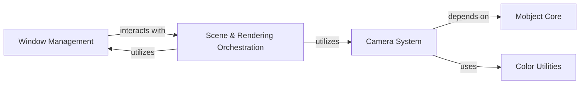

## Component Details

The Rendering & Display component is a high-level system responsible for visualizing Manim scenes. It orchestrates the camera's view, manages the display window, processes user input, and integrates various sub-components like the Camera System, Window Management, and Mobject Core to render the visual scene to the display or output files.

### Camera System
This component is responsible for managing the camera's view, projection, and rendering pipeline. It initializes the camera frame buffer objects, handles light sources, and refreshes uniforms for rendering. It also provides methods to retrieve camera properties like view matrix, implied location, scale, and pixel size.

**Related Classes/Methods**:

- <a href="https://github.com/3b1b/manim/blob/master/manimlib/camera/camera.py#L25-L255" target="_blank" rel="noopener noreferrer">`manim.manimlib.camera.camera.Camera` (25:255)</a>
- <a href="https://github.com/3b1b/manim/blob/master/manimlib/camera/camera.py#L26-L67" target="_blank" rel="noopener noreferrer">`manim.manimlib.camera.camera.Camera:__init__` (26:67)</a>
- <a href="https://github.com/3b1b/manim/blob/master/manimlib/camera/camera.py#L69-L70" target="_blank" rel="noopener noreferrer">`manim.manimlib.camera.camera.Camera.init_frame` (69:70)</a>
- <a href="https://github.com/3b1b/manim/blob/master/manimlib/camera/camera.py#L81-L95" target="_blank" rel="noopener noreferrer">`manim.manimlib.camera.camera.Camera.init_fbo` (81:95)</a>
- <a href="https://github.com/3b1b/manim/blob/master/manimlib/camera/camera.py#L97-L98" target="_blank" rel="noopener noreferrer">`manim.manimlib.camera.camera.Camera.init_light_source` (97:98)</a>
- <a href="https://github.com/3b1b/manim/blob/master/manimlib/camera/camera.py#L225-L236" target="_blank" rel="noopener noreferrer">`manim.manimlib.camera.camera.Camera:capture` (225:236)</a>
- <a href="https://github.com/3b1b/manim/blob/master/manimlib/camera/camera.py#L238-L255" target="_blank" rel="noopener noreferrer">`manim.manimlib.camera.camera.Camera.refresh_uniforms` (238:255)</a>
- <a href="https://github.com/3b1b/manim/blob/master/manimlib/camera/camera.py#L176-L177" target="_blank" rel="noopener noreferrer">`manim.manimlib.camera.camera.Camera:get_pixel_size` (176:177)</a>
- <a href="https://github.com/3b1b/manim/blob/master/manimlib/camera/camera_frame.py#L23-L266" target="_blank" rel="noopener noreferrer">`manimlib.camera.camera_frame.CameraFrame` (23:266)</a>
- <a href="https://github.com/3b1b/manim/blob/master/manimlib/camera/camera_frame.py#L24-L49" target="_blank" rel="noopener noreferrer">`manimlib.camera.camera_frame.CameraFrame:__init__` (24:49)</a>
- <a href="https://github.com/3b1b/manim/blob/master/manimlib/camera/camera_frame.py#L100-L116" target="_blank" rel="noopener noreferrer">`manimlib.camera.camera_frame.CameraFrame.get_view_matrix` (100:116)</a>
- <a href="https://github.com/3b1b/manim/blob/master/manimlib/camera/camera_frame.py#L251-L256" target="_blank" rel="noopener noreferrer">`manimlib.camera.camera_frame.CameraFrame.get_implied_camera_location` (251:256)</a>
- <a href="https://github.com/3b1b/manim/blob/master/manimlib/camera/camera_frame.py#L94-L95" target="_blank" rel="noopener noreferrer">`manimlib.camera.camera_frame.CameraFrame.get_scale` (94:95)</a>
- <a href="https://github.com/3b1b/manim/blob/master/manimlib/camera/camera_frame.py#L233-L235" target="_blank" rel="noopener noreferrer">`manimlib.camera.camera_frame.CameraFrame.get_center` (233:235)</a>
- <a href="https://github.com/3b1b/manim/blob/master/manimlib/camera/camera_frame.py#L97-L98" target="_blank" rel="noopener noreferrer">`manimlib.camera.camera_frame.CameraFrame.get_inverse_camera_rotation_matrix` (97:98)</a>
- <a href="https://github.com/3b1b/manim/blob/master/manimlib/camera/camera_frame.py#L245-L246" target="_blank" rel="noopener noreferrer">`manimlib.camera.camera_frame.CameraFrame.get_focal_distance` (245:246)</a>
- <a href="https://github.com/3b1b/manim/blob/master/manimlib/camera/camera_frame.py#L241-L243" target="_blank" rel="noopener noreferrer">`manimlib.camera.camera_frame.CameraFrame.get_height` (241:243)</a>
- <a href="https://github.com/3b1b/manim/blob/master/manimlib/camera/camera_frame.py#L237-L239" target="_blank" rel="noopener noreferrer">`manimlib.camera.camera_frame.CameraFrame.get_width` (237:239)</a>

### Mobject Core
This component defines the fundamental building blocks for all visual elements in Manim. It provides methods for initializing, manipulating points, setting dimensions, moving objects, applying depth tests, fixing objects in the frame, resizing, scaling, and managing bounding boxes. It also includes the base Point class.

**Related Classes/Methods**:

- <a href="https://github.com/3b1b/manim/blob/master/manimlib/mobject/mobject.py#L64-L2166" target="_blank" rel="noopener noreferrer">`manimlib.mobject.mobject.Mobject` (64:2166)</a>
- <a href="https://github.com/3b1b/manim/blob/master/manimlib/mobject/mobject.py#L79-L124" target="_blank" rel="noopener noreferrer">`manimlib.mobject.mobject.Mobject.__init__` (79:124)</a>
- <a href="https://github.com/3b1b/manim/blob/master/manimlib/mobject/mobject.py#L256-L259" target="_blank" rel="noopener noreferrer">`manimlib.mobject.mobject.Mobject.set_points` (256:259)</a>
- <a href="https://github.com/3b1b/manim/blob/master/manimlib/mobject/mobject.py#L1165-L1166" target="_blank" rel="noopener noreferrer">`manimlib.mobject.mobject.Mobject.set_width` (1165:1166)</a>
- <a href="https://github.com/3b1b/manim/blob/master/manimlib/mobject/mobject.py#L1168-L1169" target="_blank" rel="noopener noreferrer">`manimlib.mobject.mobject.Mobject.set_height` (1168:1169)</a>
- <a href="https://github.com/3b1b/manim/blob/master/manimlib/mobject/mobject.py#L1245-L1257" target="_blank" rel="noopener noreferrer">`manimlib.mobject.mobject.Mobject.move_to` (1245:1257)</a>
- <a href="https://github.com/3b1b/manim/blob/master/manimlib/mobject/mobject.py#L1925-L1928" target="_blank" rel="noopener noreferrer">`manim.manimlib.mobject.mobject.Mobject.apply_depth_test` (1925:1928)</a>
- <a href="https://github.com/3b1b/manim/blob/master/manimlib/mobject/mobject.py#L1912-L1914" target="_blank" rel="noopener noreferrer">`manim.manimlib.mobject.mobject.Mobject.fix_in_frame` (1912:1914)</a>
- <a href="https://github.com/3b1b/manim/blob/master/manimlib/mobject/mobject.py#L240-L253" target="_blank" rel="noopener noreferrer">`manim.manimlib.mobject.mobject.Mobject.resize_points` (240:253)</a>
- <a href="https://github.com/3b1b/manim/blob/master/manimlib/mobject/mobject.py#L1146-L1154" target="_blank" rel="noopener noreferrer">`manim.manimlib.mobject.mobject.Mobject.rescale_to_fit` (1146:1154)</a>
- <a href="https://github.com/3b1b/manim/blob/master/manimlib/mobject/mobject.py#L1500-L1506" target="_blank" rel="noopener noreferrer">`manim.manimlib.mobject.mobject.Mobject.get_bounding_box_point` (1500:1506)</a>
- <a href="https://github.com/3b1b/manim/blob/master/manimlib/mobject/mobject.py#L916-L922" target="_blank" rel="noopener noreferrer">`manim.manimlib.mobject.mobject.Mobject.shift` (916:922)</a>
- <a href="https://github.com/3b1b/manim/blob/master/manimlib/mobject/mobject.py#L2193-L2220" target="_blank" rel="noopener noreferrer">`manimlib.mobject.mobject.Point` (2193:2220)</a>
- <a href="https://github.com/3b1b/manim/blob/master/manimlib/mobject/mobject.py#L2212-L2213" target="_blank" rel="noopener noreferrer">`manimlib.mobject.mobject.Point.get_location` (2212:2213)</a>
- <a href="https://github.com/3b1b/manim/blob/master/manimlib/mobject/mobject.py#L423-L430" target="_blank" rel="noopener noreferrer">`manim.manimlib.mobject.mobject.Mobject.get_family` (423:430)</a>
- <a href="https://github.com/3b1b/manim/blob/master/manimlib/mobject/mobject.py#L1906-L1909" target="_blank" rel="noopener noreferrer">`manim.manimlib.mobject.mobject.Mobject.set_uniform` (1906:1909)</a>
- <a href="https://github.com/3b1b/manim/blob/master/manimlib/mobject/mobject.py#L323-L324" target="_blank" rel="noopener noreferrer">`manim.manimlib.mobject.mobject.Mobject.get_num_points` (323:324)</a>
- <a href="https://github.com/3b1b/manim/blob/master/manimlib/mobject/mobject.py#L359-L369" target="_blank" rel="noopener noreferrer">`manim.manimlib.mobject.mobject.Mobject.refresh_bounding_box` (359:369)</a>
- <a href="https://github.com/3b1b/manim/blob/master/manimlib/mobject/mobject.py#L1562-L1564" target="_blank" rel="noopener noreferrer">`manim.manimlib.mobject.mobject.Mobject.length_over_dim` (1562:1564)</a>
- <a href="https://github.com/3b1b/manim/blob/master/manimlib/mobject/mobject.py#L959-L964" target="_blank" rel="noopener noreferrer">`manim.manimlib.mobject.mobject.Mobject.stretch` (959:964)</a>
- <a href="https://github.com/3b1b/manim/blob/master/manimlib/mobject/mobject.py#L924-L952" target="_blank" rel="noopener noreferrer">`manim.manimlib.mobject.mobject.Mobject.scale` (924:952)</a>
- <a href="https://github.com/3b1b/manim/blob/master/manimlib/mobject/mobject.py#L335-L339" target="_blank" rel="noopener noreferrer">`manim.manimlib.mobject.mobject.Mobject.get_bounding_box` (335:339)</a>
- <a href="https://github.com/3b1b/manim/blob/master/manimlib/mobject/mobject.py#L279-L305" target="_blank" rel="noopener noreferrer">`manim.manimlib.mobject.mobject.Mobject.apply_points_function` (279:305)</a>
- <a href="https://github.com/3b1b/manim/blob/master/manimlib/mobject/mobject.py#L316-L317" target="_blank" rel="noopener noreferrer">`manimlib.mobject.mobject.Mobject.get_points` (316:317)</a>
- <a href="https://github.com/3b1b/manim/blob/master/manimlib/mobject/mobject.py#L341-L357" target="_blank" rel="noopener noreferrer">`manimlib.mobject.mobject.Mobject.compute_bounding_box` (341:357)</a>

### Window Management
This component is responsible for creating and managing the display window for Manim scenes. It handles the initialization of the window for a scene and processes user input events such as mouse motion.

**Related Classes/Methods**:

- <a href="https://github.com/3b1b/manim/blob/master/manimlib/window.py#L23-L242" target="_blank" rel="noopener noreferrer">`manim.manimlib.window.Window` (23:242)</a>
- <a href="https://github.com/3b1b/manim/blob/master/manimlib/window.py#L30-L50" target="_blank" rel="noopener noreferrer">`manim.manimlib.window.Window:__init__` (30:50)</a>
- <a href="https://github.com/3b1b/manim/blob/master/manimlib/window.py#L52-L73" target="_blank" rel="noopener noreferrer">`manim.manimlib.window.Window:init_for_scene` (52:73)</a>
- <a href="https://github.com/3b1b/manim/blob/master/manimlib/window.py#L155-L161" target="_blank" rel="noopener noreferrer">`manim.manimlib.window.Window:on_mouse_motion` (155:161)</a>

### Color Utilities
This component provides helper functions for color manipulation and conversion, specifically converting color representations to RGBA and RGB formats.

**Related Classes/Methods**:

- <a href="https://github.com/3b1b/manim/blob/master/manimlib/utils/color.py#L31-L32" target="_blank" rel="noopener noreferrer">`manim.manimlib.utils.color.color_to_rgba` (31:32)</a>
- <a href="https://github.com/3b1b/manim/blob/master/manimlib/utils/color.py#L22-L28" target="_blank" rel="noopener noreferrer">`manim.manimlib.utils.color.color_to_rgb` (22:28)</a>

### Scene & Rendering Orchestration
This component manages the overall scene execution, including initializing the camera and window, adding and removing mobjects, playing animations, and handling updates. It is responsible for orchestrating the rendering of the visual scene to the display window or output files, integrating the camera's view management and processing user input events for interactive scenes.

**Related Classes/Methods**:

- <a href="https://github.com/3b1b/manim/blob/master/manimlib/scene/scene.py#L51-L868" target="_blank" rel="noopener noreferrer">`manim.manimlib.scene.scene.Scene` (51:868)</a>
- <a href="https://github.com/3b1b/manim/blob/master/manimlib/scene/scene.py#L63-L140" target="_blank" rel="noopener noreferrer">`manim.manimlib.scene.scene.Scene:__init__` (63:140)</a>
- <a href="https://github.com/3b1b/manim/blob/master/manimlib/scene/scene.py#L571-L588" target="_blank" rel="noopener noreferrer">`manim.manimlib.scene.scene.Scene.play` (571:588)</a>
- <a href="https://github.com/3b1b/manim/blob/master/manimlib/scene/scene.py#L327-L344" target="_blank" rel="noopener noreferrer">`manim.manimlib.scene.scene.Scene.add` (327:344)</a>
- <a href="https://github.com/3b1b/manim/blob/master/manimlib/scene/scene.py#L370-L381" target="_blank" rel="noopener noreferrer">`manim.manimlib.scene.scene.Scene.remove` (370:381)</a>
- <a href="https://github.com/3b1b/manim/blob/master/manimlib/camera/camera.py#L26-L67" target="_blank" rel="noopener noreferrer">`manim.manimlib.camera.camera.Camera:__init__` (26:67)</a>
- <a href="https://github.com/3b1b/manim/blob/master/manimlib/camera/camera.py#L225-L236" target="_blank" rel="noopener noreferrer">`manim.manimlib.camera.camera.Camera:capture` (225:236)</a>
- <a href="https://github.com/3b1b/manim/blob/master/manimlib/camera/camera_frame.py#L24-L49" target="_blank" rel="noopener noreferrer">`manim.manimlib.camera.camera_frame.CameraFrame:__init__` (24:49)</a>
- <a href="https://github.com/3b1b/manim/blob/master/manimlib/window.py#L30-L50" target="_blank" rel="noopener noreferrer">`manim.manimlib.window.Window:__init__` (30:50)</a>
- <a href="https://github.com/3b1b/manim/blob/master/manimlib/window.py#L155-L161" target="_blank" rel="noopener noreferrer">`manim.manimlib.window.Window:on_mouse_motion` (155:161)</a>

### [FAQ](https://github.com/CodeBoarding/GeneratedOnBoardings/tree/main?tab=readme-ov-file#faq)