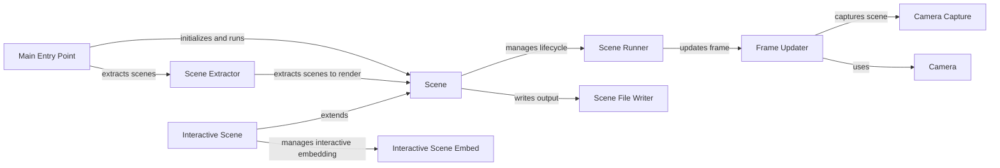

## Component Details

The Scene Management component orchestrates the animation process in Manim. It begins with the `__main__.py` entry point, which initializes the configuration and extracts the scene to be rendered using `extract_scene.py`. The extracted scene, an instance of the `Scene` class, then manages its lifecycle, including setup, animation, interaction, and rendering. The `Scene` interacts with the `Camera` to capture frames and the `SceneFileWriter` to output the rendered scene to files. Interactive scenes are handled by `InteractiveScene` and `InteractiveSceneEmbed`, allowing for real-time manipulation and exploration.

### Main Entry Point
The `__main__.py` module serves as the entry point for the Manim program. It initializes the configuration, extracts the scene to render, and then runs the scene.
- **Related Classes/Methods**: `manim.manimlib.__main__:main`

### Scene Extractor
The `extract_scene.py` module extracts the scene class from a given module. It loads the module, identifies scene classes, and prepares them for rendering. It also determines which scenes to render based on configuration.
- **Related Classes/Methods**: `manim.manimlib.extract_scene:main`, `manim.manimlib.extract_scene:get_scenes_to_render`

### Scene
The `Scene` class is the base class for all scenes in Manim. It manages the lifecycle of a scene, including setup, animation, interaction, and rendering. It interacts with the Camera to capture frames and the SceneFileWriter to output the rendered scene.
- **Related Classes/Methods**: `manim.manimlib.scene.scene.Scene`

### Scene Runner
The `Scene:run` method orchestrates the animation and interaction loop within a scene. It calls various methods for pre-play, begin animations, progress through animations, finish animations, and post-play.
- **Related Classes/Methods**: `manim.manimlib.scene.scene.Scene:run`

### Frame Updater
The `Scene:update_frame` method updates the frame of the scene, emitting the frame, updating mobjects, and capturing the current state of the camera.
- **Related Classes/Methods**: `manim.manimlib.scene.scene.Scene:update_frame`

### Camera
The `Camera` class represents the camera in the scene. It handles capturing the scene, managing the frame buffer object (FBO), and providing image data. It interacts with the Scene to capture the current frame.
- **Related Classes/Methods**: `manim.manimlib.camera.camera.Camera`

### Camera Capture
The `Camera:capture` method captures the current state of the scene from the camera's perspective, storing the image data in the frame buffer.
- **Related Classes/Methods**: `manim.manimlib.camera.camera.Camera:capture`

### Scene File Writer
The `SceneFileWriter` class handles writing the scene's output to files, including images, movies, and audio. It manages the output directories and file paths. It receives frames from the Scene and writes them to the specified output format.
- **Related Classes/Methods**: `manim.manimlib.scene.scene_file_writer.SceneFileWriter`

### Interactive Scene
The `InteractiveScene` class extends the base Scene class to provide interactive features, such as selection, manipulation, and color palette tools.
- **Related Classes/Methods**: `manim.manimlib.scene.interactive_scene.InteractiveScene`

### Interactive Scene Embed
The `InteractiveSceneEmbed` class manages the interactive embedding of a scene, providing tools for interaction and debugging.
- **Related Classes/Methods**: `manim.manimlib.scene.scene_embed.InteractiveSceneEmbed`
