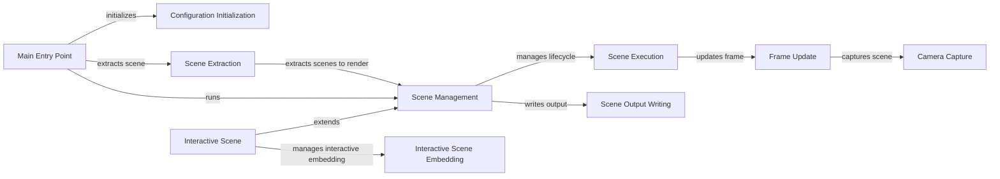

## Component Details

The Scene Management component orchestrates the entire animation process in Manim. It begins with the `main` function, which initializes the configuration and extracts the scene to be rendered. The `Scene` class then manages the lifecycle of the scene, handling setup, animation, interaction, and rendering. The `Camera` captures the scene, and the `SceneFileWriter` writes the output to files. Interactive features are provided by `InteractiveScene` and `InteractiveSceneEmbed`. This system ensures a structured and efficient animation workflow.

### Main Entry Point
The `main` function serves as the entry point for the Manim program. It initializes the configuration, extracts the scene to render, and then runs the scene, initiating the animation process.
- **Related Classes/Methods**: `manim.manimlib.__main__:main`

### Configuration Initialization
The `initialize_manim_config` function sets up the global configuration for Manim. It handles default values and command-line arguments, ensuring the program is properly configured before rendering.
- **Related Classes/Methods**: `manim.manimlib.config:initialize_manim_config`

### Scene Extraction
The `extract_scene` function extracts the scene class from a given module. It loads the module, identifies scene classes, and prepares them for rendering, making the scene available for animation.
- **Related Classes/Methods**: `manim.manimlib.extract_scene:main`, `manim.manimlib.extract_scene:get_scenes_to_render`

### Scene Management
The `Scene` class is the base class for all scenes in Manim. It manages the lifecycle of a scene, including setup, animation, interaction, and rendering, providing the core functionality for creating animations.
- **Related Classes/Methods**: `manim.manimlib.scene.scene.Scene`

### Scene Execution
The `Scene:run` method orchestrates the animation and interaction loop. It calls various methods for pre-play, begin animations, progress through animations, finish animations, and post-play, controlling the flow of the animation.
- **Related Classes/Methods**: `manim.manimlib.scene.scene.Scene:run`

### Frame Update
The `Scene:update_frame` method updates the frame of the scene. It emits the frame, updates mobjects, and captures the current state of the camera, ensuring the scene is visually updated.
- **Related Classes/Methods**: `manim.manimlib.scene.scene.Scene:update_frame`

### Camera Capture
The `Camera` class represents the camera in the scene. It handles capturing the scene, managing the frame buffer object (FBO), and providing image data, allowing the scene to be visualized.
- **Related Classes/Methods**: `manim.manimlib.camera.camera.Camera`, `manim.manimlib.camera.camera.Camera:capture`

### Scene Output Writing
The `SceneFileWriter` class handles writing the scene's output to files, including images, movies, and audio. It manages the output directories and file paths, ensuring the animation is saved correctly.
- **Related Classes/Methods**: `manim.manimlib.scene.scene_file_writer.SceneFileWriter`, `manim.manimlib.scene.scene_file_writer.SceneFileWriter:finish`

### Interactive Scene
The `InteractiveScene` class extends the base Scene class to provide interactive features, such as selection, manipulation, and color palette tools, allowing for real-time interaction with the scene.
- **Related Classes/Methods**: `manim.manimlib.scene.interactive_scene.InteractiveScene`

### Interactive Scene Embedding
The `InteractiveSceneEmbed` class manages the interactive embedding of a scene, providing tools for interaction and debugging, enabling a more immersive and interactive experience.
- **Related Classes/Methods**: `manim.manimlib.scene.scene_embed.InteractiveSceneEmbed`
