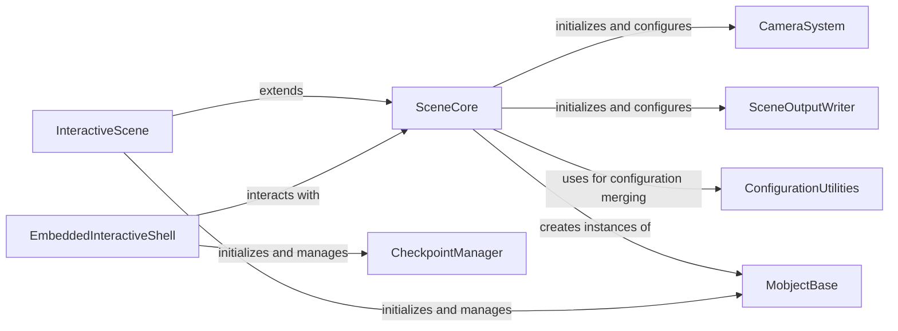

## Component Details

This component manages the overall animation timeline and the state of the visual scene. It handles the addition and removal of Mobjects, updates their state over time, and orchestrates the playback of animations. It serves as the central control for defining and running an animation sequence, also facilitating embedding interactive scenes.

### SceneCore
The fundamental building block for creating animations in Manim. It manages the scene's state, including mobjects, camera, and file writing. It orchestrates the animation playback cycle through methods like `play`, `add`, and `remove`.

**Related Classes/Methods**:

- <a href="https://github.com/3b1b/manim/blob/master/manimlib/scene/scene.py#L51-L868" target="_blank" rel="noopener noreferrer">`manim.manimlib.scene.scene.Scene` (51:868)</a>
- <a href="https://github.com/3b1b/manim/blob/master/manimlib/scene/scene.py#L63-L140" target="_blank" rel="noopener noreferrer">`manim.manimlib.scene.scene.Scene:__init__` (63:140)</a>
- <a href="https://github.com/3b1b/manim/blob/master/manimlib/scene/scene.py#L571-L588" target="_blank" rel="noopener noreferrer">`manim.manimlib.scene.scene.Scene:play` (571:588)</a>
- <a href="https://github.com/3b1b/manim/blob/master/manimlib/scene/scene.py#L327-L344" target="_blank" rel="noopener noreferrer">`manim.manimlib.scene.scene.Scene:add` (327:344)</a>
- <a href="https://github.com/3b1b/manim/blob/master/manimlib/scene/scene.py#L370-L381" target="_blank" rel="noopener noreferrer">`manim.manimlib.scene.scene.Scene:remove` (370:381)</a>
- <a href="https://github.com/3b1b/manim/blob/master/manimlib/scene/scene.py#L513-L524" target="_blank" rel="noopener noreferrer">`manim.manimlib.scene.scene.Scene.pre_play` (513:524)</a>
- <a href="https://github.com/3b1b/manim/blob/master/manimlib/scene/scene.py#L536-L547" target="_blank" rel="noopener noreferrer">`manim.manimlib.scene.scene.Scene.begin_animations` (536:547)</a>
- <a href="https://github.com/3b1b/manim/blob/master/manimlib/scene/scene.py#L549-L559" target="_blank" rel="noopener noreferrer">`manim.manimlib.scene.scene.Scene.progress_through_animations` (549:559)</a>
- <a href="https://github.com/3b1b/manim/blob/master/manimlib/scene/scene.py#L561-L568" target="_blank" rel="noopener noreferrer">`manim.manimlib.scene.scene.Scene.finish_animations` (561:568)</a>
- <a href="https://github.com/3b1b/manim/blob/master/manimlib/scene/scene.py#L526-L534" target="_blank" rel="noopener noreferrer">`manim.manimlib.scene.scene.Scene.post_play` (526:534)</a>

### InteractiveScene
Extends the core Scene functionality to provide interactive capabilities. It handles user input (mouse and keyboard) for selecting, manipulating, and displaying information about mobjects on the screen, enhancing the development and debugging experience.

**Related Classes/Methods**:

- <a href="https://github.com/3b1b/manim/blob/master/manimlib/scene/interactive_scene.py#L65-L638" target="_blank" rel="noopener noreferrer">`manim.manimlib.scene.interactive_scene.InteractiveScene` (65:638)</a>
- <a href="https://github.com/3b1b/manim/blob/master/manimlib/scene/interactive_scene.py#L111-L132" target="_blank" rel="noopener noreferrer">`manim.manimlib.scene.interactive_scene.InteractiveScene:setup` (111:132)</a>
- <a href="https://github.com/3b1b/manim/blob/master/manimlib/scene/interactive_scene.py#L154-L158" target="_blank" rel="noopener noreferrer">`manim.manimlib.scene.interactive_scene.InteractiveScene.get_selection_highlight` (154:158)</a>
- <a href="https://github.com/3b1b/manim/blob/master/manimlib/scene/interactive_scene.py#L134-L142" target="_blank" rel="noopener noreferrer">`manim.manimlib.scene.interactive_scene.InteractiveScene.get_selection_rectangle` (134:142)</a>
- <a href="https://github.com/3b1b/manim/blob/master/manimlib/scene/interactive_scene.py#L181-L191" target="_blank" rel="noopener noreferrer">`manim.manimlib.scene.interactive_scene.InteractiveScene.get_crosshair` (181:191)</a>
- <a href="https://github.com/3b1b/manim/blob/master/manimlib/scene/interactive_scene.py#L205-L226" target="_blank" rel="noopener noreferrer">`manim.manimlib.scene.interactive_scene.InteractiveScene.get_information_label` (205:226)</a>
- <a href="https://github.com/3b1b/manim/blob/master/manimlib/scene/interactive_scene.py#L193-L203" target="_blank" rel="noopener noreferrer">`manim.manimlib.scene.interactive_scene.InteractiveScene.get_color_palette` (193:203)</a>
- <a href="https://github.com/3b1b/manim/blob/master/manimlib/scene/interactive_scene.py#L258-L270" target="_blank" rel="noopener noreferrer">`manim.manimlib.scene.interactive_scene.InteractiveScene.regenerate_selection_search_set` (258:270)</a>

### EmbeddedInteractiveShell
Facilitates interactive development by embedding an IPython shell directly within a Manim scene. It allows for dynamic code execution, scene reloading, and checkpoint management, providing a powerful environment for rapid prototyping and debugging.

**Related Classes/Methods**:

- <a href="https://github.com/3b1b/manim/blob/master/manimlib/scene/scene_embed.py#L23-L159" target="_blank" rel="noopener noreferrer">`manim.manimlib.scene.scene_embed.InteractiveSceneEmbed` (23:159)</a>
- <a href="https://github.com/3b1b/manim/blob/master/manimlib/scene/scene_embed.py#L24-L33" target="_blank" rel="noopener noreferrer">`manim.manimlib.scene.scene_embed.InteractiveSceneEmbed:__init__` (24:33)</a>
- <a href="https://github.com/3b1b/manim/blob/master/manimlib/scene/scene_embed.py#L38-L57" target="_blank" rel="noopener noreferrer">`manim.manimlib.scene.scene_embed.InteractiveSceneEmbed.get_ipython_shell_for_embedded_scene` (38:57)</a>
- <a href="https://github.com/3b1b/manim/blob/master/manimlib/scene/scene_embed.py#L81-L91" target="_blank" rel="noopener noreferrer">`manim.manimlib.scene.scene_embed.InteractiveSceneEmbed.enable_gui` (81:91)</a>
- <a href="https://github.com/3b1b/manim/blob/master/manimlib/scene/scene_embed.py#L93-L99" target="_blank" rel="noopener noreferrer">`manim.manimlib.scene.scene_embed.InteractiveSceneEmbed.ensure_frame_update_post_cell` (93:99)</a>
- <a href="https://github.com/3b1b/manim/blob/master/manimlib/scene/scene_embed.py#L101-L110" target="_blank" rel="noopener noreferrer">`manim.manimlib.scene.scene_embed.InteractiveSceneEmbed.ensure_flash_on_error` (101:110)</a>
- <a href="https://github.com/3b1b/manim/blob/master/manimlib/scene/scene_embed.py#L144-L150" target="_blank" rel="noopener noreferrer">`manim.manimlib.scene.scene_embed.InteractiveSceneEmbed.auto_reload` (144:150)</a>

### CameraSystem
Manages the rendering pipeline, including frame buffer objects (FBOs), pixel data, and camera properties. It is responsible for capturing and processing the visual output of the scene.

**Related Classes/Methods**:

- <a href="https://github.com/3b1b/manim/blob/master/manimlib/camera/camera.py#L25-L255" target="_blank" rel="noopener noreferrer">`manimlib.camera.camera.Camera` (25:255)</a>
- <a href="https://github.com/3b1b/manim/blob/master/manimlib/camera/camera_frame.py#L172-L189" target="_blank" rel="noopener noreferrer">`manimlib.camera.camera_frame.CameraFrame.reorient` (172:189)</a>
- <a href="https://github.com/3b1b/manim/blob/master/manimlib/camera/camera_frame.py#L58-L60" target="_blank" rel="noopener noreferrer">`manimlib.camera.camera_frame.CameraFrame.make_orientation_default` (58:60)</a>

### SceneOutputWriter
Handles the output of the scene to various file formats, primarily video and images. It integrates with external tools like FFmpeg for video encoding and manages audio synchronization and progress display.

**Related Classes/Methods**:

- <a href="https://github.com/3b1b/manim/blob/master/manimlib/scene/scene_file_writer.py#L28-L385" target="_blank" rel="noopener noreferrer">`manimlib.scene.scene_file_writer.SceneFileWriter` (28:385)</a>

### MobjectBase
The foundational class for all graphical objects in Manim. It provides core functionalities for managing points, colors, transformations, and hierarchical relationships between objects. 'Point' is a basic implementation of a Mobject.

**Related Classes/Methods**:

- <a href="https://github.com/3b1b/manim/blob/master/manimlib/mobject/mobject.py#L64-L2166" target="_blank" rel="noopener noreferrer">`manimlib.mobject.mobject.Mobject` (64:2166)</a>
- <a href="https://github.com/3b1b/manim/blob/master/manimlib/mobject/mobject.py#L2193-L2220" target="_blank" rel="noopener noreferrer">`manimlib.mobject.mobject.Point` (2193:2220)</a>

### ConfigurationUtilities
Provides utility functions for recursive dictionary merging, primarily used for consolidating configuration settings from various sources within the Manim framework.

**Related Classes/Methods**:

- <a href="https://github.com/3b1b/manim/blob/master/manimlib/utils/dict_ops.py#L5-L22" target="_blank" rel="noopener noreferrer">`manimlib.utils.dict_ops.merge_dicts_recursively` (5:22)</a>

### CheckpointManager
Manages the saving and restoring of scene states, allowing users to revert to previous points in their interactive development session. It is a sub-component of the EmbeddedInteractiveShell.

**Related Classes/Methods**:

- <a href="https://github.com/3b1b/manim/blob/master/manimlib/scene/scene_embed.py#L162-L203" target="_blank" rel="noopener noreferrer">`manim.manimlib.scene.scene_embed.CheckpointManager` (162:203)</a>

### [FAQ](https://github.com/CodeBoarding/GeneratedOnBoardings/tree/main?tab=readme-ov-file#faq)