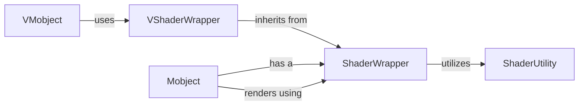

## Component Details

The Shader Management subsystem in Manim is responsible for handling the low-level graphics programming aspects, specifically the loading, compilation, and application of OpenGL shaders. It provides a structured way to manage shader programs, uniforms, and textures, enabling complex visual effects and efficient rendering of Mobjects. The core flow involves Mobjects requesting shader wrappers, which then utilize shader utilities to compile and link shader code, manage vertex data, and apply uniforms before rendering. Specialized Mobjects like VMobjects use extended shader wrappers for advanced rendering techniques.

### ShaderWrapper
The ShaderWrapper component encapsulates OpenGL shader programs and manages their associated vertex data, textures, and uniform variables. It provides core functionalities for initializing shader programs, binding mobject uniforms, handling textures, and preparing vertex objects for rendering. This component serves as a base for more specialized shader wrappers.

**Related Classes/Methods**:

- <a href="https://github.com/3b1b/manim/blob/master/manimlib/shader_wrapper.py#L34-L217" target="_blank" rel="noopener noreferrer">`manim.manimlib.shader_wrapper.ShaderWrapper` (34:217)</a>
- <a href="https://github.com/3b1b/manim/blob/master/manimlib/shader_wrapper.py#L35-L63" target="_blank" rel="noopener noreferrer">`manim.manimlib.shader_wrapper.ShaderWrapper:__init__` (35:63)</a>
- <a href="https://github.com/3b1b/manim/blob/master/manimlib/shader_wrapper.py#L83-L91" target="_blank" rel="noopener noreferrer">`manim.manimlib.shader_wrapper.ShaderWrapper:init_program` (83:91)</a>
- <a href="https://github.com/3b1b/manim/blob/master/manimlib/shader_wrapper.py#L111-L112" target="_blank" rel="noopener noreferrer">`manim.manimlib.shader_wrapper.ShaderWrapper.bind_to_mobject_uniforms` (111:112)</a>
- <a href="https://github.com/3b1b/manim/blob/master/manimlib/shader_wrapper.py#L71-L81" target="_blank" rel="noopener noreferrer">`manim.manimlib.shader_wrapper.ShaderWrapper.init_program_code` (71:81)</a>
- <a href="https://github.com/3b1b/manim/blob/master/manimlib/shader_wrapper.py#L126-L133" target="_blank" rel="noopener noreferrer">`manim.manimlib.shader_wrapper.ShaderWrapper.replace_code` (126:133)</a>
- <a href="https://github.com/3b1b/manim/blob/master/manimlib/shader_wrapper.py#L93-L97" target="_blank" rel="noopener noreferrer">`manim.manimlib.shader_wrapper.ShaderWrapper.init_textures` (93:97)</a>
- <a href="https://github.com/3b1b/manim/blob/master/manimlib/shader_wrapper.py#L99-L101" target="_blank" rel="noopener noreferrer">`manim.manimlib.shader_wrapper.ShaderWrapper.init_vertex_objects` (99:101)</a>
- <a href="https://github.com/3b1b/manim/blob/master/manimlib/shader_wrapper.py#L117-L124" target="_blank" rel="noopener noreferrer">`manim.manimlib.shader_wrapper.ShaderWrapper.refresh_id` (117:124)</a>
- <a href="https://github.com/3b1b/manim/blob/master/manimlib/shader_wrapper.py#L103-L109" target="_blank" rel="noopener noreferrer">`manim.manimlib.shader_wrapper.ShaderWrapper.add_texture` (103:109)</a>
- <a href="https://github.com/3b1b/manim/blob/master/manimlib/shader_wrapper.py#L153-L174" target="_blank" rel="noopener noreferrer">`manim.manimlib.shader_wrapper.ShaderWrapper.read_in` (153:174)</a>
- <a href="https://github.com/3b1b/manim/blob/master/manimlib/shader_wrapper.py#L176-L185" target="_blank" rel="noopener noreferrer">`manim.manimlib.shader_wrapper.ShaderWrapper.generate_vaos` (176:185)</a>
- <a href="https://github.com/3b1b/manim/blob/master/manimlib/shader_wrapper.py#L188-L192" target="_blank" rel="noopener noreferrer">`manim.manimlib.shader_wrapper.ShaderWrapper.pre_render` (188:192)</a>
- <a href="https://github.com/3b1b/manim/blob/master/manimlib/shader_wrapper.py#L194-L196" target="_blank" rel="noopener noreferrer">`manim.manimlib.shader_wrapper.ShaderWrapper.render` (194:196)</a>
- <a href="https://github.com/3b1b/manim/blob/master/manimlib/shader_wrapper.py#L198-L204" target="_blank" rel="noopener noreferrer">`manim.manimlib.shader_wrapper.ShaderWrapper.update_program_uniforms` (198:204)</a>

### VShaderWrapper
The VShaderWrapper component extends ShaderWrapper, providing specialized shader management for VMobjects. It initializes multiple shader programs (stroke, fill, fill_border, fill_depth) and manages a dedicated fill canvas for complex alpha blending and winding number calculations, ensuring correct rendering of vector graphics.

**Related Classes/Methods**:

- <a href="https://github.com/3b1b/manim/blob/master/manimlib/shader_wrapper.py#L220-L480" target="_blank" rel="noopener noreferrer">`manim.manimlib.shader_wrapper.VShaderWrapper` (220:480)</a>
- <a href="https://github.com/3b1b/manim/blob/master/manimlib/shader_wrapper.py#L221-L246" target="_blank" rel="noopener noreferrer">`manim.manimlib.shader_wrapper.VShaderWrapper:__init__` (221:246)</a>
- <a href="https://github.com/3b1b/manim/blob/master/manimlib/shader_wrapper.py#L402-L472" target="_blank" rel="noopener noreferrer">`manim.manimlib.shader_wrapper.VShaderWrapper.get_fill_canvas` (402:472)</a>
- <a href="https://github.com/3b1b/manim/blob/master/manimlib/shader_wrapper.py#L248-L255" target="_blank" rel="noopener noreferrer">`manim.manimlib.shader_wrapper.VShaderWrapper.init_program_code` (248:255)</a>
- <a href="https://github.com/3b1b/manim/blob/master/manimlib/shader_wrapper.py#L257-L305" target="_blank" rel="noopener noreferrer">`manim.manimlib.shader_wrapper.VShaderWrapper.init_program` (257:305)</a>
- <a href="https://github.com/3b1b/manim/blob/master/manimlib/shader_wrapper.py#L307-L312" target="_blank" rel="noopener noreferrer">`manim.manimlib.shader_wrapper.VShaderWrapper.init_vertex_objects` (307:312)</a>
- <a href="https://github.com/3b1b/manim/blob/master/manimlib/shader_wrapper.py#L314-L335" target="_blank" rel="noopener noreferrer">`manim.manimlib.shader_wrapper.VShaderWrapper.generate_vaos` (314:335)</a>
- <a href="https://github.com/3b1b/manim/blob/master/manimlib/shader_wrapper.py#L345-L348" target="_blank" rel="noopener noreferrer">`manim.manimlib.shader_wrapper.VShaderWrapper.render_stroke` (345:348)</a>
- <a href="https://github.com/3b1b/manim/blob/master/manimlib/shader_wrapper.py#L350-L397" target="_blank" rel="noopener noreferrer">`manim.manimlib.shader_wrapper.VShaderWrapper.render_fill` (350:397)</a>
- <a href="https://github.com/3b1b/manim/blob/master/manimlib/shader_wrapper.py#L474-L480" target="_blank" rel="noopener noreferrer">`manim.manimlib.shader_wrapper.VShaderWrapper.render` (474:480)</a>

### ShaderUtility
The ShaderUtility component provides essential helper functions for interacting with OpenGL shaders. Its responsibilities include loading shader code from files, compiling and linking shader programs, and efficiently setting uniform variables within these programs. This component abstracts away low-level shader operations, supporting the higher-level ShaderWrapper components.

**Related Classes/Methods**:

- <a href="https://github.com/3b1b/manim/blob/master/manimlib/utils/shaders.py#L34-L44" target="_blank" rel="noopener noreferrer">`manimlib.utils.shaders.get_shader_program` (34:44)</a>
- <a href="https://github.com/3b1b/manim/blob/master/manimlib/utils/shaders.py#L80-L106" target="_blank" rel="noopener noreferrer">`manimlib.utils.shaders.get_shader_code_from_file` (80:106)</a>
- <a href="https://github.com/3b1b/manim/blob/master/manimlib/utils/shaders.py#L24-L30" target="_blank" rel="noopener noreferrer">`manimlib.utils.shaders.image_path_to_texture` (24:30)</a>
- <a href="https://github.com/3b1b/manim/blob/master/manimlib/utils/shaders.py#L47-L76" target="_blank" rel="noopener noreferrer">`manimlib.utils.shaders.set_program_uniform` (47:76)</a>

### Mobject
The base class for all objects displayed in Manim. It manages general properties, transformations, and the rendering process by interacting with a ShaderWrapper.

**Related Classes/Methods**:

- <a href="https://github.com/3b1b/manim/blob/master/manimlib/mobject/mobject.py#L64-L2166" target="_blank" rel="noopener noreferrer">`manimlib.mobject.mobject.Mobject` (64:2166)</a>
- <a href="https://github.com/3b1b/manim/blob/master/manimlib/mobject/mobject.py#L2003-L2013" target="_blank" rel="noopener noreferrer">`manimlib.mobject.mobject.Mobject:init_shader_wrapper` (2003:2013)</a>
- <a href="https://github.com/3b1b/manim/blob/master/manimlib/mobject/mobject.py#L2015-L2022" target="_blank" rel="noopener noreferrer">`manimlib.mobject.mobject.Mobject:refresh_shader_wrapper_id` (2015:2022)</a>
- <a href="https://github.com/3b1b/manim/blob/master/manimlib/mobject/mobject.py#L2024-L2027" target="_blank" rel="noopener noreferrer">`manimlib.mobject.mobject.Mobject:get_shader_wrapper` (2024:2027)</a>
- <a href="https://github.com/3b1b/manim/blob/master/manimlib/mobject/mobject.py#L2054-L2061" target="_blank" rel="noopener noreferrer">`manimlib.mobject.mobject.Mobject:render` (2054:2061)</a>

### VMobject
A vectorized Mobject that specifically uses VShaderWrapper for rendering complex vector graphics with distinct passes for strokes, fills, and depth. It handles the generation of vertex data suitable for these specialized rendering techniques.

**Related Classes/Methods**:

- <a href="https://github.com/3b1b/manim/blob/master/manimlib/mobject/types/vectorized_mobject.py#L60-L1295" target="_blank" rel="noopener noreferrer">`manimlib.mobject.types.vectorized_mobject.VMobject` (60:1295)</a>
- <a href="https://github.com/3b1b/manim/blob/master/manimlib/mobject/types/vectorized_mobject.py#L1271-L1279" target="_blank" rel="noopener noreferrer">`manimlib.mobject.types.vectorized_mobject.VMobject:init_shader_wrapper` (1271:1279)</a>
- <a href="https://github.com/3b1b/manim/blob/master/manimlib/mobject/types/vectorized_mobject.py#L1281-L1286" target="_blank" rel="noopener noreferrer">`manimlib.mobject.types.vectorized_mobject.VMobject:refresh_shader_wrapper_id` (1281:1286)</a>

### [FAQ](https://github.com/CodeBoarding/GeneratedOnBoardings/tree/main?tab=readme-ov-file#faq)