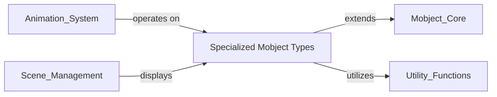

## Component Details

This graph describes the 'Specialized Mobject Types' component within the Manim library. This component is a crucial extension of the core Mobject system, providing a wide array of pre-built graphical objects. Its purpose is to offer readily available and specialized visual elements, ranging from basic geometric shapes and complex 3D structures to text, interactive elements, and mathematical representations. These specialized mobjects are designed to be easily integrated into Manim scenes and can be manipulated by the Animation System and displayed by the Scene Management component, leveraging the foundational capabilities of the Mobject Core and various Utility Functions.

### Specialized Mobject Types
This component provides a comprehensive collection of pre-defined graphical objects in Manim, extending the foundational `Mobject` and `VMobject` classes. It encompasses a wide array of visual elements, including basic geometric shapes, complex 3D objects, text and mathematical expressions, interactive UI elements, and specialized representations for data visualization and mathematical concepts. These specialized mobjects are organized into distinct modules based on their functionality, allowing for modular and extensible creation of visual content.

**Related Classes/Methods**:

- <a href="https://github.com/3b1b/manim/blob/master/manimlib/mobject/three_dimensions.py#L94-L114" target="_blank" rel="noopener noreferrer">`manim.manimlib.mobject.three_dimensions.Sphere:__init__` (94:114)</a>
- <a href="https://github.com/3b1b/manim/blob/master/manimlib/mobject/number_line.py#L24-L98" target="_blank" rel="noopener noreferrer">`manim.manimlib.mobject.number_line.NumberLine:__init__` (24:98)</a>
- <a href="https://github.com/3b1b/manim/blob/master/manimlib/mobject/coordinate_systems.py#L440-L483" target="_blank" rel="noopener noreferrer">`manim.manimlib.mobject.coordinate_systems.Axes:__init__` (440:483)</a>
- <a href="https://github.com/3b1b/manim/blob/master/manimlib/mobject/geometry.py#L291-L301" target="_blank" rel="noopener noreferrer">`manim.manimlib.mobject.geometry.Circle:__init__` (291:301)</a>
- <a href="https://github.com/3b1b/manim/blob/master/manimlib/mobject/interactive.py#L59-L65" target="_blank" rel="noopener noreferrer">`manim.manimlib.mobject.interactive.Button:__init__` (59:65)</a>
- <a href="https://github.com/3b1b/manim/blob/master/manimlib/mobject/svg/tex_mobject.py#L27-L68" target="_blank" rel="noopener noreferrer">`manim.manimlib.mobject.svg.tex_mobject.Tex:__init__` (27:68)</a>
- <a href="https://github.com/3b1b/manim/blob/master/manimlib/mobject/svg/text_mobject.py#L389-L406" target="_blank" rel="noopener noreferrer">`manim.manimlib.mobject.svg.text_mobject.Text:__init__` (389:406)</a>
- <a href="https://github.com/3b1b/manim/blob/master/manimlib/mobject/types/dot_cloud.py#L35-L57" target="_blank" rel="noopener noreferrer">`manim.manimlib.mobject.types.dot_cloud.DotCloud:__init__` (35:57)</a>
- <a href="https://github.com/3b1b/manim/blob/master/manimlib/mobject/types/image_mobject.py#L30-L39" target="_blank" rel="noopener noreferrer">`manim.manimlib.mobject.types.image_mobject.ImageMobject:__init__` (30:39)</a>
- <a href="https://github.com/3b1b/manim/blob/master/manimlib/mobject/vector_field.py#L142-L200" target="_blank" rel="noopener noreferrer">`manim.manimlib.mobject.vector_field.VectorField:__init__` (142:200)</a>
- <a href="https://github.com/3b1b/manim/blob/master/manimlib/mobject/value_tracker.py#L22-L28" target="_blank" rel="noopener noreferrer">`manim.manimlib.mobject.value_tracker.ValueTracker:__init__` (22:28)</a>
- <a href="https://github.com/3b1b/manim/blob/master/manimlib/mobject/shape_matchers.py#L23-L34" target="_blank" rel="noopener noreferrer">`manim.manimlib.mobject.shape_matchers.SurroundingRectangle:__init__` (23:34)</a>
- <a href="https://github.com/3b1b/manim/blob/master/manimlib/mobject/changing.py#L19-L50" target="_blank" rel="noopener noreferrer">`manim.manimlib.mobject.changing.AnimatedBoundary:__init__` (19:50)</a>
- <a href="https://github.com/3b1b/manim/blob/master/manimlib/mobject/numbers.py#L35-L76" target="_blank" rel="noopener noreferrer">`manim.manimlib.mobject.numbers.DecimalNumber:__init__` (35:76)</a>
- <a href="https://github.com/3b1b/manim/blob/master/manimlib/mobject/boolean_ops.py#L53-L63" target="_blank" rel="noopener noreferrer">`manim.manimlib.mobject.boolean_ops.Union:__init__` (53:63)</a>
- <a href="https://github.com/3b1b/manim/blob/master/manimlib/mobject/functions.py#L71-L84" target="_blank" rel="noopener noreferrer">`manim.manimlib.mobject.functions.FunctionGraph:__init__` (71:84)</a>
- <a href="https://github.com/3b1b/manim/blob/master/manimlib/mobject/probability.py#L29-L48" target="_blank" rel="noopener noreferrer">`manim.manimlib.mobject.probability.SampleSpace:__init__` (29:48)</a>
- <a href="https://github.com/3b1b/manim/blob/master/manimlib/mobject/matrix.py#L25-L71" target="_blank" rel="noopener noreferrer">`manim.manimlib.mobject.matrix.Matrix:__init__` (25:71)</a>
- <a href="https://github.com/3b1b/manim/blob/master/manimlib/mobject/svg/drawings.py#L92-L107" target="_blank" rel="noopener noreferrer">`manim.manimlib.mobject.svg.drawings.Lightbulb:__init__` (92:107)</a>

### [FAQ](https://github.com/CodeBoarding/GeneratedOnBoardings/tree/main?tab=readme-ov-file#faq)