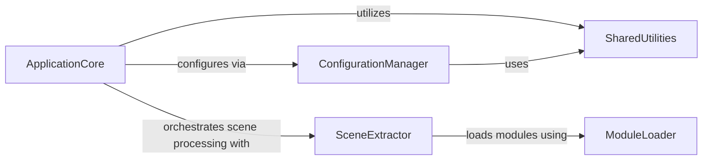

## Component Details

This graph illustrates the core components responsible for Manim's system configuration, module loading, scene extraction, and overall application execution. The `ApplicationCore` acts as the central orchestrator, initiating the configuration process through the `ConfigurationManager`, utilizing `SharedUtilities` for common tasks like cache clearing, and delegating scene processing to the `SceneExtractor`. The `SceneExtractor`, in turn, relies on the `ModuleLoader` to dynamically load user-defined Python modules containing Manim scenes. The `ConfigurationManager` is crucial for parsing command-line arguments and loading settings from YAML files, ensuring the application runs with the correct parameters.

### ModuleLoader
This component is responsible for dynamically loading and reloading Python modules, which is essential for Manim's ability to update scenes without a full application restart. It tracks imported modules and performs deep reloads to ensure consistency.

**Related Classes/Methods**:

- <a href="https://github.com/3b1b/manim/blob/master/manimlib/module_loader.py#L24-L50" target="_blank" rel="noopener noreferrer">`manim.manimlib.module_loader.ModuleLoader:get_module` (24:50)</a>
- <a href="https://github.com/3b1b/manim/blob/master/manimlib/module_loader.py#L53-L85" target="_blank" rel="noopener noreferrer">`manim.manimlib.module_loader.ModuleLoader._exec_module_and_track_imports` (53:85)</a>
- <a href="https://github.com/3b1b/manim/blob/master/manimlib/module_loader.py#L88-L104" target="_blank" rel="noopener noreferrer">`manim.manimlib.module_loader.ModuleLoader._reload_modules` (88:104)</a>

### SceneExtractor
This component handles the process of identifying, extracting, and preparing Manim scene classes from a given Python module. It manages user interaction for scene selection, calculates rendering parameters, and can inject interactive debugging features.

**Related Classes/Methods**:

- <a href="https://github.com/3b1b/manim/blob/master/manimlib/extract_scene.py#L188-L194" target="_blank" rel="noopener noreferrer">`manim.manimlib.extract_scene:main` (188:194)</a>
- <a href="https://github.com/3b1b/manim/blob/master/manimlib/extract_scene.py#L181-L185" target="_blank" rel="noopener noreferrer">`manim.manimlib.extract_scene.get_module` (181:185)</a>
- <a href="https://github.com/3b1b/manim/blob/master/manimlib/extract_scene.py#L112-L125" target="_blank" rel="noopener noreferrer">`manim.manimlib.extract_scene.get_scene_classes` (112:125)</a>
- <a href="https://github.com/3b1b/manim/blob/master/manimlib/extract_scene.py#L94-L109" target="_blank" rel="noopener noreferrer">`manim.manimlib.extract_scene.get_scenes_to_render` (94:109)</a>

### ConfigurationManager
This component is the central authority for managing Manim's operational settings. It parses command-line arguments, loads configuration from default and custom YAML files, and updates various application-wide settings related to directories, window display, camera properties, file output, scene behavior, and runtime options.

**Related Classes/Methods**:

- <a href="https://github.com/3b1b/manim/blob/master/manimlib/config.py#L23-L51" target="_blank" rel="noopener noreferrer">`manim.manimlib.config:initialize_manim_config` (23:51)</a>
- <a href="https://github.com/3b1b/manim/blob/master/manimlib/config.py#L54-L232" target="_blank" rel="noopener noreferrer">`manim.manimlib.config.parse_cli` (54:232)</a>
- <a href="https://github.com/3b1b/manim/blob/master/manimlib/config.py#L344-L347" target="_blank" rel="noopener noreferrer">`manim.manimlib.config.get_manim_dir` (344:347)</a>
- <a href="https://github.com/3b1b/manim/blob/master/manimlib/config.py#L336-L341" target="_blank" rel="noopener noreferrer">`manim.manimlib.config.load_yaml` (336:341)</a>
- <a href="https://github.com/3b1b/manim/blob/master/manimlib/config.py#L235-L239" target="_blank" rel="noopener noreferrer">`manim.manimlib.config.update_directory_config` (235:239)</a>
- <a href="https://github.com/3b1b/manim/blob/master/manimlib/config.py#L242-L248" target="_blank" rel="noopener noreferrer">`manim.manimlib.config.update_window_config` (242:248)</a>
- <a href="https://github.com/3b1b/manim/blob/master/manimlib/config.py#L251-L265" target="_blank" rel="noopener noreferrer">`manim.manimlib.config.update_camera_config` (251:265)</a>
- <a href="https://github.com/3b1b/manim/blob/master/manimlib/config.py#L268-L292" target="_blank" rel="noopener noreferrer">`manim.manimlib.config.update_file_writer_config` (268:292)</a>
- <a href="https://github.com/3b1b/manim/blob/master/manimlib/config.py#L295-L312" target="_blank" rel="noopener noreferrer">`manim.manimlib.config.update_scene_config` (295:312)</a>
- <a href="https://github.com/3b1b/manim/blob/master/manimlib/config.py#L315-L325" target="_blank" rel="noopener noreferrer">`manim.manimlib.config.update_run_config` (315:325)</a>
- <a href="https://github.com/3b1b/manim/blob/master/manimlib/config.py#L328-L330" target="_blank" rel="noopener noreferrer">`manim.manimlib.config.update_embed_config` (328:330)</a>

### ApplicationCore
This component serves as the main entry point and orchestrator of the Manim application. It initiates the configuration process, manages cache clearing, and drives the execution of selected Manim scenes.

**Related Classes/Methods**:

- <a href="https://github.com/3b1b/manim/blob/master/manimlib/__main__.py#L49-L61" target="_blank" rel="noopener noreferrer">`manim.manimlib.__main__:main` (49:61)</a>
- <a href="https://github.com/3b1b/manim/blob/master/manimlib/__main__.py#L20-L46" target="_blank" rel="noopener noreferrer">`manim.manimlib.__main__.run_scenes` (20:46)</a>

### SharedUtilities
This component provides a collection of general-purpose utility functions that are utilized across various parts of the Manim system. These include operations for recursively merging dictionaries and managing application-level caches.

**Related Classes/Methods**:

- <a href="https://github.com/3b1b/manim/blob/master/manimlib/utils/dict_ops.py#L5-L22" target="_blank" rel="noopener noreferrer">`manimlib.utils.dict_ops.merge_dicts_recursively` (5:22)</a>
- <a href="https://github.com/3b1b/manim/blob/master/manimlib/utils/cache.py#L33-L34" target="_blank" rel="noopener noreferrer">`manimlib.utils.cache.clear_cache` (33:34)</a>

### [FAQ](https://github.com/CodeBoarding/GeneratedOnBoardings/tree/main?tab=readme-ov-file#faq)