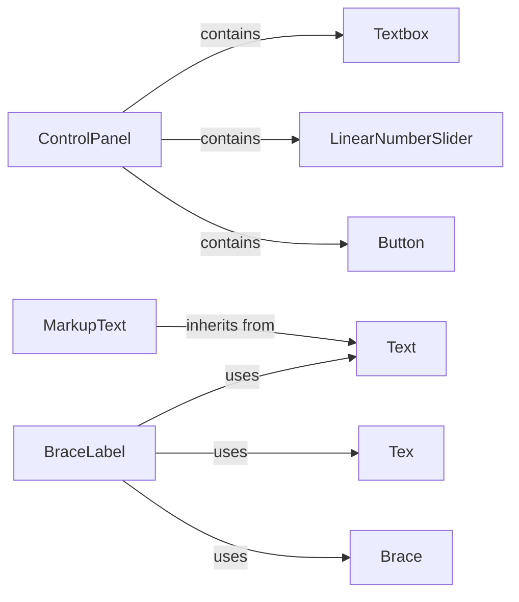

## Component Details

This component focuses on rendering text and creating interactive elements within manim scenes. It provides classes for displaying plain text, formatted text using markup, and LaTeX equations. Additionally, it offers interactive components like buttons, sliders, and textboxes, enabling users to create engaging and interactive animations.

### Text
The Text class renders plain text within a manim scene. It handles the creation of text mobjects from strings, allowing for customization of font, size, color, and other visual attributes. It serves as the foundation for displaying textual information in animations.
- **Related Classes/Methods**: `manim.manimlib.mobject.svg.text_mobject.Text`

### MarkupText
The MarkupText class extends the Text class by adding support for custom markup. It enables users to format text with styles like bold, italics, and color changes using a simple markup syntax. This allows for richer text formatting within animations without relying on LaTeX.
- **Related Classes/Methods**: `manim.manimlib.mobject.svg.text_mobject.MarkupText`

### Tex
The Tex class renders LaTeX equations and expressions within a manim scene. It leverages LaTeX to generate high-quality visual representations of mathematical formulas, symbols, and equations. It is essential for creating animations that involve mathematical content.
- **Related Classes/Methods**: `manim.manimlib.mobject.svg.tex_mobject.Tex`

### Button
The Button class represents a clickable button that can trigger actions when pressed. It inherits from a more general interactive Mobject class and provides specific functionality for handling button presses, such as executing a callback function. It enables users to create interactive animations with clickable elements.
- **Related Classes/Methods**: `manim.manimlib.mobject.interactive.Button`

### LinearNumberSlider
The LinearNumberSlider class provides a slider for selecting a numerical value within a linear range. It allows users to drag a slider handle to adjust the value and likely provides visual feedback to indicate the current value. It is useful for creating interactive animations where users can control numerical parameters.
- **Related Classes/Methods**: `manim.manimlib.mobject.interactive.LinearNumberSlider`

### Textbox
The Textbox class provides a text input field where users can enter and edit text. It handles keyboard input, text rendering, and potentially validation or formatting of the input. It enables users to create interactive animations where users can input text.
- **Related Classes/Methods**: `manim.manimlib.mobject.interactive.Textbox`

### ControlPanel
The ControlPanel class provides a container for interactive controls, allowing users to group and manage UI elements within a panel that can be opened and closed. It handles the layout and organization of controls, as well as interactions like moving the panel and scrolling. It helps organize interactive elements in a manim scene.
- **Related Classes/Methods**: `manim.manimlib.mobject.interactive.ControlPanel`

### Brace
The Brace class creates brace annotations for marking sections of a scene. It allows users to add visual cues to highlight specific elements or regions.
- **Related Classes/Methods**: `manim.manimlib.mobject.svg.brace.Brace`

### BraceLabel
The BraceLabel class combines a brace with a label, providing a more informative annotation. It allows users to add text descriptions alongside the brace.
- **Related Classes/Methods**: `manim.manimlib.mobject.svg.brace.BraceLabel`
