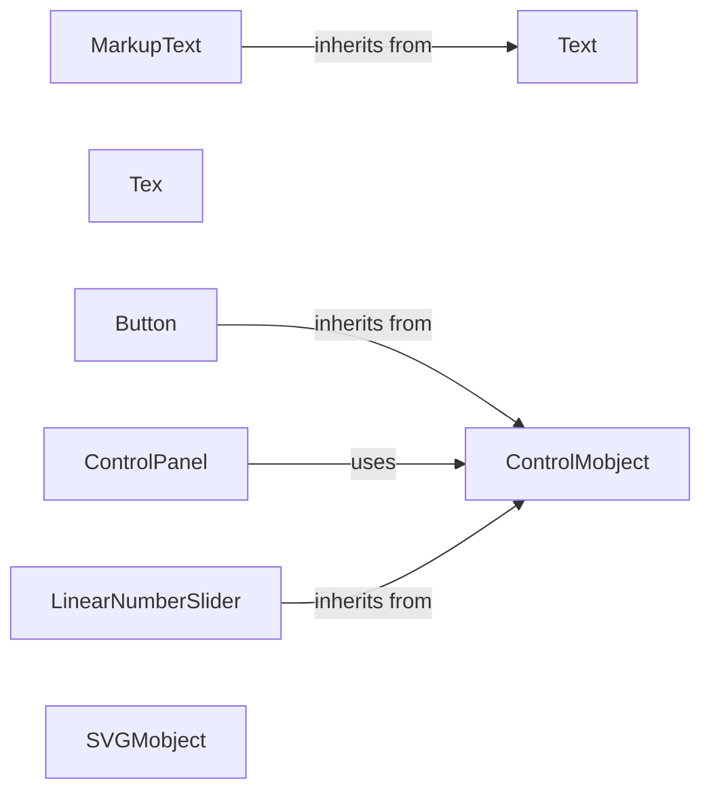

## Component Details

This component focuses on rendering text and providing interactive elements within animations. It includes classes for displaying plain text, formatted text (using markup or LaTeX), and interactive controls like buttons and sliders. These elements enhance the expressiveness and interactivity of animations, allowing for more engaging and informative visualizations.

### Text
The Text class is responsible for displaying plain text on the screen. It handles font selection, text alignment, and basic text formatting, providing a foundation for more complex text rendering.
- **Related Classes/Methods**: `manim.manimlib.mobject.svg.text_mobject.Text`

### MarkupText
MarkupText extends the Text class to enable rendering of text with HTML-like markup. This allows for richer text formatting, including bold, italic, color changes, and other styling options within a single text object, enhancing the visual appeal of text in animations.
- **Related Classes/Methods**: `manim.manimlib.mobject.svg.text_mobject.MarkupText`

### Tex
The Tex class renders mathematical expressions using LaTeX. It supports a wide range of mathematical symbols and notation, allowing for the creation of complex equations and formulas within animations, making it essential for mathematical visualizations.
- **Related Classes/Methods**: `manim.manimlib.mobject.svg.tex_mobject.Tex`

### Button
The Button class implements a clickable button that can trigger actions when pressed. It inherits from ControlMobject and provides a visual representation of a button with customizable appearance and behavior, enabling user interaction within animations.
- **Related Classes/Methods**: `manim.manimlib.mobject.interactive.Button`

### LinearNumberSlider
The LinearNumberSlider class provides a slider that allows users to select a numerical value within a specified range. It provides methods for setting the value, handling mouse drag events, and retrieving the value from a given point, facilitating dynamic control over numerical parameters in animations.
- **Related Classes/Methods**: `manim.manimlib.mobject.interactive.LinearNumberSlider`

### ControlPanel
The ControlPanel class provides a container for interactive controls, allowing users to group and manage multiple interactive elements within a single panel. It handles the addition, removal, and organization of controls, as well as the opening, closing, and dragging of the panel, providing a structured way to manage interactive elements.
- **Related Classes/Methods**: `manim.manimlib.mobject.interactive.ControlPanel`

### ControlMobject
The ControlMobject class serves as a base class for interactive control elements like buttons and sliders. It provides a common interface for setting and getting values, and handling user interactions, establishing a foundation for interactive components.
- **Related Classes/Methods**: `manim.manimlib.mobject.interactive.ControlMobject`

### SVGMobject
The SVGMobject class is a base class for creating Mobjects from SVG files or strings. It provides methods for parsing SVG data and converting it into Manim objects, enabling the integration of vector graphics into animations.
- **Related Classes/Methods**: `manim.manimlib.mobject.svg.svg_mobject.SVGMobject`
