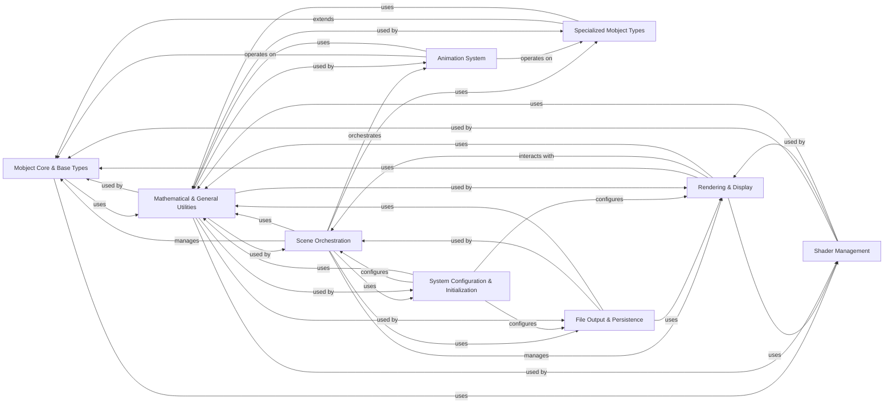

## Component Details

The Manim architecture is designed for creating programmatic animations, primarily focusing on mathematical visualizations. The core functionality revolves around `Mobject Core & Base Types`, which define the fundamental graphical elements. These elements are then specialized into various `Specialized Mobject Types` for specific visual representations. The `Scene Orchestration` component manages the animation timeline and scene state, coordinating with the `Animation System` to apply dynamic transformations to Mobjects. The `Rendering & Display` component handles the visual output, interacting with `Shader Management` for advanced graphics. `File Output & Persistence` ensures the final animation is saved. `System Configuration & Initialization` sets up the environment and loads scenes, while `Mathematical & General Utilities` provide foundational support across all components.

### Mobject Core & Base Types
This component defines the fundamental properties and operations for all graphical objects (Mobjects) in Manim, including point management, transformations, color, and family hierarchy. It also encompasses the base for vectorized objects (VMobjects) and point-based objects (PMobjects), providing the foundation for all visual elements.

**Related Classes/Methods**:

- <a href="https://github.com/3b1b/manim/blob/master/manimlib/mobject/mobject.py#L79-L124" target="_blank" rel="noopener noreferrer">`manim.manimlib.mobject.mobject.Mobject:__init__` (79:124)</a>
- <a href="https://github.com/3b1b/manim/blob/master/manimlib/mobject/mobject.py#L916-L922" target="_blank" rel="noopener noreferrer">`manim.manimlib.mobject.mobject.Mobject:shift` (916:922)</a>
- <a href="https://github.com/3b1b/manim/blob/master/manimlib/mobject/mobject.py#L1369-L1381" target="_blank" rel="noopener noreferrer">`manim.manimlib.mobject.mobject.Mobject:set_color` (1369:1381)</a>
- <a href="https://github.com/3b1b/manim/blob/master/manimlib/mobject/types/vectorized_mobject.py#L81-L122" target="_blank" rel="noopener noreferrer">`manim.manimlib.mobject.types.vectorized_mobject.VMobject:__init__` (81:122)</a>
- <a href="https://github.com/3b1b/manim/blob/master/manimlib/mobject/types/vectorized_mobject.py#L159-L172" target="_blank" rel="noopener noreferrer">`manim.manimlib.mobject.types.vectorized_mobject.VMobject:set_fill` (159:172)</a>
- <a href="https://github.com/3b1b/manim/blob/master/manimlib/mobject/types/vectorized_mobject.py#L467-L476" target="_blank" rel="noopener noreferrer">`manim.manimlib.mobject.types.vectorized_mobject.VMobject:add_cubic_bezier_curve` (467:476)</a>
- <a href="https://github.com/3b1b/manim/blob/master/manimlib/mobject/types/point_cloud_mobject.py#L18-L23" target="_blank" rel="noopener noreferrer">`manim.manimlib.mobject.types.point_cloud_mobject.PMobject:set_points` (18:23)</a>
- <a href="https://github.com/3b1b/manim/blob/master/manimlib/mobject/types/surface.py#L38-L70" target="_blank" rel="noopener noreferrer">`manim.manimlib.mobject.types.surface.Surface:__init__` (38:70)</a>

### Specialized Mobject Types
This component provides a rich set of pre-defined graphical objects built upon the Mobject and VMobject foundations. It includes various geometric shapes, text, images, 3D objects, coordinate systems, interactive elements, and specialized visual representations for mathematical and probabilistic concepts.

**Related Classes/Methods**:

- <a href="https://github.com/3b1b/manim/blob/master/manimlib/mobject/three_dimensions.py#L94-L114" target="_blank" rel="noopener noreferrer">`manim.manimlib.mobject.three_dimensions.Sphere:__init__` (94:114)</a>
- <a href="https://github.com/3b1b/manim/blob/master/manimlib/mobject/number_line.py#L24-L98" target="_blank" rel="noopener noreferrer">`manim.manimlib.mobject.number_line.NumberLine:__init__` (24:98)</a>
- <a href="https://github.com/3b1b/manim/blob/master/manimlib/mobject/coordinate_systems.py#L440-L483" target="_blank" rel="noopener noreferrer">`manim.manimlib.mobject.coordinate_systems.Axes:__init__` (440:483)</a>
- <a href="https://github.com/3b1b/manim/blob/master/manimlib/mobject/geometry.py#L291-L301" target="_blank" rel="noopener noreferrer">`manim.manimlib.mobject.geometry.Circle:__init__` (291:301)</a>
- <a href="https://github.com/3b1b/manim/blob/master/manimlib/mobject/interactive.py#L59-L65" target="_blank" rel="noopener noreferrer">`manim.manimlib.mobject.interactive.Button:__init__` (59:65)</a>
- <a href="https://github.com/3b1b/manim/blob/master/manimlib/mobject/svg/tex_mobject.py#L27-L68" target="_blank" rel="noopener noreferrer">`manim.manimlib.mobject.svg.tex_mobject.Tex:__init__` (27:68)</a>
- <a href="https://github.com/3b1b/manim/blob/master/manimlib/mobject/svg/text_mobject.py#L389-L406" target="_blank" rel="noopener noreferrer">`manim.manimlib.mobject.svg.text_mobject.Text:__init__` (389:406)</a>
- <a href="https://github.com/3b1b/manim/blob/master/manimlib/mobject/types/dot_cloud.py#L35-L57" target="_blank" rel="noopener noreferrer">`manim.manimlib.mobject.types.dot_cloud.DotCloud:__init__` (35:57)</a>
- <a href="https://github.com/3b1b/manim/blob/master/manimlib/mobject/types/image_mobject.py#L30-L39" target="_blank" rel="noopener noreferrer">`manim.manimlib.mobject.types.image_mobject.ImageMobject:__init__` (30:39)</a>
- <a href="https://github.com/3b1b/manim/blob/master/manimlib/mobject/vector_field.py#L142-L200" target="_blank" rel="noopener noreferrer">`manim.manimlib.mobject.vector_field.VectorField:__init__` (142:200)</a>
- <a href="https://github.com/3b1b/manim/blob/master/manimlib/mobject/value_tracker.py#L22-L28" target="_blank" rel="noopener noreferrer">`manim.manimlib.mobject.value_tracker.ValueTracker:__init__` (22:28)</a>
- <a href="https://github.com/3b1b/manim/blob/master/manimlib/mobject/shape_matchers.py#L23-L34" target="_blank" rel="noopener noreferrer">`manim.manimlib.mobject.shape_matchers.SurroundingRectangle:__init__` (23:34)</a>
- <a href="https://github.com/3b1b/manim/blob/master/manimlib/mobject/changing.py#L19-L50" target="_blank" rel="noopener noreferrer">`manim.manimlib.mobject.changing.AnimatedBoundary:__init__` (19:50)</a>
- <a href="https://github.com/3b1b/manim/blob/master/manimlib/mobject/numbers.py#L35-L76" target="_blank" rel="noopener noreferrer">`manim.manimlib.mobject.numbers.DecimalNumber:__init__` (35:76)</a>
- <a href="https://github.com/3b1b/manim/blob/master/manimlib/mobject/boolean_ops.py#L53-L63" target="_blank" rel="noopener noreferrer">`manim.manimlib.mobject.boolean_ops.Union:__init__` (53:63)</a>
- <a href="https://github.com/3b1b/manim/blob/master/manimlib/mobject/functions.py#L71-L84" target="_blank" rel="noopener noreferrer">`manim.manimlib.mobject.functions.FunctionGraph:__init__` (71:84)</a>
- <a href="https://github.com/3b1b/manim/blob/master/manimlib/mobject/probability.py#L29-L48" target="_blank" rel="noopener noreferrer">`manim.manimlib.mobject.probability.SampleSpace:__init__` (29:48)</a>
- <a href="https://github.com/3b1b/manim/blob/master/manimlib/mobject/matrix.py#L25-L71" target="_blank" rel="noopener noreferrer">`manim.manimlib.mobject.matrix.Matrix:__init__` (25:71)</a>
- <a href="https://github.com/3b1b/manim/blob/master/manimlib/mobject/svg/drawings.py#L92-L107" target="_blank" rel="noopener noreferrer">`manim.manimlib.mobject.svg.drawings.Lightbulb:__init__` (92:107)</a>

### Scene Orchestration
This component manages the overall animation timeline and the state of the visual scene. It handles the addition and removal of Mobjects, updates their state over time, and orchestrates the playback of animations. It serves as the central control for defining and running an animation sequence, also facilitating embedding interactive scenes.

**Related Classes/Methods**:

- <a href="https://github.com/3b1b/manim/blob/master/manimlib/scene/scene.py#L63-L140" target="_blank" rel="noopener noreferrer">`manim.manimlib.scene.scene.Scene:__init__` (63:140)</a>
- <a href="https://github.com/3b1b/manim/blob/master/manimlib/scene/scene.py#L571-L588" target="_blank" rel="noopener noreferrer">`manim.manimlib.scene.scene.Scene:play` (571:588)</a>
- <a href="https://github.com/3b1b/manim/blob/master/manimlib/scene/scene.py#L327-L344" target="_blank" rel="noopener noreferrer">`manim.manimlib.scene.scene.Scene:add` (327:344)</a>
- <a href="https://github.com/3b1b/manim/blob/master/manimlib/scene/interactive_scene.py#L111-L132" target="_blank" rel="noopener noreferrer">`manim.manimlib.scene.interactive_scene.InteractiveScene:setup` (111:132)</a>
- <a href="https://github.com/3b1b/manim/blob/master/manimlib/scene/scene_embed.py#L24-L33" target="_blank" rel="noopener noreferrer">`manim.manimlib.scene.scene_embed.InteractiveSceneEmbed:__init__` (24:33)</a>

### Animation System
This component provides the framework for creating and managing dynamic visual changes (animations) of Mobjects. It defines the base animation class, handles interpolation of Mobject properties over time, and offers mechanisms for composing multiple animations into complex sequences and various visual transformations.

**Related Classes/Methods**:

- <a href="https://github.com/3b1b/manim/blob/master/manimlib/animation/animation.py#L60-L74" target="_blank" rel="noopener noreferrer">`manim.manimlib.animation.animation.Animation:begin` (60:74)</a>
- <a href="https://github.com/3b1b/manim/blob/master/manimlib/animation/animation.py#L135-L136" target="_blank" rel="noopener noreferrer">`manim.manimlib.animation.animation.Animation:interpolate` (135:136)</a>
- <a href="https://github.com/3b1b/manim/blob/master/manimlib/animation/composition.py#L28-L58" target="_blank" rel="noopener noreferrer">`manim.manimlib.animation.composition.AnimationGroup:__init__` (28:58)</a>
- <a href="https://github.com/3b1b/manim/blob/master/manimlib/animation/transform.py#L27-L41" target="_blank" rel="noopener noreferrer">`manim.manimlib.animation.transform.Transform:__init__` (27:41)</a>

### Rendering & Display
This component is responsible for rendering the visual scene to the display window or output files. It manages the camera's view, handles OpenGL context and frame buffer objects (FBOs), and processes user input events for interactive scenes.

**Related Classes/Methods**:

- <a href="https://github.com/3b1b/manim/blob/master/manimlib/camera/camera.py#L26-L67" target="_blank" rel="noopener noreferrer">`manim.manimlib.camera.camera.Camera:__init__` (26:67)</a>
- <a href="https://github.com/3b1b/manim/blob/master/manimlib/camera/camera.py#L225-L236" target="_blank" rel="noopener noreferrer">`manim.manimlib.camera.camera.Camera:capture` (225:236)</a>
- <a href="https://github.com/3b1b/manim/blob/master/manimlib/camera/camera_frame.py#L24-L49" target="_blank" rel="noopener noreferrer">`manim.manimlib.camera.camera_frame.CameraFrame:__init__` (24:49)</a>
- <a href="https://github.com/3b1b/manim/blob/master/manimlib/window.py#L30-L50" target="_blank" rel="noopener noreferrer">`manim.manimlib.window.Window:__init__` (30:50)</a>
- <a href="https://github.com/3b1b/manim/blob/master/manimlib/window.py#L155-L161" target="_blank" rel="noopener noreferrer">`manim.manimlib.window.Window:on_mouse_motion` (155:161)</a>

### Shader Management
This component handles the low-level graphics programming aspects, specifically the loading, compilation, and application of OpenGL shaders. It manages shader programs, uniforms, and textures, enabling complex visual effects and efficient rendering of Mobjects.

**Related Classes/Methods**:

- <a href="https://github.com/3b1b/manim/blob/master/manimlib/shader_wrapper.py#L35-L63" target="_blank" rel="noopener noreferrer">`manim.manimlib.shader_wrapper.ShaderWrapper:__init__` (35:63)</a>
- <a href="https://github.com/3b1b/manim/blob/master/manimlib/shader_wrapper.py#L83-L91" target="_blank" rel="noopener noreferrer">`manim.manimlib.shader_wrapper.ShaderWrapper:init_program` (83:91)</a>
- <a href="https://github.com/3b1b/manim/blob/master/manimlib/shader_wrapper.py#L221-L246" target="_blank" rel="noopener noreferrer">`manim.manimlib.shader_wrapper.VShaderWrapper:__init__` (221:246)</a>

### File Output & Persistence
This component manages the process of writing rendered animation frames and audio to various output file formats (e.g., video, GIF, images). It handles file paths, audio synchronization, and progress display during the rendering process.

**Related Classes/Methods**:

- <a href="https://github.com/3b1b/manim/blob/master/manimlib/scene/scene_file_writer.py#L29-L77" target="_blank" rel="noopener noreferrer">`manim.manimlib.scene.scene_file_writer.SceneFileWriter:__init__` (29:77)</a>
- <a href="https://github.com/3b1b/manim/blob/master/manimlib/scene/scene_file_writer.py#L135-L162" target="_blank" rel="noopener noreferrer">`manim.manimlib.scene.scene_file_writer.SceneFileWriter:add_audio_segment` (135:162)</a>
- <a href="https://github.com/3b1b/manim/blob/master/manimlib/scene/scene_file_writer.py#L190-L200" target="_blank" rel="noopener noreferrer">`manim.manimlib.scene.scene_file_writer.SceneFileWriter:finish` (190:200)</a>

### System Configuration & Initialization
This component is responsible for loading and managing Manim's configuration settings, including command-line arguments and YAML configuration files. It also handles the dynamic loading of Python modules containing user-defined scenes and orchestrates the initial setup and main execution flow of the Manim environment.

**Related Classes/Methods**:

- <a href="https://github.com/3b1b/manim/blob/master/manimlib/module_loader.py#L24-L50" target="_blank" rel="noopener noreferrer">`manim.manimlib.module_loader.ModuleLoader:get_module` (24:50)</a>
- <a href="https://github.com/3b1b/manim/blob/master/manimlib/config.py#L23-L51" target="_blank" rel="noopener noreferrer">`manim.manimlib.config:initialize_manim_config` (23:51)</a>
- <a href="https://github.com/3b1b/manim/blob/master/manimlib/extract_scene.py#L188-L194" target="_blank" rel="noopener noreferrer">`manim.manimlib.extract_scene:main` (188:194)</a>
- <a href="https://github.com/3b1b/manim/blob/master/manimlib/__main__.py#L49-L61" target="_blank" rel="noopener noreferrer">`manim.manimlib.__main__:main` (49:61)</a>

### Mathematical & General Utilities
This component provides a collection of general-purpose utility functions that support various aspects of Manim, including vector and space operations, color conversions, iterable manipulations, and debugging tools. These utilities are foundational for Mobject transformations, rendering, and other core functionalities.

**Related Classes/Methods**:

- <a href="https://github.com/3b1b/manim/blob/master/manimlib/utils/space_ops.py#L117-L123" target="_blank" rel="noopener noreferrer">`manim.manimlib.utils.space_ops:rotate_vector` (117:123)</a>
- <a href="https://github.com/3b1b/manim/blob/master/manimlib/utils/color.py#L22-L28" target="_blank" rel="noopener noreferrer">`manim.manimlib.utils.color:color_to_rgb` (22:28)</a>
- <a href="https://github.com/3b1b/manim/blob/master/manimlib/utils/iterables.py#L25-L30" target="_blank" rel="noopener noreferrer">`manim.manimlib.utils.iterables:list_update` (25:30)</a>
- <a href="https://github.com/3b1b/manim/blob/master/manimlib/utils/tex_file_writing.py#L51-L81" target="_blank" rel="noopener noreferrer">`manim.manimlib.utils.tex_file_writing:latex_to_svg` (51:81)</a>
- <a href="https://github.com/3b1b/manim/blob/master/manimlib/utils/bezier.py#L28-L42" target="_blank" rel="noopener noreferrer">`manim.manimlib.utils.bezier:bezier` (28:42)</a>
- <a href="https://github.com/3b1b/manim/blob/master/manimlib/utils/rate_functions.py#L24-L25" target="_blank" rel="noopener noreferrer">`manim.manimlib.utils.rate_functions:rush_into` (24:25)</a>

### [FAQ](https://github.com/CodeBoarding/GeneratedOnBoardings/tree/main?tab=readme-ov-file#faq)