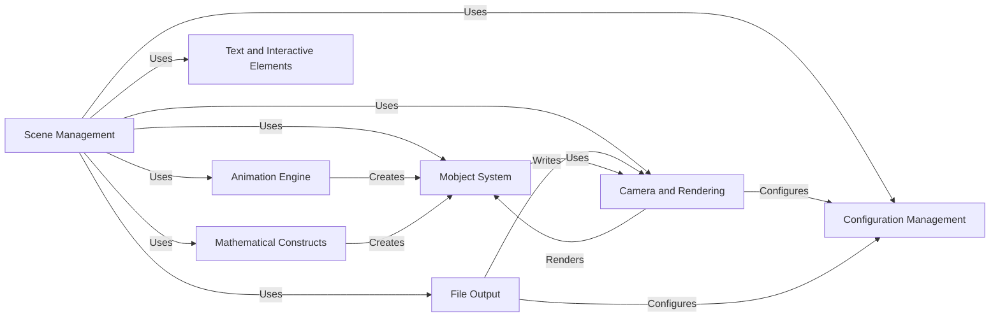

## Component Details

Manim is a powerful animation engine for creating mathematical visualizations. The core flow involves defining scenes, populating them with mathematical objects (Mobjects), animating these objects using various transformations and effects, rendering the scene from a virtual camera, and finally outputting the rendered frames as images or a video. The system is highly configurable, allowing users to customize various aspects of the animation process, from camera settings to output formats. Interactive elements and text rendering capabilities further enhance the expressiveness and utility of the animations.

### Scene Management
This component orchestrates the entire animation process. It handles the creation, rendering, and management of scenes, controlling the flow of animations and interactions between different elements. It provides the environment in which mathematical objects are displayed and animated.
- **Related Classes/Methods**: `manim.manimlib.scene.scene.Scene`, `manim.manimlib.extract_scene.extract_scene`, `manim.manimlib.scene.interactive_scene.InteractiveScene`, `manim.manimlib.scene.scene_embed.InteractiveSceneEmbed`

### Mobject System
The foundation of all visual elements in Manim, this component defines the base class and related functionalities for all mathematical objects (Mobjects). It provides methods for transformations, styling, and hierarchical management of objects, enabling the creation of complex and dynamic visual representations.
- **Related Classes/Methods**: `manim.manimlib.mobject.mobject.Mobject`, `manim.manimlib.mobject.mobject.Group`, `manim.manimlib.mobject.types.vectorized_mobject.VMobject`, `manim.manimlib.mobject.types.point_cloud_mobject.PMobject`

### Animation Engine
This component provides the core animation functionalities, including transformations, fading, growing, and specialized effects. It manages the interpolation and updating of Mobjects over time, bringing mathematical concepts to life through dynamic visual changes.
- **Related Classes/Methods**: `manim.manimlib.animation.animation.Animation`, `manim.manimlib.animation.transform.Transform`, `manim.manimlib.animation.creation.ShowCreation`, `manim.manimlib.animation.fading.FadeIn`

### Camera and Rendering
This component handles the rendering of the scene from a specific viewpoint. It manages the frame buffer object (FBO), lighting, and the transformation matrices, producing the final visual output that is displayed or saved to a file. It also manages shaders.
- **Related Classes/Methods**: `manim.manimlib.camera.camera.Camera`, `manim.manimlib.camera.camera_frame.CameraFrame`, `manim.manimlib.shader_wrapper.ShaderWrapper`, `manim.manimlib.shader_wrapper.VShaderWrapper`

### Configuration Management
This component initializes and manages the configuration settings for the Manim environment. It includes file paths, camera settings, and scene parameters, ensuring that the environment is properly set up for rendering and that the animation behaves as expected.
- **Related Classes/Methods**: `manim.manimlib.config.initialize_manim_config`, `manim.manimlib.config.update_camera_config`, `manim.manimlib.config.update_file_writer_config`, `manim.manimlib.config.update_scene_config`

### File Output
This component manages the writing of scene frames to image and video files. It initializes output directories, encodes frames, and adds audio to the final video, creating the final product that can be shared or used in presentations.
- **Related Classes/Methods**: `manim.manimlib.scene.scene_file_writer.SceneFileWriter`

### Text and Interactive Elements
This component handles the creation and rendering of text objects, including LaTeX and MarkupText, and provides interactive components like buttons and sliders. It enhances the expressiveness and interactivity of the animations, allowing for more engaging and informative visualizations.
- **Related Classes/Methods**: `manim.manimlib.mobject.svg.text_mobject.Text`, `manim.manimlib.mobject.svg.text_mobject.MarkupText`, `manim.manimlib.mobject.svg.tex_mobject.Tex`, `manim.manimlib.mobject.interactive.Button`, `manim.manimlib.mobject.interactive.LinearNumberSlider`, `manim.manimlib.mobject.interactive.Textbox`, `manim.manimlib.mobject.interactive.ControlPanel`

### Mathematical Constructs
This component creates coordinate systems, vector fields, and three-dimensional objects. It provides tools for representing mathematical concepts visually, enabling the creation of complex and informative diagrams and animations.
- **Related Classes/Methods**: `manim.manimlib.mobject.coordinate_systems.CoordinateSystem`, `manim.manimlib.mobject.coordinate_systems.Axes`, `manim.manimlib.mobject.coordinate_systems.ThreeDAxes`, `manim.manimlib.mobject.coordinate_systems.NumberPlane`, `manim.manimlib.mobject.coordinate_systems.ComplexPlane`, `manim.manimlib.mobject.vector_field.VectorField`, `manim.manimlib.mobject.vector_field.TimeVaryingVectorField`, `manim.manimlib.mobject.vector_field.StreamLines`, `manim.manimlib.mobject.vector_field.AnimatedStreamLines`, `manim.manimlib.mobject.three_dimensions.SurfaceMesh`, `manim.manimlib.mobject.three_dimensions.Sphere`, `manim.manimlib.mobject.three_dimensions.Torus`, `manim.manimlib.mobject.three_dimensions.Cylinder`, `manim.manimlib.mobject.three_dimensions.Cone`, `manim.manimlib.mobject.three_dimensions.Line3D`, `manim.manimlib.mobject.three_dimensions.Disk3D`, `manim.manimlib.mobject.three_dimensions.Square3D`, `manim.manimlib.mobject.three_dimensions.Cube`, `manim.manimlib.mobject.three_dimensions.Prism`, `manim.manimlib.mobject.three_dimensions.VGroup3D`, `manim.manimlib.mobject.three_dimensions.VCube`, `manim.manimlib.mobject.three_dimensions.VPrism`, `manim.manimlib.mobject.three_dimensions.Dodecahedron`, `manim.manimlib.mobject.three_dimensions.Prismify`