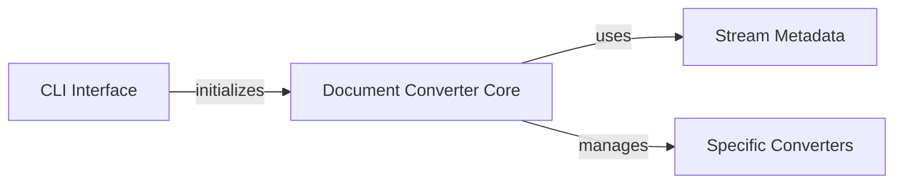

## Component Details

This graph illustrates the core components of the `markitdown` application, focusing on the command-line interface, the central document conversion engine, metadata management, and the various specialized converters. The CLI Interface serves as the entry point, parsing user input and orchestrating the conversion process by initializing the Document Converter Core. The Document Converter Core is responsible for managing different input types, dispatching to appropriate conversion methods, and utilizing Stream Metadata to handle document information. It also manages and invokes various Specific Converters, each designed to transform a particular document format into markdown.

### CLI Interface
The primary execution point for the `markitdown` command-line application, responsible for parsing arguments, initiating the document conversion process, and managing output to the console or files. It handles command-line argument parsing, input/output redirection, and orchestrates the main conversion flow by initializing and invoking the core conversion logic, as well as managing error reporting and program exit.

**Related Classes/Methods**:

- <a href="https://github.com/microsoft/markitdown/blob/master/packages/markitdown/src/markitdown/__main__.py#L13-L200" target="_blank" rel="noopener noreferrer">`markitdown.packages.markitdown.src.markitdown.__main__.main` (13:200)</a>
- <a href="https://github.com/microsoft/markitdown/blob/master/packages/markitdown/src/markitdown/__main__.py#L217-L219" target="_blank" rel="noopener noreferrer">`markitdown.packages.markitdown.src.markitdown.__main__._exit_with_error` (217:219)</a>
- <a href="https://github.com/microsoft/markitdown/blob/master/packages/markitdown/src/markitdown/__main__.py#L203-L214" target="_blank" rel="noopener noreferrer">`markitdown.packages.markitdown.src.markitdown.__main__._handle_output` (203:214)</a>

### Stream Metadata
This component defines and manages the data structure (`StreamInfo`) used to encapsulate various metadata about an input stream, such as its MIME type, file extension, character set, filename, local path, and URL. It provides methods for copying and updating this information, which is crucial for the conversion process.

**Related Classes/Methods**:

- <a href="https://github.com/microsoft/markitdown/blob/master/packages/markitdown/src/markitdown/_stream_info.py#L6-L32" target="_blank" rel="noopener noreferrer">`markitdown.packages.markitdown.src.markitdown._stream_info.StreamInfo` (6:32)</a>

### Document Converter Core
This is the central component of the `markitdown` subsystem, responsible for the overall document conversion process. It handles different input sources (local files, binary streams, URIs, HTTP responses), dispatches to appropriate conversion methods, iterates through registered converters to find one that can process the input, normalizes the final markdown output, and manages the registration and enabling of various conversion strategies, including built-in and plugin-based converters, as well as performing content analysis to infer stream characteristics.

**Related Classes/Methods**:

- <a href="https://github.com/microsoft/markitdown/blob/master/packages/markitdown/src/markitdown/_markitdown.py#L93-L771" target="_blank" rel="noopener noreferrer">`markitdown.packages.markitdown.src.markitdown._markitdown.MarkItDown` (93:771)</a>
- <a href="https://github.com/microsoft/markitdown/blob/master/packages/markitdown/src/markitdown/_markitdown.py#L243-L291" target="_blank" rel="noopener noreferrer">`markitdown.packages.markitdown.src.markitdown._markitdown.MarkItDown.convert` (243:291)</a>
- <a href="https://github.com/microsoft/markitdown/blob/master/packages/markitdown/src/markitdown/_markitdown.py#L330-L375" target="_blank" rel="noopener noreferrer">`markitdown.packages.markitdown.src.markitdown._markitdown.MarkItDown.convert_stream` (330:375)</a>
- <a href="https://github.com/microsoft/markitdown/blob/master/packages/markitdown/src/markitdown/_markitdown.py#L293-L328" target="_blank" rel="noopener noreferrer">`markitdown.packages.markitdown.src.markitdown._markitdown.MarkItDown.convert_local` (293:328)</a>
- <a href="https://github.com/microsoft/markitdown/blob/master/packages/markitdown/src/markitdown/_markitdown.py#L396-L455" target="_blank" rel="noopener noreferrer">`markitdown.packages.markitdown.src.markitdown._markitdown.MarkItDown.convert_uri` (396:455)</a>
- <a href="https://github.com/microsoft/markitdown/blob/master/packages/markitdown/src/markitdown/_markitdown.py#L457-L527" target="_blank" rel="noopener noreferrer">`markitdown.packages.markitdown.src.markitdown._markitdown.MarkItDown.convert_response` (457:527)</a>
- <a href="https://github.com/microsoft/markitdown/blob/master/packages/markitdown/src/markitdown/_markitdown.py#L529-L619" target="_blank" rel="noopener noreferrer">`markitdown.packages.markitdown.src.markitdown._markitdown.MarkItDown._convert` (529:619)</a>
- <a href="https://github.com/microsoft/markitdown/blob/master/packages/markitdown/src/markitdown/_markitdown.py#L132-L221" target="_blank" rel="noopener noreferrer">`markitdown.packages.markitdown.src.markitdown._markitdown.MarkItDown.enable_builtins` (132:221)</a>
- <a href="https://github.com/microsoft/markitdown/blob/master/packages/markitdown/src/markitdown/_markitdown.py#L223-L241" target="_blank" rel="noopener noreferrer">`markitdown.packages.markitdown.src.markitdown._markitdown.MarkItDown.enable_plugins` (223:241)</a>
- <a href="https://github.com/microsoft/markitdown/blob/master/packages/markitdown/src/markitdown/_markitdown.py#L629-L659" target="_blank" rel="noopener noreferrer">`markitdown.packages.markitdown.src.markitdown._markitdown.MarkItDown.register_converter` (629:659)</a>
- <a href="https://github.com/microsoft/markitdown/blob/master/packages/markitdown/src/markitdown/_markitdown.py#L86-L90" target="_blank" rel="noopener noreferrer">`markitdown.packages.markitdown.src.markitdown._markitdown.ConverterRegistration` (86:90)</a>
- <a href="https://github.com/microsoft/markitdown/blob/master/packages/markitdown/src/markitdown/_markitdown.py#L65-L82" target="_blank" rel="noopener noreferrer">`markitdown.packages.markitdown.src.markitdown._markitdown._load_plugins` (65:82)</a>
- <a href="https://github.com/microsoft/markitdown/blob/master/packages/markitdown/src/markitdown/_markitdown.py#L661-L760" target="_blank" rel="noopener noreferrer">`markitdown.packages.markitdown.src.markitdown._markitdown.MarkItDown._get_stream_info_guesses` (661:760)</a>
- <a href="https://github.com/microsoft/markitdown/blob/master/packages/markitdown/src/markitdown/_markitdown.py#L762-L771" target="_blank" rel="noopener noreferrer">`markitdown.packages.markitdown.src.markitdown._markitdown.MarkItDown._normalize_charset` (762:771)</a>

### Specific Converters
This component encompasses the various individual converter implementations responsible for transforming specific document types (e.g., audio, HTML, PDF, images) into markdown format. These converters are managed and invoked by the `Document Converter Core`.

**Related Classes/Methods**:

- `markitdown.packages.markitdown.src.markitdown.converters._audio_converter` (full file reference)
- `markitdown.packages.markitdown.src.markitdown.converters._bing_serp_converter` (full file reference)
- `markitdown.packages.markitdown.src.markitdown.converters._csv_converter` (full file reference)
- `markitdown.packages.markitdown.src.markitdown.converters._doc_intel_converter` (full file reference)
- `markitdown.packages.markitdown.src.markitdown.converters._docx_converter` (full file reference)
- `markitdown.packages.markitdown.src.markitdown.converters._epub_converter` (full file reference)
- `markitdown.packages.markitdown.src.markitdown.converters._html_converter` (full file reference)
- `markitdown.packages.markitdown.src.markitdown.converters._image_converter` (full file reference)
- `markitdown.packages.markitdown.src.markitdown.converters._ipynb_converter` (full file reference)
- `markitdown.packages.markitdown.src.markitdown.converters._outlook_msg_converter` (full file reference)
- `markitdown.packages.markitdown.src.markitdown.converters._pdf_converter` (full file reference)
- `markitdown.packages.markitdown.src.markitdown.converters._plain_text_converter` (full file reference)
- `markitdown.packages.markitdown.src.markitdown.converters._pptx_converter` (full file reference)
- `markitdown.packages.markitdown.src.markitdown.converters._rss_converter` (full file reference)
- `markitdown.packages.markitdown.src.markitdown.converters._wikipedia_converter` (full file reference)
- `markitdown.packages.markitdown.src.markitdown.converters._xlsx_converter` (full file reference)
- `markitdown.packages.markitdown.src.markitdown.converters._youtube_converter` (full file reference)
- `markitdown.packages.markitdown.src.markitdown.converters._zip_converter` (full file reference)

### [FAQ](https://github.com/CodeBoarding/GeneratedOnBoardings/tree/main?tab=readme-ov-file#faq)