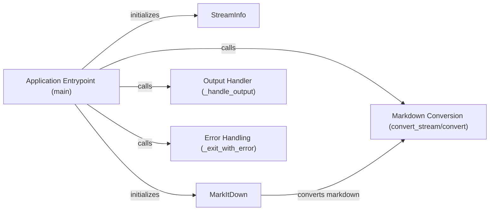

## Component Details

### Application Entrypoint (main)
The `main` function in `__main__.py` serves as the application's entry point. It parses command-line arguments using `argparse`, initializes the `StreamInfo` and `MarkItDown` objects, orchestrates the markdown conversion process by calling either `MarkItDown.convert_stream` or `MarkItDown.convert` based on the input source, and handles the output using `_handle_output`. It also includes error handling using `_exit_with_error`.
- **Related Classes/Methods**: `markitdown.__main__.main`, `markitdown.__main__._exit_with_error`

### StreamInfo
The `StreamInfo` class encapsulates information about the input stream, determining whether the input is from stdin or a file. It's initialized in the `main` function based on the command-line arguments and provides a consistent way to access the input stream.
- **Related Classes/Methods**: `markitdown._stream_info`

### MarkItDown
The `MarkItDown` class is the core component responsible for the markdown conversion logic. It initializes the `markdown` library with specified extensions and provides `convert_stream` and `convert` methods to perform the conversion from a stream or a string, respectively. It encapsulates the markdown conversion process.
- **Related Classes/Methods**: `markitdown._markitdown`

### Markdown Conversion (convert_stream/convert)
The `convert_stream` and `convert` methods of the `MarkItDown` class perform the actual markdown conversion using the `markdown` library. `convert_stream` reads from an input stream, while `convert` takes a string as input. Both methods return the converted HTML output.
- **Related Classes/Methods**: `markitdown._markitdown`

### Output Handler (_handle_output)
The `_handle_output` function is responsible for writing the converted HTML output to either stdout or a specified file. It takes the output string and the output file path as input and handles the file writing process, including error handling.
- **Related Classes/Methods**: `markitdown.__main__._handle_output`

### Error Handling (_exit_with_error)
The `_exit_with_error` function provides a consistent way to exit the program with an error message and a non-zero exit code. It's used throughout the `main` function to handle various error conditions, such as invalid arguments or file I/O errors.
- **Related Classes/Methods**: `markitdown.__main__._exit_with_error`
