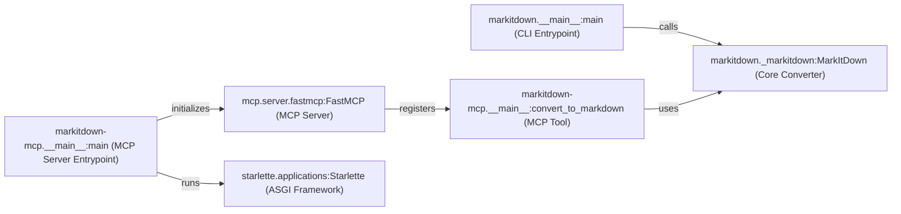

## Component Details

The MarkItDown application provides two entry points: `markitdown` and `markitdown-mcp`. The `markitdown` entry point is a command-line tool that converts files or standard input to Markdown. It uses the `MarkItDown` class for the conversion. The `markitdown-mcp` entry point is a server that exposes the conversion functionality as an MCP (Message Component Protocol) service, allowing other applications to request Markdown conversion over a network. It can run in either SSE (Server-Sent Events) transport mode using Starlette or in STDIO mode. Both entry points parse command-line arguments to configure their behavior.

### markitdown.__main__:main (CLI Entrypoint)
This component represents the main function for the `markitdown` command-line tool. It's responsible for parsing command-line arguments using `argparse`, determining the input source (file or stdin), initializing the `MarkItDown` converter, invoking the conversion process, and writing the output to a file or stdout. It orchestrates the entire command-line conversion workflow.
- **Related Classes/Methods**: `markitdown.packages.markitdown.src.markitdown.__main__:main`

### markitdown._markitdown:MarkItDown (Core Converter)
The `MarkItDown` class is the core component responsible for the actual conversion of various file formats to Markdown. It encapsulates the conversion logic and may utilize plugins or external services like Document Intelligence to perform the conversion. It receives the input content and returns the converted Markdown output.
- **Related Classes/Methods**: `markitdown.packages.markitdown.src.markitdown._markitdown:MarkItDown`

### markitdown-mcp.__main__:main (MCP Server Entrypoint)
This component represents the main function for the `markitdown-mcp` server. It parses command-line arguments, initializes the `FastMCP` server, registers the `convert_to_markdown` tool, and starts the server in either SSE transport mode (using Starlette) or STDIO mode. It manages the lifecycle of the MCP server.
- **Related Classes/Methods**: `markitdown.packages.markitdown-mcp.src.markitdown_mcp.__main__:main`

### markitdown-mcp.__main__:convert_to_markdown (MCP Tool)
This component is an MCP tool that converts a resource identified by a URI to Markdown. It receives a URI as input, retrieves the resource, uses the `MarkItDown` converter to convert it to Markdown, and returns the Markdown output. It acts as a bridge between the MCP server and the core conversion logic.
- **Related Classes/Methods**: `markitdown.packages.markitdown-mcp.src.markitdown_mcp.__main__:convert_to_markdown`

### mcp.server.fastmcp:FastMCP (MCP Server)
The `FastMCP` class from the `mcp` library provides a fast Message Component Protocol (MCP) server. It handles the communication with MCP clients, dispatches requests to registered tools, and returns the results. In `markitdown-mcp`, it's used to expose the `convert_to_markdown` function as an MCP tool.
- **Related Classes/Methods**: `mcp.server.fastmcp:FastMCP`

### starlette.applications:Starlette (ASGI Framework)
The `Starlette` class from the `starlette` library provides a lightweight ASGI framework. It's used in `markitdown-mcp` when running in SSE transport mode to create a web application that handles the server-sent events. It provides the web server functionality for the MCP service.
- **Related Classes/Methods**: `starlette.applications:Starlette`
