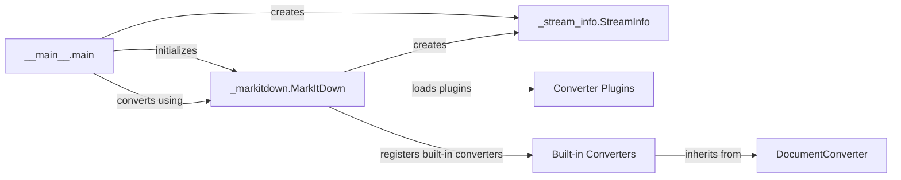

## Component Details

### __main__.main
The entry point of the markitdown application. It parses command-line arguments, initializes the MarkItDown converter, performs the conversion, and handles output. It orchestrates the overall application flow, including error handling and output formatting.
- **Related Classes/Methods**: `repos.markitdown.packages.markitdown.src.markitdown.__main__:main`, `repos.markitdown.packages.markitdown.src.markitdown.__main__:_exit_with_error`, `repos.markitdown.packages.markitdown.src.markitdown.__main__:_handle_output`

### _markitdown.MarkItDown
The core class responsible for managing the conversion process. It handles converter registration, plugin loading, and invokes the appropriate converter based on the input type. It maintains a registry of available converters and selects the appropriate one based on the input file type or URI scheme.
- **Related Classes/Methods**: `repos.markitdown.packages.markitdown.src.markitdown._markitdown.MarkItDown`

### _stream_info.StreamInfo
A data class that stores information about the input stream, such as its URI, content type, charset, and other relevant metadata. It's used to pass stream-related information between different components, ensuring that converters have the necessary context for processing the input.
- **Related Classes/Methods**: `repos.markitdown.packages.markitdown.src.markitdown._stream_info.StreamInfo`

### DocumentConverter
An abstract base class for all converters. It defines the interface that all converters must implement, ensuring a consistent way to convert different document types. Concrete converters inherit from this class and provide specific implementations for converting their respective document types to Markdown.
- **Related Classes/Methods**: `repos.markitdown.packages.markitdown.src.markitdown._base_converter.DocumentConverter`

### Converter Plugins
Plugins extend the functionality of the MarkItDown converter by providing additional converters for various document types. These plugins are loaded dynamically, allowing the application to support new document types without modifying the core code. The `_load_plugins` function handles the discovery and loading of these plugins.
- **Related Classes/Methods**: `repos.markitdown.packages.markitdown.src.markitdown._markitdown._load_plugins`

### Built-in Converters
A collection of pre-defined converters for common document types, such as plain text, HTML, and zip files. These converters are registered with the MarkItDown converter during initialization, providing out-of-the-box support for a wide range of document formats. Examples include PlainTextConverter, HtmlConverter, and ZipConverter.
- **Related Classes/Methods**: `repos.markitdown.packages.markitdown.src.markitdown.converters._plain_text_converter.PlainTextConverter`, `repos.markitdown.packages.markitdown.src.markitdown.converters._zip_converter.ZipConverter`, `repos.markitdown.packages.markitdown.src.markitdown.converters._html_converter.HtmlConverter`, `repos.markitdown.packages.markitdown.src.markitdown.converters._rss_converter.RssConverter`, `repos.markitdown.packages.markitdown.src.markitdown.converters._wikipedia_converter.WikipediaConverter`, `repos.markitdown.packages.markitdown.src.markitdown.converters._youtube_converter.YouTubeConverter`, `repos.markitdown.packages.markitdown.src.markitdown.converters._bing_serp_converter.BingSerpConverter`, `repos.markitdown.packages.markitdown.src.markitdown.converters._docx_converter.DocxConverter`, `repos.markitdown.packages.markitdown.src.markitdown.converters._xlsx_converter.XlsxConverter`, `repos.markitdown.packages.markitdown.src.markitdown.converters._pptx_converter.PptxConverter`, `repos.markitdown.packages.markitdown.src.markitdown.converters._audio_converter.AudioConverter`, `repos.markitdown.packages.markitdown.src.markitdown.converters._image_converter.ImageConverter`, `repos.markitdown.packages.markitdown.src.markitdown.converters._ipynb_converter.IpynbConverter`, `repos.markitdown.packages.markitdown.src.markitdown.converters._pdf_converter.PdfConverter`, `repos.markitdown.packages.markitdown.src.markitdown.converters._outlook_msg_converter.OutlookMsgConverter`, `repos.markitdown.packages.markitdown.src.markitdown.converters._epub_converter.EpubConverter`, `repos.markitdown.packages.markitdown.src.markitdown.converters._csv_converter.CsvConverter`, `repos.markitdown.packages.markitdown.src.markitdown.converters._doc_intel_converter.DocumentIntelligenceConverter`
