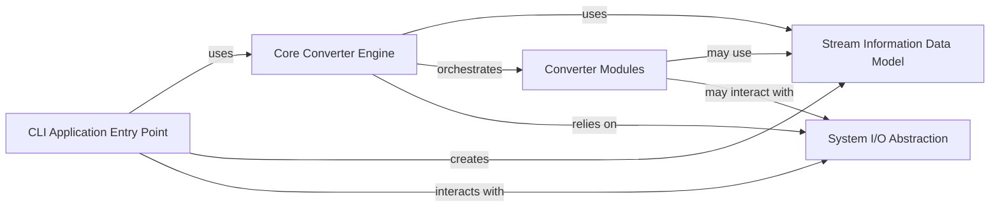

## Component Details

Overview of the key components, their responsibilities, and their interactions within the `markitdown` application, focusing on the `Application Entry Point` subsystem.

### CLI Application Entry Point
This component serves as the primary interface for the `markitdown` command-line application. It is responsible for parsing command-line arguments using `argparse`, validating user input, initializing the `Core Converter Engine` with appropriate configurations (e.g., plugin enablement, Document Intelligence endpoint), and orchestrating the overall conversion process from input source (file or stdin) to output destination (file or stdout). It also manages error handling related to CLI arguments and provides utility for listing installed plugins.

**Related Classes/Methods**:

- <a href="https://github.com/microsoft/markitdown/blob/master/packages/markitdown/src/markitdown/__main__.py#L0-L0" target="_blank" rel="noopener noreferrer">`src/markitdown/__main__.py` (0:0)</a>

### Core Converter Engine
This component, centered around the `MarkItDown` class, is the central orchestrator of the conversion process. It provides high-level methods to convert various input types (files, streams) into Markdown. It manages the integration of different `Converter Modules` and handles exceptions during conversion. It also utilizes `Stream Information Data Model` to correctly interpret input data.

**Related Classes/Methods**:

- <a href="https://github.com/microsoft/markitdown/blob/master/packages/markitdown/src/markitdown/_markitdown.py#L0-L0" target="_blank" rel="noopener noreferrer">`src/markitdown/_markitdown.py` (0:0)</a>
- <a href="https://github.com/microsoft/markitdown/blob/master/packages/markitdown/src/markitdown/_base_converter.py#L0-L0" target="_blank" rel="noopener noreferrer">`src/markitdown/_base_converter.py` (0:0)</a>
- <a href="https://github.com/microsoft/markitdown/blob/master/packages/markitdown/src/markitdown/_exceptions.py#L0-L0" target="_blank" rel="noopener noreferrer">`src/markitdown/_exceptions.py` (0:0)</a>
- <a href="https://github.com/microsoft/markitdown/blob/master/packages/markitdown/src/markitdown/_uri_utils.py#L0-L0" target="_blank" rel="noopener noreferrer">`src/markitdown/_uri_utils.py` (0:0)</a>

### Stream Information Data Model
This component defines the `StreamInfo` data structure, which encapsulates metadata (such as file extension, MIME type, and character set) about an input stream. This information is crucial for the `Core Converter Engine` and individual `Converter Modules` to correctly process data, especially when the source lacks inherent metadata (e.g., `stdin`).

**Related Classes/Methods**:

- <a href="https://github.com/microsoft/markitdown/blob/master/packages/markitdown/src/markitdown/_stream_info.py#L0-L0" target="_blank" rel="noopener noreferrer">`src/markitdown/_stream_info.py` (0:0)</a>

### Converter Modules
This component represents a collection of specialized modules, each responsible for converting a specific document or media type (e.g., DOCX, PDF, HTML, images, audio) into Markdown. These modules implement the actual conversion logic for their respective formats and are orchestrated by the `Core Converter Engine`. They often leverage external libraries or services for their specific conversion tasks.

**Related Classes/Methods**:

- <a href="https://github.com/microsoft/markitdown/blob/master/packages/markitdown/src/markitdown/converters/_audio_converter.py#L0-L0" target="_blank" rel="noopener noreferrer">`src/markitdown/converters/_audio_converter.py` (0:0)</a>
- <a href="https://github.com/microsoft/markitdown/blob/master/packages/markitdown/src/markitdown/converters/_bing_serp_converter.py#L0-L0" target="_blank" rel="noopener noreferrer">`src/markitdown/converters/_bing_serp_converter.py` (0:0)</a>
- <a href="https://github.com/microsoft/markitdown/blob/master/packages/markitdown/src/markitdown/converters/_csv_converter.py#L0-L0" target="_blank" rel="noopener noreferrer">`src/markitdown/converters/_csv_converter.py` (0:0)</a>
- <a href="https://github.com/microsoft/markitdown/blob/master/packages/markitdown/src/markitdown/converters/_doc_intel_converter.py#L0-L0" target="_blank" rel="noopener noreferrer">`src/markitdown/converters/_doc_intel_converter.py` (0:0)</a>
- <a href="https://github.com/microsoft/markitdown/blob/master/packages/markitdown/src/markitdown/converters/_docx_converter.py#L0-L0" target="_blank" rel="noopener noreferrer">`src/markitdown/converters/_docx_converter.py` (0:0)</a>
- <a href="https://github.com/microsoft/markitdown/blob/master/packages/markitdown/src/markitdown/converters/_epub_converter.py#L0-L0" target="_blank" rel="noopener noreferrer">`src/markitdown/converters/_epub_converter.py` (0:0)</a>
- <a href="https://github.com/microsoft/markitdown/blob/master/packages/markitdown/src/markitdown/converters/_exiftool.py#L0-L0" target="_blank" rel="noopener noreferrer">`src/markitdown/converters/_exiftool.py` (0:0)</a>
- <a href="https://github.com/microsoft/markitdown/blob/master/packages/markitdown/src/markitdown/converters/_html_converter.py#L0-L0" target="_blank" rel="noopener noreferrer">`src/markitdown/converters/_html_converter.py` (0:0)</a>
- <a href="https://github.com/microsoft/markitdown/blob/master/packages/markitdown/src/markitdown/converters/_image_converter.py#L0-L0" target="_blank" rel="noopener noreferrer">`src/markitdown/converters/_image_converter.py` (0:0)</a>
- <a href="https://github.com/microsoft/markitdown/blob/master/packages/markitdown/src/markitdown/converters/_ipynb_converter.py#L0-L0" target="_blank" rel="noopener noreferrer">`src/markitdown/converters/_ipynb_converter.py` (0:0)</a>
- <a href="https://github.com/microsoft/markitdown/blob/master/packages/markitdown/src/markitdown/converters/_llm_caption.py#L0-L0" target="_blank" rel="noopener noreferrer">`src/markitdown/converters/_llm_caption.py` (0:0)</a>
- <a href="https://github.com/microsoft/markitdown/blob/master/packages/markitdown/src/markitdown/converters/_markdownify.py#L0-L0" target="_blank" rel="noopener noreferrer">`src/markitdown/converters/_markdownify.py` (0:0)</a>
- <a href="https://github.com/microsoft/markitdown/blob/master/packages/markitdown/src/markitdown/converters/_outlook_msg_converter.py#L0-L0" target="_blank" rel="noopener noreferrer">`src/markitdown/converters/_outlook_msg_converter.py` (0:0)</a>
- <a href="https://github.com/microsoft/markitdown/blob/master/packages/markitdown/src/markitdown/converters/_pdf_converter.py#L0-L0" target="_blank" rel="noopener noreferrer">`src/markitdown/converters/_pdf_converter.py` (0:0)</a>
- <a href="https://github.com/microsoft/markitdown/blob/master/packages/markitdown/src/markitdown/converters/_plain_text_converter.py#L0-L0" target="_blank" rel="noopener noreferrer">`src/markitdown/converters/_plain_text_converter.py` (0:0)</a>
- <a href="https://github.com/microsoft/markitdown/blob/master/packages/markitdown/src/markitdown/converters/_pptx_converter.py#L0-L0" target="_blank" rel="noopener noreferrer">`src/markitdown/converters/_pptx_converter.py` (0:0)</a>
- <a href="https://github.com/microsoft/markitdown/blob/master/packages/markitdown/src/markitdown/converters/_rss_converter.py#L0-L0" target="_blank" rel="noopener noreferrer">`src/markitdown/converters/_rss_converter.py` (0:0)</a>
- <a href="https://github.com/microsoft/markitdown/blob/master/packages/markitdown/src/markitdown/converters/_transcribe_audio.py#L0-L0" target="_blank" rel="noopener noreferrer">`src/markitdown/converters/_transcribe_audio.py` (0:0)</a>
- <a href="https://github.com/microsoft/markitdown/blob/master/packages/markitdown/src/markitdown/converters/_wikipedia_converter.py#L0-L0" target="_blank" rel="noopener noreferrer">`src/markitdown/converters/_wikipedia_converter.py` (0:0)</a>
- <a href="https://github.com/microsoft/markitdown/blob/master/packages/markitdown/src/markitdown/converters/_xlsx_converter.py#L0-L0" target="_blank" rel="noopener noreferrer">`src/markitdown/converters/_xlsx_converter.py` (0:0)</a>
- <a href="https://github.com/microsoft/markitdown/blob/master/packages/markitdown/src/markitdown/converters/_zip_converter.py#L0-L0" target="_blank" rel="noopener noreferrer">`src/markitdown/converters/_zip_converter.py` (0:0)</a>
- <a href="https://github.com/microsoft/markitdown/blob/master/packages/markitdown/src/markitdown/converter_utils/docx/math/omml.py#L0-L0" target="_blank" rel="noopener noreferrer">`src/markitdown/converter_utils/docx/math/omml.py` (0:0)</a>
- <a href="https://github.com/microsoft/markitdown/blob/master/packages/markitdown/src/markitdown/converter_utils/docx/pre_process.py#L0-L0" target="_blank" rel="noopener noreferrer">`src/markitdown/converter_utils/docx/pre_process.py` (0:0)</a>

### System I/O Abstraction
This conceptual component represents the interactions with the underlying operating system for input and output operations. This includes reading from standard input (`stdin`), writing to standard output (`stdout`), and performing file system operations (reading from and writing to files). While not a single Python module, it's a fundamental interaction point for the application.

**Related Classes/Methods**: _None_

### [FAQ](https://github.com/CodeBoarding/GeneratedOnBoardings/tree/main?tab=readme-ov-file#faq)