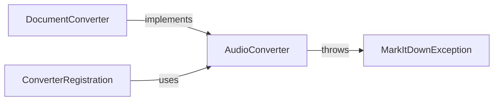

## Component Details

One paragraph explaining the functionality which is represented by this graph. What the main flow is and what is its purpose.

### DocumentConverter
Abstract Base Class. Defines the interface for all converters.

**Related Classes/Methods**: _None_

### AudioConverter
Implements DocumentConverter for audio files. Handles conversion of audio to Markdown.

**Related Classes/Methods**:

- `packages.markitdown.src.markitdown.converters.AudioConverter` (0:0)

### ConverterRegistration
Manages the mapping between file extensions and converter classes.

**Related Classes/Methods**: _None_

### MarkItDownException
Base Exception Class. Provides a base class for all exceptions within the markitdown package.

**Related Classes/Methods**: _None_

### [FAQ](https://github.com/CodeBoarding/GeneratedOnBoardings/tree/main?tab=readme-ov-file#faq)