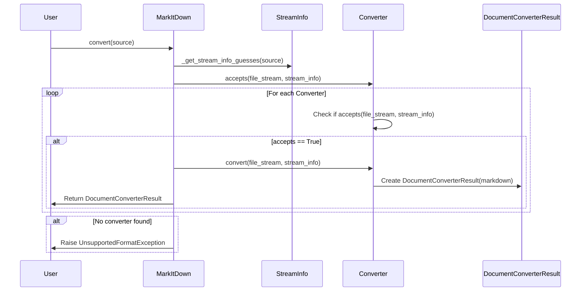
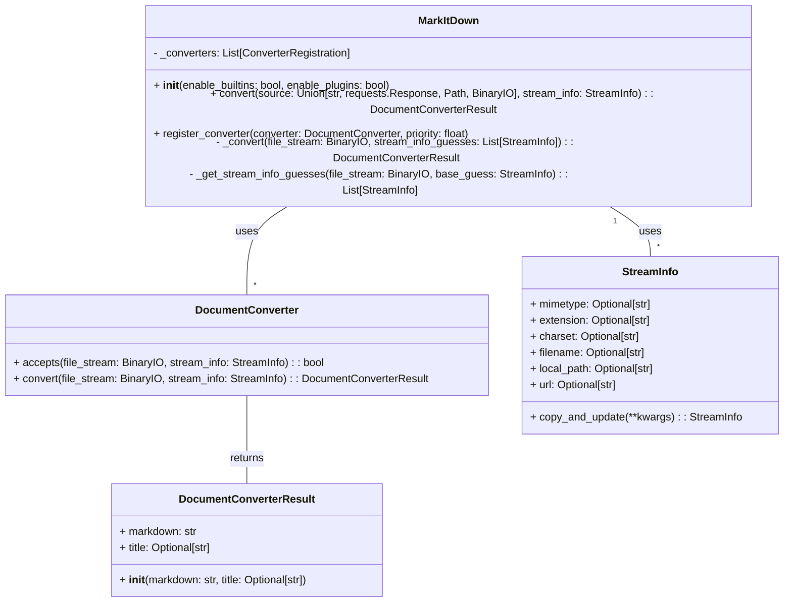

Based on the information gathered, here's an overview of the `markitdown` component:

**Component Description:**

The `markitdown` component is a versatile document conversion tool that transforms various file formats and web resources into Markdown. It employs a modular architecture with a central orchestration mechanism and pluggable converters for different document types. The core functionality resides in the `MarkItDown` class, which manages converter registration, stream information handling, and the overall conversion process. Individual converters, inheriting from the `DocumentConverter` base class, implement the specific logic for transforming file formats like HTML, DOCX, PDF, and others. The `StreamInfo` class encapsulates metadata about the input stream, aiding in converter selection and processing.

**Main Classes and Their Purposes:**

1.  **`MarkItDown`**: The central class responsible for orchestrating the conversion process. It manages converter registration, handles different input types (local files, URLs, streams, responses), and selects the appropriate converter based on file type and stream information.
2.  **`DocumentConverter`**: An abstract base class for all converters. It defines the `accepts()` method to determine if a converter can handle a given input and the `convert()` method to perform the actual conversion.
3.  **`DocumentConverterResult`**: A data class that encapsulates the result of a conversion, containing the converted Markdown text and an optional title.
4.  **`StreamInfo`**: A data class that stores metadata about the input stream, such as MIME type, file extension, character set, filename, local path, and URL. This information is used to select the appropriate converter and to provide context for the conversion process.

**Main Flow:**

The main flow within the `markitdown` component involves the `MarkItDown` class receiving a conversion request, determining the input type, identifying the appropriate converter, and then executing the conversion.

**Component Structure:**

The structure of the `markitdown` component is centered around the `MarkItDown` class and its interaction with various `DocumentConverter` implementations.

