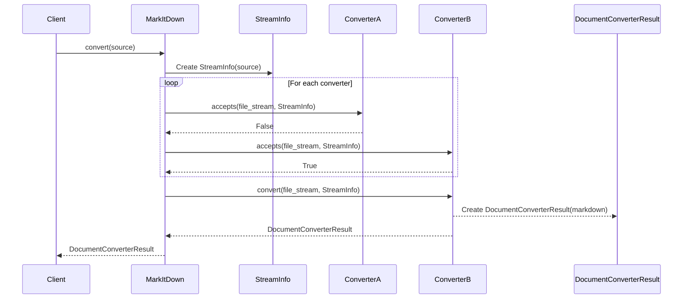
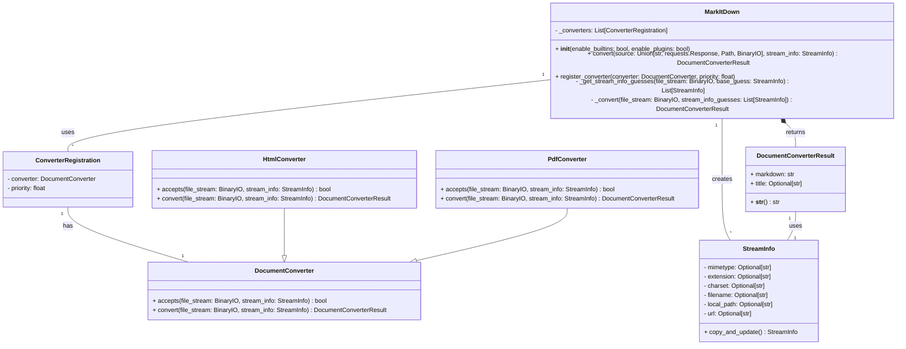

Based on the code investigation, here's a refined overview of the `markitdown` component:

**Description:**

The `markitdown` component is designed to convert various document formats and web resources into Markdown. It provides a unified interface for handling different input types (local files, URLs, streams, responses) and automatically selects the appropriate converter based on file type detection. The core of the component revolves around the `MarkItDown` class, which orchestrates the conversion process. It uses `StreamInfo` to store metadata about the input and relies on a collection of `DocumentConverter` subclasses to perform the actual conversion.

**Main Classes and Their Purposes:**

*   **`MarkItDown`**: The main class responsible for orchestrating the document conversion process. It handles input, detects file types, selects the appropriate converter, and returns the Markdown output.
*   **`StreamInfo`**: A data class that stores metadata about the input stream, such as MIME type, file extension, charset, filename, and URL. This information is used to determine the appropriate converter to use.
*   **`DocumentConverter`**: An abstract base class for all document converters. It defines the `accepts` and `convert` methods, which are used to determine if a converter can handle a given input and to perform the conversion, respectively.
*   **`DocumentConverterResult`**: A data class that stores the result of the conversion, including the Markdown output and the document title.
*   **`HtmlConverter`**: A concrete `DocumentConverter` that converts HTML documents to Markdown using `BeautifulSoup`.
*   **`PdfConverter`**: A concrete `DocumentConverter` that converts PDF documents to Markdown using `pdfminer`.

**Main Flow:**

The main flow within the `markitdown` component can be summarized as follows:

1.  The `MarkItDown.convert()` method receives the input document (file path, URL, stream, etc.).
2.  `MarkItDown` determines the input type and extracts relevant metadata, creating a `StreamInfo` object.
3.  `MarkItDown` iterates through registered `DocumentConverter` instances, calling the `accepts()` method of each converter to determine if it can handle the input based on the `StreamInfo`.
4.  If a converter accepts the input, its `convert()` method is called to perform the conversion.
5.  The `convert()` method returns a `DocumentConverterResult` object containing the Markdown output.
6.  `MarkItDown` returns the `DocumentConverterResult`.

**Sequence Diagram:**

**Class Diagram:**

