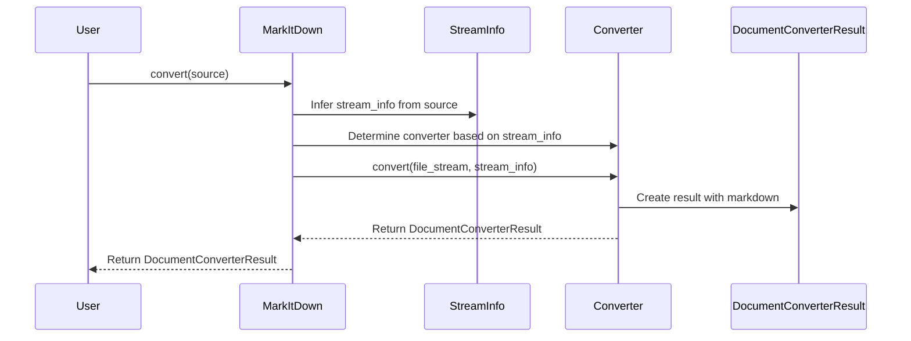
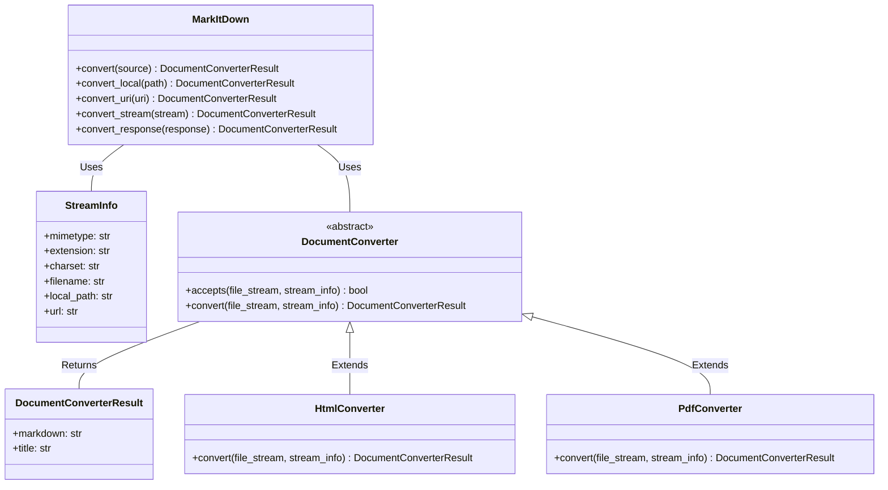

```text
## Component Description: Document Conversion

The `markitdown` component provides a unified interface for converting various document formats into Markdown. It orchestrates the conversion process by selecting the appropriate converter based on the input document's type and then utilizing that converter to generate the Markdown output. The core of the component lies in the `MarkItDown` class, which acts as the central point for initiating conversions. It determines the input type (local file, URL, stream, etc.) and dispatches the conversion to the relevant handler. Each specific document type has its own converter class (e.g., `HtmlConverter`, `PdfConverter`), inheriting from the `DocumentConverter` base class. These converters implement the actual logic for extracting content and formatting it into Markdown. The `StreamInfo` class encapsulates metadata about the input stream, such as MIME type and file extension, aiding in converter selection. The result of the conversion, including the Markdown content and optional title, is encapsulated in the `DocumentConverterResult` class.

## Main Flow (Sequence Diagram)



## Component Structure (Class Diagram)

