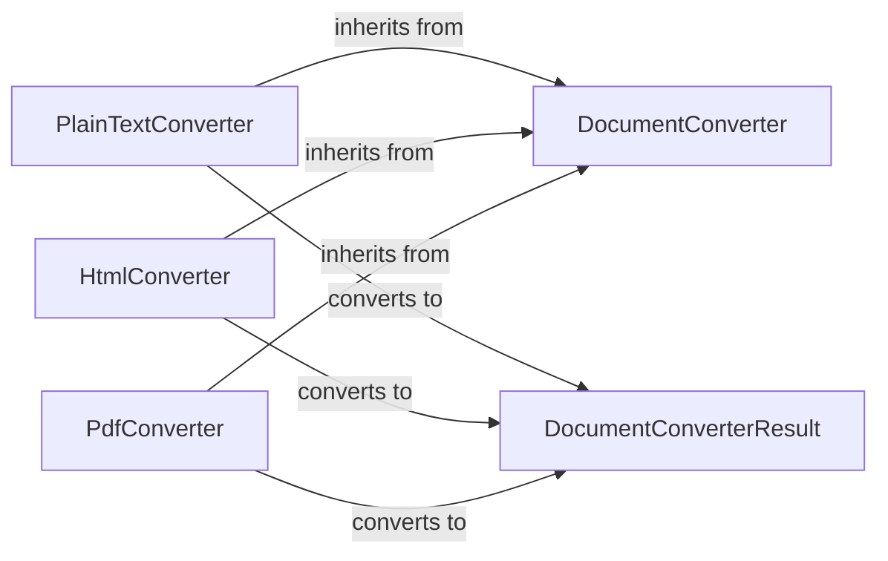

## Component Details

### DocumentConverter
Abstract base class for all document converters. Defines the `accepts` and `convert` methods that subclasses must implement. It provides a common interface and structure for converters to inherit from, ensuring consistency in how different content types are handled.
- **Related Classes/Methods**: `repos.markitdown.packages.markitdown.src.markitdown._base_converter`

### DocumentConverterResult
Represents the result of a document conversion, containing the converted document (markdown) and an optional title. It defines the structure of the conversion result, including content and metadata.
- **Related Classes/Methods**: `repos.markitdown.packages.markitdown.src.markitdown._base_converter`

### PlainTextConverter
Converter for plain text files. It inherits from DocumentConverter and implements the `accepts` and `convert` methods to handle plain text files.
- **Related Classes/Methods**: `repos.markitdown.packages.markitdown.src.markitdown.converters._plain_text_converter`

### HtmlConverter
Converter for HTML files. It inherits from DocumentConverter and implements the `accepts` and `convert` methods to handle HTML files.
- **Related Classes/Methods**: `repos.markitdown.packages.markitdown.src.markitdown.converters._html_converter`

### PdfConverter
Converter for PDF files. It inherits from DocumentConverter and implements the `accepts` and `convert` methods to handle PDF files.
- **Related Classes/Methods**: `repos.markitdown.packages.markitdown.src.markitdown.converters._pdf_converter`
