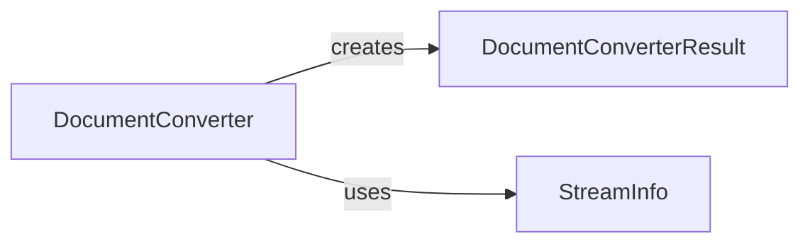

## Component Details

### DocumentConverter
Abstract base class for all document converters. Defines the `accepts` and `convert` methods that subclasses must implement to determine if they can handle the document and convert it to Markdown, respectively.
- **Related Classes/Methods**: `repos.markitdown.packages.markitdown.src.markitdown._base_converter`

### DocumentConverterResult
Data class representing the result of a document conversion, containing the converted markdown text and optional title. It provides a structured way to return the conversion result.
- **Related Classes/Methods**: `repos.markitdown.packages.markitdown.src.markitdown._base_converter`

### StreamInfo
Data class containing metadata about the file (mimetype, extension, charset, set).
- **Related Classes/Methods**: `repos.markitdown.packages.markitdown.src.markitdown._stream_info`
