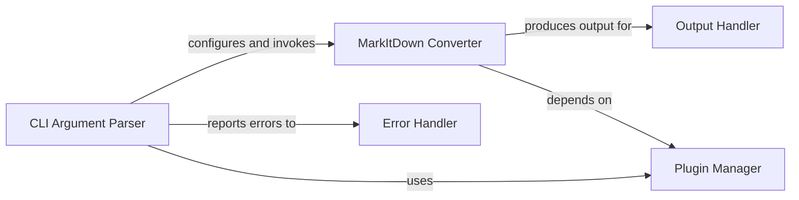

## Component Details

The CLI Application for `markitdown` serves as the primary user interface, orchestrating the conversion of various file formats to markdown. It handles command-line argument parsing, manages input/output operations, and integrates with the core `MarkItDown Converter` while providing error handling and plugin management capabilities.

### CLI Argument Parser
This component is responsible for parsing command-line arguments provided by the user. It defines various options such as input/output files, file type hints, and flags for enabling document intelligence or plugins. It uses `argparse` to handle argument parsing and provides help messages and version information.

**Related Classes/Methods**:

- <a href="https://github.com/microsoft/markitdown/blob/master/packages/markitdown/src/markitdown/__main__.py#L13-L200" target="_blank" rel="noopener noreferrer">`packages.markitdown.src.markitdown.__main__:main` (13:200)</a>
- `argparse.ArgumentParser` (full file reference)
- `argparse.RawDescriptionHelpFormatter` (full file reference)
- `markitdown.__about__:__version__` (full file reference)
- `sys.stdin.buffer` (full file reference)
- `sys.exit` (full file reference)

### Error Handler
This component provides a centralized way to handle and report errors to the user. It prints an error message to the console and exits the program with a non-zero status code, indicating an error occurred.

**Related Classes/Methods**:

- <a href="https://github.com/microsoft/markitdown/blob/master/packages/markitdown/src/markitdown/__main__.py#L217-L219" target="_blank" rel="noopener noreferrer">`packages.markitdown.src.markitdown.__main__._exit_with_error` (217:219)</a>
- `sys.exit` (full file reference)

### Output Handler
This component manages the output of the conversion process. It can write the generated markdown to a specified output file or print it directly to standard output, handling potential encoding issues for stdout.

**Related Classes/Methods**:

- <a href="https://github.com/microsoft/markitdown/blob/master/packages/markitdown/src/markitdown/__main__.py#L203-L214" target="_blank" rel="noopener noreferrer">`packages.markitdown.src.markitdown.__main__._handle_output` (203:214)</a>
- `markitdown._markitdown:DocumentConverterResult` (full file reference)
- `sys.stdout.encoding` (full file reference)

### MarkItDown Converter
This is the core conversion component. It initializes the MarkItDown engine, optionally enabling plugins or configuring Document Intelligence. It then performs the conversion either from a file or a stream, producing a `DocumentConverterResult`.

**Related Classes/Methods**:

- <a href="https://github.com/microsoft/markitdown/blob/master/packages/markitdown/src/markitdown/__main__.py#L13-L200" target="_blank" rel="noopener noreferrer">`packages.markitdown.src.markitdown.__main__:main` (13:200)</a>
- <a href="https://github.com/microsoft/markitdown/blob/master/packages/markitdown/src/markitdown/_markitdown.py#L93-L771" target="_blank" rel="noopener noreferrer">`markitdown._markitdown:MarkItDown` (93:771)</a>
- `markitdown._markitdown:StreamInfo` (full file reference)
- `markitdown._markitdown:DocumentConverterResult` (full file reference)

### Plugin Manager
This component is responsible for listing and potentially enabling third-party plugins for MarkItDown. It uses `importlib.metadata.entry_points` to discover installed plugins and provides information about them to the user.

**Related Classes/Methods**:

- <a href="https://github.com/microsoft/markitdown/blob/master/packages/markitdown/src/markitdown/__main__.py#L13-L200" target="_blank" rel="noopener noreferrer">`packages.markitdown.src.markitdown.__main__:main` (13:200)</a>
- `importlib.metadata.entry_points` (full file reference)

### [FAQ](https://github.com/CodeBoarding/GeneratedOnBoardings/tree/main?tab=readme-ov-file#faq)