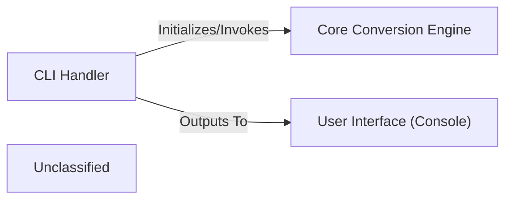

## Details

The `markitdown` project is structured around a Command-Line Interface (CLI) that serves as the primary user interaction point. The `CLI Handler` component is responsible for parsing user commands and arguments, then orchestrating the document conversion process. It initializes the `Core Conversion Engine`, which performs the actual conversion logic. Finally, the `CLI Handler` directs the output, either to a specified file or directly to the `User Interface (Console)`, ensuring the user receives the conversion results. This clear separation of concerns allows for a robust and extensible document conversion utility.

### CLI Handler
This component is the dedicated entry point for command-line users. It is responsible for parsing and validating command-line arguments, orchestrating the initialization of the core conversion engine, and managing the entire conversion workflow from user request to result display. It embodies the Command-Line Interface (CLI) pattern, providing a direct interaction layer for users.

**Related Classes/Methods**:

- <a href="https://github.com/microsoft/markitdown/blob/main/packages/markitdown/src/markitdown/__main__.py" target="_blank" rel="noopener noreferrer">`markitdown.__main__:main`</a>

### Core Conversion Engine [[Expand]](./Core_Conversion_Engine.md)
This component encapsulates the core logic for converting various document formats into markdown. It receives conversion requests from the `CLI Handler` and performs the necessary operations, potentially utilizing plugins or external services like Document Intelligence.

**Related Classes/Methods**:

- <a href="https://github.com/microsoft/markitdown/blob/main/packages/markitdown/src/markitdown/_markitdown.py#L93-L776" target="_blank" rel="noopener noreferrer">`markitdown._markitdown.MarkItDown`:93-776</a>

### User Interface (Console)
This component represents the standard output stream (console) where conversion results or error messages are displayed to the user. It is the final destination for textual feedback from the `CLI Handler`.

**Related Classes/Methods**:

- <a href="https://github.com/microsoft/markitdown/blob/main/packages/markitdown/src/markitdown/__main__.py" target="_blank" rel="noopener noreferrer">`markitdown.__main__:_handle_output`</a>

### Unclassified
Component for all unclassified files and utility functions (Utility functions/External Libraries/Dependencies)

**Related Classes/Methods**: _None_

### [FAQ](https://github.com/CodeBoarding/GeneratedOnBoardings/tree/main?tab=readme-ov-file#faq)